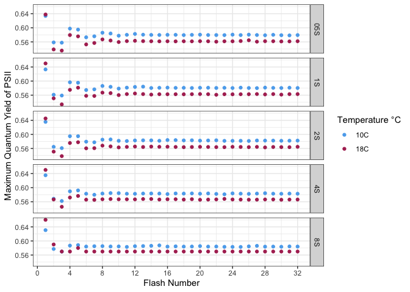
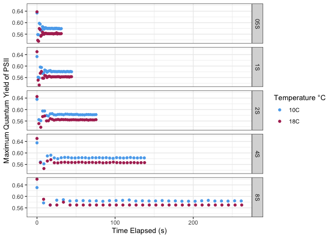
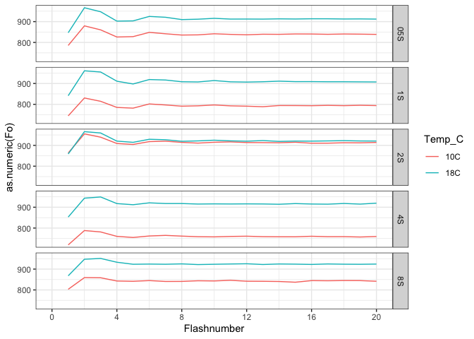

*Some of the code used to create this R Notebook was refurbished from "PlateAbImport.Rmd" written by Maximilian Berthold, Douglas A. Campbell, Melissa L. Rioux, Sarah J Gore, and Alyson MacCormack.*

# To Do
FFT analysis of FvFm vs Flashnumber     
    Data - Raw Data - NoDecay - Fit - files from 20230314       
Small dataset: 32 flashes at each of 0.5, 1, 2, 4, and 8 second intervals done at 10 and 18°C   

Issue: to generate poster references, bib file had to be in poster folder   
    Add references somehow? ".." path?        
    
Add secondary y-axis for flash spacing    

Choose (ask Campbell)   
- Facet by time or temperature    
    maybe choose to illustrate whichever shows a more significant difference (seems to be spacing)    
- Graph/analyze Fm or FvFm    
    which is better     


```r
library(tidyverse)
```

```
## ── Attaching packages ─────────────────────────────────────── tidyverse 1.3.2 ──
## ✔ ggplot2 3.4.0     ✔ purrr   1.0.1
## ✔ tibble  3.1.8     ✔ dplyr   1.1.0
## ✔ tidyr   1.3.0     ✔ stringr 1.5.0
## ✔ readr   2.1.3     ✔ forcats 1.0.0
## ── Conflicts ────────────────────────────────────────── tidyverse_conflicts() ──
## ✖ dplyr::filter() masks stats::filter()
## ✖ dplyr::lag()    masks stats::lag()
```

```r
library(lubridate)
```

```
## 
## Attaching package: 'lubridate'
## 
## The following objects are masked from 'package:base':
## 
##     date, intersect, setdiff, union
```

```r
library(zoo)
```

```
## 
## Attaching package: 'zoo'
## 
## The following objects are masked from 'package:base':
## 
##     as.Date, as.Date.numeric
```


# Set Project Variables

```r
Project <- "LOW"
DataOut <- file.path("..","Data", "CleanData")
CalibData <- file.path("..","Data", "CalibData")

#Temporary RunDate during auditing
#RunDate <- "Refit"

#DataIn <- file.path("..","Data", "RawData","Fit", fsep = .Platform$file.sep)
DataIn <- file.path("..","Data", "RawData","NoDecay","Fit", fsep = .Platform$file.sep)

FileID <- "fit"

FileEncode <- "UTF-8"
#guess_encoding says 'ASCII"

Delimiter <- ","

HeaderRows <- 0
```


```r
us_s = 1000000
photons_umol = 6.022E17
A2_m2 = 1E20
```


```r
#ActPARCal <- readRDS("~/Dropbox/CampbellLabProtocols/ChlorophyllFluorescence/SolisenseInformation/SolisenseInformation_DCCalibParam.Rds")

ActPARCrossCal <- list.files(path = CalibData, full.names = TRUE) %>%
     map_df(~readRDS(file  = .))

#intercept set to 0 in lm in SolisenseInformation.Rproj/SolisenseCalibCompare.Rmd
ActPARCrossCal <- ActPARCrossCal |>
  rename(#Intercept = `estimate_(Intercept)`,
         Slope = `estimate_LIFT_Gen_Developer.cal`,
         #Intercept_SE = `std.error_(Intercept)`,
         Slope_SE = `std.error_LIFT_Gen_Developer.cal`)
```


```r
Wavelengths_nm = c(445, 470, 505, 535, 590)
Colours_nm = c("darkblue", "dodgerblue", "darkgreen", "yellowgreen",  "darkorange")


names(Colours_nm) <- Wavelengths_nm
Colours_nm
```

```
##           445           470           505           535           590 
##    "darkblue"  "dodgerblue"   "darkgreen" "yellowgreen"  "darkorange"
```


```r
SolisenseFiles <- list.files(path = DataIn, pattern = FileID, full.names = TRUE)
SolisenseFiles
```

```
##  [1] "../Data/RawData/NoDecay/Fit/20230309_NaOm1293_10C_05S_fit.csv"
##  [2] "../Data/RawData/NoDecay/Fit/20230309_NaOm1293_10C_1S_fit.csv" 
##  [3] "../Data/RawData/NoDecay/Fit/20230309_NaOm1293_10C_2S_fit.csv" 
##  [4] "../Data/RawData/NoDecay/Fit/20230309_NaOm1293_10C_4S_fit.csv" 
##  [5] "../Data/RawData/NoDecay/Fit/20230309_NaOm1293_10C_8S_fit.csv" 
##  [6] "../Data/RawData/NoDecay/Fit/20230314_NaOm1305_10C_05S_fit.csv"
##  [7] "../Data/RawData/NoDecay/Fit/20230314_NaOm1305_10C_1S_fit.csv" 
##  [8] "../Data/RawData/NoDecay/Fit/20230314_NaOm1305_10C_2S_fit.csv" 
##  [9] "../Data/RawData/NoDecay/Fit/20230314_NaOm1305_10C_4S_fit.csv" 
## [10] "../Data/RawData/NoDecay/Fit/20230314_NaOm1305_10C_8S_fit.csv" 
## [11] "../Data/RawData/NoDecay/Fit/20230314_NaOm1305_18C_05S_fit.csv"
## [12] "../Data/RawData/NoDecay/Fit/20230314_NaOm1305_18C_1S_fit.csv" 
## [13] "../Data/RawData/NoDecay/Fit/20230314_NaOm1305_18C_2S_fit.csv" 
## [14] "../Data/RawData/NoDecay/Fit/20230314_NaOm1305_18C_4S_fit.csv" 
## [15] "../Data/RawData/NoDecay/Fit/20230314_NaOm1305_18C_8S_fit.csv"
```

```r
#test for duplicate file names
unique(duplicated(SolisenseFiles))
```

```
## [1] FALSE
```


# Create Data Frame 
purrr::map to read all files

```r
SolFits <- SolisenseFiles %>%
  map_df(~read.delim_plus(flnm =., file_encode = FileEncode, delimiter = Delimiter, header_rows = HeaderRows))
```


```r
#for NoDecayDataset
SolFitsTrim <- SolFits %>% 
  filter(!grepl("----", DATE)) %>% # remove rows with "----" 
  select(-c("RFID_User_Data", "Barcode_Data","PIF", "Lon", "Lat", "GPS_stat","X")) %>% # remove superfluous columns
  mutate(Filename = str_remove(string = Filename, pattern = "_fit.csv")) %>%
  mutate(Filename = str_remove(string = Filename, pattern = "../Data/RawData/NoDecay/Fit/")) %>%
  separate(Filename, into=c("YYYYMMDD", "CultureID", "Temp_C", "PulseSpace_s"), sep = "([\\/\\_])", remove = FALSE) %>%
  mutate(YYYYMMDD = lubridate::ymd(YYYYMMDD),
          TIME = as.character(TIME)) %>%
   rename(ObsDate = DATE,
         ObsTime = TIME,
         FvFm = "Fv.Fm") %>%
  mutate(FvFm = as.numeric(as.character(FvFm)),
         nm445 = as.numeric(as.character(Light_1)),
         nm470 = as.numeric(as.character(Light_2)),
         nm505 = as.numeric(as.character(Light_3)),
         nm535 = as.numeric(as.character(Light_4)),
         nm590 = as.numeric(as.character(Light_5)),
         IR = as.numeric(as.character(Light_6))) %>%
  mutate(ObsDateTime = lubridate::ymd_hms(paste(ObsDate, ObsTime))) %>%
  relocate(ObsDateTime, .after = ObsTime) %>%
  relocate(CultureID, .before = ObsDate)

SolFitsTrim2 <-SolFitsTrim[-(1:160),] %>%
  group_by(Filename) %>%
  mutate(Flashnumber = row_number()) %>%
  relocate(Flashnumber, .before=p) %>%
  mutate(Etime_s = (as.numeric(Time__mSec) - min(as.numeric(Time__mSec), na.rm = TRUE))/1000, .before=Flashnumber) %>%
  ungroup()
```


```r
#only use this chunk if analyzing data from Data-RawData-WithDecay-Fit
#create new data frame, had to remove extra column
#SolFits2 <- SolFits[-32] 
#assign correct names
#Fixnames <- colnames(SolFits)[22:32]
#rename columns 
#colnames(SolFits2)[21:31] <- c(Fixnames)
```


```r
# for WithDecay Fit Dataset

#Think of better ways to do this
#Careful about RunDate, which is the label of a RunDate sub-folder.
#SolFitsTrim <- SolFits %>% 
  #filter(!grepl("----", DATE)) %>% # remove rows with "----"
 # select(-c("RFID_User_Data", "Barcode_Data","PIF", "Lon", "Lat", "GPS_stat","X")) %>% # remove superfluous columns
  #mutate(Filename = str_remove(string = Filename, pattern = "_fit.csv")) %>%
  #mutate(Filename = str_remove(string = Filename, pattern = "../Data/RawData/NoDecay/Fit/")) %>%
  #separate(Filename, into=c("YYYYMMDD", "CultureID", "Temp_C", "PulseSpace_s"), sep = "([\\/\\_])", remove = FALSE) %>%
  #separate(Filename, into = c("Project", "YYYYMMDD", "CultureID","Temp_C", "PulseSpace_s","Ex_WL", "Flashpower"), sep = "([\\/\\_])", remove = FALSE) %>%
 # mutate(YYYYMMDD = lubridate::ymd(YYYYMMDD),
         # TIME = as.character(TIME)) %>% #time-column may be read in as factor, and as.character changes it to numeric; using lubdridate::hms would only change the format to 13H 4M 2S but does not work later to merge into one DateTime-column
  #rename(ObsDate = DATE,
        # ObsTime = TIME,
       #  FvFm = "Fv.Fm") %>%
 # mutate(Ex_WL = as.factor(as.numeric(Ex_WL))) %>%
  #mutate(FvFm = as.numeric(as.character(FvFm)),
        # nm445 = as.numeric(as.character(Light_1)),
        # nm470 = as.numeric(as.character(Light_2)),
        # nm505 = as.numeric(as.character(Light_3)),
       # nm535 = as.numeric(as.character(Light_4)),
       #  nm590 = as.numeric(as.character(Light_5)),
        # IR = as.numeric(as.character(Light_6))) %>%
 # mutate(ObsDateTime = lubridate::ymd_hms(paste(ObsDate, ObsTime))) %>%
 # relocate(ObsDateTime, .after = ObsTime) %>%
 # relocate(CultureID, .before = ObsDate)

#SolFitsTrim2 <-SolFitsTrim %>%
#  group_by(Filename) %>%
 # mutate(Flashnumber = row_number()) %>%
 # relocate(Flashnumber, .before=p) %>%
  #mutate(Etime_s = (as.numeric(Time__mSec) - min(as.numeric(Time__mSec), na.rm = TRUE))/1000, .before=Flashnumber) %>%
  #ungroup()
```

# Basic plots

Fm vs Flashnumber line; facet by temp 

```r
#facetbytemp
SolFitsTrim2 %>%
  ggplot()+
  geom_line(aes(x=Flashnumber, y=as.numeric(Fm), group=PulseSpace_s, colour=PulseSpace_s))+
  scale_x_continuous(limits=c(0,20), breaks=seq(0,20,4)) +
  facet_grid("Temp_C") +
  theme_bw()
```

```
## Warning: Removed 60 rows containing missing values (`geom_line()`).
```

-1.png)<!-- -->

Fm vs Flashnumber line; facet by flash spacing

```r
#facetbyspacing
SolFitsTrim2 %>%
  ggplot()+
  geom_line(aes(x=Flashnumber, y=as.numeric(Fm), group=Temp_C, colour=Temp_C)) +
  scale_x_continuous(limits=c(0,20), breaks=seq(0,20,4)) +
  facet_grid("PulseSpace_s") +
  theme_bw()
```

```
## Warning: Removed 24 rows containing missing values (`geom_line()`).
```

-1.png)<!-- -->

**Very rough** results:   
At **10c**        
Flash spacing- Very approximate # of flashes
0.5s-18   
1s-14   
1s-14   
4s-12   
8s-8    

At 10c, maintains periodicity longest at 0.5, followed by 1&2, then 4, and finally 8 damps out fastest        
    -as expected    

Maximum fluorescence is more variable   
    -why?   

At **18c**,   
Flash spacing- Very approximate # of flashes    
0.5s-16   
1s-12   
1s-10   
4s-8      
8s-8  


At 18c, same pattern in flash duration but overall shorter    

(line kinda shows it better than point, ask campbell?)    

Biggest gap between 10&18c is at 4s   
    -why?   

**One to use** (according to Campbell):    
FvFm vs Flashnumber point 

```r
SolFitsTrim2 %>%
  ggplot()+
  geom_point(aes(x=Flashnumber, y=as.numeric(FvFm), group=Temp_C, colour=Temp_C)) +
  facet_grid("PulseSpace_s") +
  scale_x_continuous(breaks=seq(0,32,4)) +
  #scale_x_continuous(limits=c(0,12), breaks=seq(0,12,4)) +
  scale_colour_manual(values = c("steelblue2","maroon")) +
  theme(legend.position = "right") + xlab("Flash Number") + ylab("Maximum Quantum Yield of PSII") + 
  labs(colour="Temperature °C") +
  theme_bw()
```

<!-- -->

FvFm vs Time point

```r
SolFitsTrim2 %>%
  ggplot()+
  geom_point(aes(x=Etime_s, y=as.numeric(FvFm), group=Temp_C, colour=Temp_C)) +
  facet_grid("PulseSpace_s") +
  scale_colour_manual(values = c("steelblue2","maroon")) +
  theme(legend.position = "right") + xlab("Time Elapsed (s)") + ylab("Maximum Quantum Yield of PSII") + 
  labs(colour="Temperature °C") +
  theme_bw()
```

<!-- -->

FvFm vs Flashnumber as line; facet by spacing

```r
#facet by spacing 
SolFitsTrim2 %>%
  ggplot()+
  geom_line(aes(x=Flashnumber, y=as.numeric(FvFm), group=Temp_C, colour=Temp_C)) +
  facet_grid("PulseSpace_s") +
  #scale_x_continuous(breaks=seq(0,32,4)) +
  scale_x_continuous(limits=c(0,16), breaks=seq(0,16,4)) +
  scale_colour_manual(values = c("steelblue2","maroon")) +
  theme(legend.position = "right") + xlab("Flash Number") + ylab("Maximum Quantum Yield of PSII") + 
  labs(colour="Temperature °C") +
  theme_bw()
```

```
## Warning: Removed 32 rows containing missing values (`geom_line()`).
```

-1.png)<!-- -->

FvFm vs Flashnumber as line; facet by temp

```r
# facet by temp
SolFitsTrim2 %>%
  ggplot()+
  geom_line(aes(x=Flashnumber, y=as.numeric(FvFm), group=PulseSpace_s, colour=PulseSpace_s)) +
  facet_grid("Temp_C") +
  #scale_x_continuous(breaks=seq(0,32,4)) +
  scale_x_continuous(limits=c(0,16), breaks=seq(0,16,4)) +
  #scale_colour_manual(values = c("steelblue2","maroon")) +
  theme(legend.position = "right") + xlab("Flash Number") + ylab("Maximum Quantum Yield of PSII") + 
  labs(colour="Temperature °C") +
  theme_bw()
```

```
## Warning: Removed 80 rows containing missing values (`geom_line()`).
```

-1.png)<!-- -->

Within each temp, periodicity is weaker with inc pulse spacing    

Fm shows better periodicity than FvFm??   
    -maybe use that instead?    
But FvFm is closer between temps    

FvFm vs Flashnumber (by t) is kind of easier to read (ask Campbell)   
    
Try Fo: 

```r
SolFitsTrim2 %>%
  ggplot()+
  geom_line(aes(x=Flashnumber, y=as.numeric(Fo), group=Temp_C, colour=Temp_C)) +
  scale_x_continuous(limits=c(0,20), breaks=seq(0,20,4)) +
  facet_grid("PulseSpace_s") +
  theme_bw()
```

```
## Warning: Removed 24 rows containing missing values (`geom_line()`).
```

<!-- -->

Fo = No. 


```r
saveRDS(SolFitsTrim2, file.path(DataOut, paste(Project, "SolFitsTrim2.Rds", sep = "_"), fsep = .Platform$file.sep))
```

FFT Transform         
@cernaFundamentalsFFTBasedSignal2000    
@natoFourierTransformTutorial2013   
@pengFastFourierTransform   
@ManipulatingTimeSeries   

# Bibliography


------------------------------ Other code from template---------------------------------
 
Add ActPARcorr with proper correction factors for TC and no TC
Intercepts for cross conversions set to 0.
Some smarter way to do this with map etc....

start chunk{r ActPARcorr}
SolFitsTrim <- SolFitsTrim |>
  mutate(nm445Corr = case_when(TempCont == "TC" ~ nm445 * ActPARCrossCal$Slope[ActPARCrossCal$DCLamp == "Pwr1_uE" & ActPARCrossCal$Models == "DCWaterJacketlm_tidy"],
                                 TempCont == "noTC" ~ nm445 * ActPARCrossCal$Slope[ActPARCrossCal$DCLamp == "Pwr1_uE" & ActPARCrossCal$Models == "DCCuvettelm_tidy"]),
         nm470Corr = case_when(TempCont == "TC" ~ nm470 * ActPARCrossCal$Slope[ActPARCrossCal$DCLamp == "Pwr2_uE" & ActPARCrossCal$Models == "DCWaterJacketlm_tidy"],
                                 TempCont == "noTC" ~ nm470 * ActPARCrossCal$Slope[ActPARCrossCal$DCLamp == "Pwr2_uE" & ActPARCrossCal$Models == "DCCuvettelm_tidy"]),
         nm505Corr = case_when(TempCont == "TC" ~ nm505 * ActPARCrossCal$Slope[ActPARCrossCal$DCLamp == "Pwr3_uE" & ActPARCrossCal$Models == "DCWaterJacketlm_tidy"],
                                 TempCont == "noTC" ~ nm505 * ActPARCrossCal$Slope[ActPARCrossCal$DCLamp == "Pwr3_uE" & ActPARCrossCal$Models == "DCCuvettelm_tidy"]),
           nm535Corr = case_when(TempCont == "TC" ~ nm535 * ActPARCrossCal$Slope[ActPARCrossCal$DCLamp == "Pwr4_uE" & ActPARCrossCal$Models == "DCWaterJacketlm_tidy"],
                                 TempCont == "noTC" ~ nm535 * ActPARCrossCal$Slope[ActPARCrossCal$DCLamp == "Pwr4_uE" & ActPARCrossCal$Models == "DCCuvettelm_tidy"]),
          nm590Corr = case_when(TempCont == "TC" ~ nm590 * ActPARCrossCal$Slope[ActPARCrossCal$DCLamp == "Pwr5_uE" & ActPARCrossCal$Models == "DCWaterJacketlm_tidy"],
                                 TempCont == "noTC" ~ nm590 * ActPARCrossCal$Slope[ActPARCrossCal$DCLamp == "Pwr5_uE" & ActPARCrossCal$Models == "DCCuvettelm_tidy"]),
          IRCorr = case_when(TempCont == "TC" ~ IR * ActPARCrossCal$Slope[ActPARCrossCal$DCLamp == "PwrIR_uE" & ActPARCrossCal$Models == "DCWaterJacketlm_tidy"],
                                 TempCont == "noTC" ~ IR * ActPARCrossCal$Slope[ActPARCrossCal$DCLamp == "PwrIR_uE" & ActPARCrossCal$Models == "DCCuvettelm_tidy"]))
                                 
SolFitsTrim <- SolFitsTrim %>%
  mutate(across(.cols = c(Light_1:ETR), .fns = as.numeric)) %>%
  mutate(ActPAR = nm445 + nm470 + nm505 + nm535 + nm590 + IR) |>
  mutate(ActPARCorr = nm445Corr + nm470Corr + nm505Corr + nm535Corr + nm590Corr + IRCorr)#better ways to do this?

SolFitsTrim[1,]

#generate column with duration of light step in s
#add a column adding Dark1s based upon any step < 5 s
#replace NA for first dark with nominal 181;  issue will be changing durations of light steps across each run
SolFitsTrim <- SolFitsTrim %>%
  group_by(Source.DataFile, CultureID, Ex_WL) %>%
  #mutate(Step_s = as.numeric(ObsDateTime - lag(ObsDateTime)), .after = ObsDateTime) %>%
  mutate(Step_s = replace_na(as.numeric(ObsDateTime - lag(ObsDateTime)), 181), .after = ObsDateTime) %>% 
  mutate(LR_s = as.numeric(ObsDateTime - ObsDateTime[1]), .after = Step_s) %>%
  mutate(Dark1s = if_else(Step_s > 5, 0, 1), .after = Step_s) %>%
  relocate(Ex_WL, .after = Dark1s) %>%
  relocate(ActPAR, .after = Ex_WL)
#Figure out how to cope with final step at 0 PAR, not followed by Dark1s step
#separate Dark1s rows
#Figure out how to re-match Dark1s to appropriate light steps

end chunk {r ActPARcorr}

start chunk {r prelimplots}
SolFitsTrim %>%
  filter(Dark1s == 0) %>%
  filter(Tau2QA < 20000) %>%
  ggplot() +
  geom_point(aes(x = ActPARCorr, y = Tau2QA, colour = as.factor(TempCont), size = LR_s)) +
  #scale_colour_manual(values = Colours_nm) +
  facet_grid(cols = vars(Ex_WL), rows = vars(CultureID)) +
  theme_bw()

SolFitsTrim %>%
  #filter(Dark1s != 0) %>%
  ggplot() +
  geom_point(aes(x = ActPARCorr, y = Alp2QA, colour = as.factor(TempCont), size = LR_s)) +
  #scale_colour_manual(values = Colours_nm) +
  facet_grid(cols = vars(Ex_WL), rows = vars(CultureID)) +
  theme_bw() 

end chunk {r prelimplots}


Oxborough & Baker 1997 for Fo'

start chunk {r estimate parameters}
SolFitsTrim2 <- SolFitsTrim %>%
  group_by(Source.DataFile, CultureID, Ex_WL, TempCont) %>%
  mutate(Fodark = Fo[1],
         Fmdark = Fm[1],
         Sigdark = Sig[1],
         TauAv = ((Tau1QA * Alp1QA) + (Tau2QA * Alp2QA))/(Alp1QA + Alp2QA),
         aLHIIdark = (Fmdark * Fodark)/(Fmdark - Fodark),
         Fomin = min(Fo, na.rm = TRUE),
         Fmmax = max(Fm, na.rm = TRUE),
         FoOxbo = Fomin/(((Fmmax - Fomin)/Fmmax) + (Fomin/Fm)),
         Sigmax = max(Sig, na.rm = TRUE),
         #aLHIIminmax = (Fmmax * Fomin)/(Fmmax - Fomin),
         aLHIIOxbomax = (Fmmax * FoOxbo)/(Fmmax - FoOxbo),
         Sig_m2psii = Sig/A2_m2,
         ActPARCorr_photonsm2s = ActPARCorr *  photons_umol,
         #Ctau1 = 1/(1 + (Sig_m2psii * ActPARCorr_photonsm2s * (Tau1QA/us_s))),
         #Ctau2 = 1/(1 + (Sig_m2psii * ActPARCorr_photonsm2s * (Tau2QA/us_s))),
         Ctauav = 1/(1 + (Sig_m2psii * ActPARCorr_photonsm2s * (TauAv/us_s))),
         #qp = (Fm - Fo)/(Fm - lead(Fo)), #(Fm' - Fs)/(Fm' - Fo'); messes up every 2nd row from double tap data but then filter out rows from 'dark'
         qpOxbo = (Fm - Fo)/(Fm - FoOxbo),
         #JVPSII_aLHIIminmax = ActPARCorr_photonsm2s * aLHIIminmax * FvFm, #issue with FvFm in cyanobacteria; minimized with blue light excitation
         #JVPSII_aLHIIdark = ActPARCorr_photonsm2s * aLHIIdark * FvFm,
         JVPSII_aLHIIOxbomax = ActPARCorr_photonsm2s * aLHIIOxbomax * FvFm,
         #ETRCtau1 = Sig_m2psii * Ctau1 * ActPARCorr_photonsm2s,
         #ETRCtau2 = Sig_m2psii * Ctau2 * ActPARCorr_photonsm2s,
         ETRCtauav = Sig_m2psii * Ctauav * ActPARCorr_photonsm2s,
         #ETRqp = Sig_m2psii * qp * ActPARCorr_photonsm2s,
         ETRqpOxbo = Sig_m2psii * qpOxbo * ActPARCorr_photonsm2s,
         #ETRGorbo = (1/TauAv[7])*((ActPARCorr*FvFm)/(ActPARCorr[7]*FvFm[7])) * us_s,
         TestTauAvSat = 1/TauAv[ActPARCorr_photonsm2s == max(ActPARCorr_photonsm2s)],
         ETRGorbo = (1/TauAv[ActPARCorr_photonsm2s == max(ActPARCorr_photonsm2s)])*((ActPARCorr_photonsm2s*FvFm)/(max(ActPARCorr_photonsm2s))*(FvFm[ActPARCorr_photonsm2s == max(ActPARCorr_photonsm2s)])) * us_s,
                                                                                    #Pmax x scaling for change in yield and light
*(#)*relies upon phiPSII which is not absolute in cyanos
         JVPSII_ETRtauav_FoSig = ETRCtauav * Fomin/Sigmax, #Sigmax not converted A2_m2
         JVPSII_ETRqpOxbo_FoSig = ETRqpOxbo * Fomin/Sigmax,
         JVPSII_ETRtauav_aLHII_Sig = ETRCtauav * aLHIIOxbomax/Sigmax,
         JVPSII_ETRqpOxbo_aLHII_Sig = ETRqpOxbo * aLHIIOxbomax/Sigmax) %>%
  ungroup()

end chunk {r estimate parameters}

start chunk {r prelimplots2}
SolFitsTrim2 %>%
  filter(Dark1s == 0) %>%
  ggplot() +
  geom_point(aes(x = ActPARCorr, y = aLHIIOxbomax, colour = as.factor(TempCont))) +
  #geom_point(aes(x = ActPARCorr, y = aLHIIminmax), shape = "cross") +
  #scale_colour_manual(values = Colours_nm) +
  facet_grid(cols = vars(Ex_WL), rows = vars(CultureID)) +
  theme_bw()

SolFitsTrim2 %>%
  filter(Dark1s == 0) %>%
  ggplot() +
  geom_point(aes(x = ActPARCorr, y = ETRqpOxbo, colour = as.factor(TempCont))) +
  geom_point(aes(x = ActPARCorr, y = ETRGorbo), shape = "cross") +
  #scale_colour_manual(values = Colours_nm) +
  facet_grid(cols = vars(Ex_WL), rows = vars(CultureID)) +
  theme_bw()


 SolFitsTrim %>%
   filter(Dark1s == 0) %>%
   ggplot() +
   geom_point(aes(x = Ctau1, y = qp, colour = as.factor(TempCont))) +
   #geom_point(aes(x = ActPARCorr, y = aLHIIminmax), shape = "cross") +
   #scale_colour_manual(values = Colours_nm) +
   facet_grid(cols = vars(Ex_WL), rows = vars(CultureID)) +
   geom_abline(intercept = 0, slope = 1, linetype = "dashed") + 
   coord_fixed(xlim = c(0,1), ylim = c(0,1), ratio = 1) +
   theme_bw()

SolFitsTrim2 %>%
  filter(Dark1s == 0) %>%
  ggplot() +
  geom_point(aes(x = Ctauav, y = qpOxbo, colour = as.factor(TempCont))) +
  #geom_point(aes(x = ActPARCorr, y = aLHIIminmax), shape = "cross") +
  #scale_colour_manual(values = Colours_nm) +
  facet_grid(cols = vars(Ex_WL), rows = vars(CultureID)) +
  geom_abline(intercept = 0, slope = 1, linetype = "dashed") + 
  coord_fixed(xlim = c(0,1), ylim = c(0,1), ratio = 1) +
  theme_bw()

SolFitsTrim2 %>%
  filter(Dark1s == 0) %>%
  ggplot() +
  geom_point(aes(x = ActPARCorr, y = JVPSII_ETRtauav_FoSig, colour = as.factor(TempCont))) +
  #geom_point(aes(x = ActPARCorr, y = aLHIIminmax), shape = "cross") +
  #scale_colour_manual(values = Colours_nm) +
  facet_grid(cols = vars(Ex_WL), rows = vars(CultureID)) +
  theme_bw()

SolFitsTrim2 %>%
  filter(Dark1s == 0) %>%
  ggplot() +
  geom_point(aes(x = 
         JVPSII_ETRqpOxbo_FoSig, y = JVPSII_ETRtauav_aLHII_Sig, colour = as.factor(TempCont))) +
  #geom_point(aes(x = ActPARCorr, y = aLHIIminmax), shape = "cross") +
  #scale_colour_manual(values = Colours_nm) +
  geom_abline(intercept = 0, slope = 1, linetype = "dashed") + 
  coord_fixed(ratio = 1) +
  facet_grid(cols = vars(Ex_WL), rows = vars(CultureID)) +
  theme_bw()

SolFitsTrim2 %>%
  filter(Dark1s == 0) %>%
  ggplot() +
  geom_point(aes(x =  JVPSII_ETRqpOxbo_FoSig, y = JVPSII_aLHIIOxbomax, colour = as.factor(TempCont))) +
  #geom_point(aes(x = ActPARCorr, y = aLHIIminmax), shape = "cross") +
  #scale_colour_manual(values = Colours_nm) +
  geom_abline(intercept = 0, slope = 1, linetype = "dashed") + 
  #coord_fixed(ratio = 1) +
  facet_grid(cols = vars(Ex_WL), rows = vars(CultureID)) +
  theme_bw()

  #ETRGorbo works well for blue light but appears to fail for 590 nm; possible issue with low FV/FM with PBsome excitation?

SolFitsTrim2 %>%
  #filter(Dark1s == 0) %>%
  ggplot() +
  geom_point(aes(x = ETRCtauav, y = ETRGorbo, colour = as.factor(TempCont))) +
  #geom_point(aes(x = ActPARCorr, y = aLHIIminmax), shape = "cross") +
  #scale_colour_manual(values = Colours_nm) +
  geom_abline(intercept = 0, slope = 1, linetype = "dashed") + 
  #coord_fixed(ratio = 1) +
  facet_grid(cols = vars(Ex_WL), rows = vars(CultureID)) +
  theme_bw()

end chunk {r prelimplots2}
