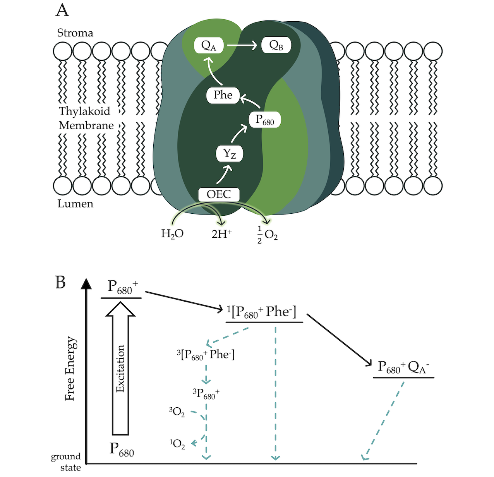

```{r, include=FALSE}
knitr::opts_chunk$set(echo = FALSE,
                      warning = FALSE,
                      tidy = FALSE,
                      message = FALSE,
                      fig.align = 'center',
                      out.width = "100%")
options(knitr.table.format = "html") 
```


# Introduction

Polar phytoplankton are **vital** to polar ecosystems [@ardyna2020]. As photolithotrophs, phytoplankton rely on photons for energy input, nominally restricting their growth to the photic zone, defined as the region where sufficient light for photosynthesis penetrates, traditionally extending down to 1% of surface irradiance [@ravenPutOutLight2000; @kirk2011]

Despite severe light constraints, certain polar phytoplankton exhibit slow but significant productivity under the ice during winter, suggesting adaptations to maintain photosynthesis under light limitation [@randelhoff2020; @hancke2018].

During photosynthesis, a complete water oxidation cycle requires the absorption of four photons. When photon arrivals are widely spaced, as occurs in low light, photosynthetic efficiency may decline due to futile charge recombinations[@keren1997]. We hypothesized that maintaining photosynthesis under extremely low light and low temperatures involves **suppressing energetically wasteful charge recombinations** in Photosystem II (PSII).




# Methods

Recombination causes an individual PSII to slip in its four-step cycle of oxygen evolution, causing desynchronization across the population of PSIIs [@gates2020]. As the energy partitioned to fluorescence varies across the four steps, a population of synchronized PSIIs will exhibit a four-step cycling pattern of chlorophyll fluorescence. 

Therefore, **variable chlorophyll fluorescence** can be used to evaluate the synchronization of the PSII. By inference, prolonged synchronization implies low recombination and vice-versa [@schubackSingleTurnoverVariableChlorophyll2021; @zaharievaEnergeticsKineticsSState2019].


We used **Wavelet Transforms** [@theis2010] to analyze the persistence of PSII chlorophyll fluorescence cycling across polar and temperate taxa of diatoms and green algae under a range of light and temperatures. This analysis helped determine whether polar taxa have evolved to increase photosynthetic energy conversion efficiency by minimizing inefficient recombination reactions. 

# Results

We observe **2 key patterns** within and between taxa:

* Within taxa, shorter spacing of photon delivery, and colder temperatures, results in stronger four-step cycling of PSII maximum chlorophyll fluorescence, and by inference, less wasteful recombination.

* Polar taxa maintain significant four-step PSII cycling across a broader range of conditions, at wider spacings of photons, equivalent to lower ambient light, than do their temperate counterparts. 


# Conclusions
Our findings indicate that diverse polar phytoplankton have capacity to suppress wasteful recombinations at PSII, to sustain efficient photosynthesis under extreme low light and low temperatures.

This research challenges the conventional understanding of the limits on photosynthesis under light limitation, helping unravel polar ecosystem dynamics and predict ecosystem responses to climate change

## Acknowledgements & References
<span style="font-size: 34px;">Marina Cvetkovska & Mackenzie Poirier, *Department of Biology, University of Ottawa* </span>               
<span style="font-size: 34px;">Marcel Babin & Sébastien Guérin, *Takuvik International Research Laboratory*</span>                        
<span style="font-size: 34px;">W. Brent Thorne (2019). posterdown: An R Package.</span>


