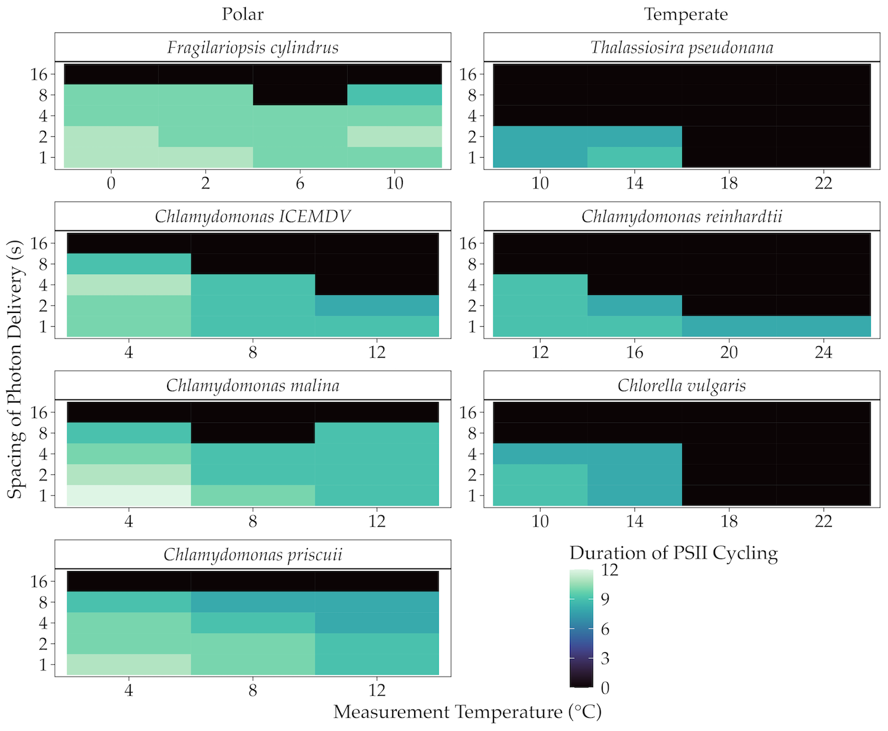

```{r, include=FALSE}
knitr::opts_chunk$set(echo = FALSE,
                      warning = FALSE,
                      tidy = FALSE,
                      message = FALSE,
                      fig.align = 'center',
                      out.width = "100%")
options(knitr.table.format = "html") 
```


# Introduction

Polar phytoplankton are **vital** to global aquatic ecosystems [@pierellakarlusich2020; @ardyna2020]

As photolithotrophs, phytoplankton rely on photons for energy input, restricting their growth to the photic zone, defined as the region where sufficient light for photosynthesis penetrates, typically extending down to 1% of surface irradiance [@ravenPutOutLight2000; @kirk2011]

Despite severe light constraints in polar regions, certain psychrophile phytoplankton exhibit remarkable adaptability through slow but significant growth under the ice during winter indicating possible photosynthetic adaptations to light limitation [@randelhoff2020; @hancke2018; @leu2015]

We hypothesized that maintaining photosynthesis under extremely low light involves **suppressing energetically wasteful charge recombinations** in Photosystem II


# Methods

**Single turnover variable chlorophyll fluorescence** can be used to evaluate recombination [@schubackSingleTurnoverVariableChlorophyll2021; @zaharievaEnergeticsKineticsSState2019]

Recombination reactions cause individual PSIIs to lose charge separation and slip back in the four-step cycle of oxygen evolution, desynchronizing the S-state cycle across the population [@gates2020] 


Conducting a comparative analysis of S-state cycling of polar and temperate diatoms and green algae under a range of light and temperature conditions, we can determine if polar taxa have evolved to increase photosynthetic energy conversion efficiency by minimizing inefficient recombination reactions 

# Results




We observe **3** key patterns between and within taxa

* Within taxa, higher frequencies of photon delivery and colder temperatures result in less recombination and, therefore, less energy waste 
* Polar taxa exhibit significant s-state cycling across a broader range of conditions than their temperate counterparts 
* Polar taxa maintain synchronicity in S-state cycling for longer durations than temperate taxa under comparable conditions

# Conclusions
Together, our findings indicate that diverse polar phytoplankton have evolved capacities to sustain efficient photosynthesis under extreme low light

This research challenges the conventional understanding of the limits on photosynthesis under light limitation, helping unravel polar ecosystem dynamics and predict ecosystem responses to climate change

# References

