# To Do {.unnumbered}

## Substantial:
convert damping index to relative probability of desynchronization?

do math or cite literature to estimate probability of double hits contributing to desynchronization and whether that probability varies with flash spacing or temperature?

process & plot tau data to track how long PSII is closed after flash

## Manu Prep:

Fix figure & table citation issue

Scan recent literature; Gates?


# Introduction {.unnumbered} 

Phytoplankton are a functional grouping of photosynthetic microorganisms, of diverse lineages and ecologies [@pierellakarlusichPhytoplanktonTaraOcean2020]. Phytoplankters share photolithotrophic growth, using highly conserved protein complexes [@falkowskiMicrobialEnginesThat2008] to harness energy from Photosynthetically Active Radiation (PAR), to drive reduction and assimilation of inorganic carbon, nitrogen, phosphorus, sulphur, and other essential micronutrients [@ravenPutOutLight2000]. PAR, however, decreases with depth, as light passing through the water column is scattered and absorbed [@kirkLightPhotosynthesisAquatic2011]. Therefore, with photons as an energy input, phytoplankton growth is constrained to the photic zone, the region of water receiving sufficient light for photosynthesis, operationally defined in past as extending down to a limit receiving 1% of surface irradiance, thus 2-20 µmol photons m^-2^ s^-1^  [@ravenPutOutLight2000].  

Light availability is further constrained in polar aquatic habitats, with light penetration of the water limited by seasonally low solar angles, ice cover, and snow cover [@cohenLightPolarNight2020; @leuArcticSpringAwakening2015; @hanckeExtremeLowLight2018], thereby presenting challenges for phytoplankton growth [@hanckeExtremeLowLight2018; @randelhoffArcticMidwinterPhytoplankton2020; @hoppePhotosyntheticLightRequirement2024]. Indeed the lower limit of the photic zone was reconsidered when benthic microalgae in the Antarctic were reported as photosynthetically active at light levels less than 1 µmol photons m^-2^ s^-1^ [@robinsonMicroalgalLightHarvestingExtreme1995; @mcminnDiurnalChangesPhotosynthesis2003]. Some polar psychrophile phytoplankton further demonstrate slow, but ecologically significant, productivity in the winter through photosynthesis below 0.17 µmol photons m^-2^ s^-1^  [@randelhoffArcticMidwinterPhytoplankton2020; @hanckeExtremeLowLight2018; ; @morgan-kissPhotoadaptationPolarNight2016; @hoppePhotosyntheticLightRequirement2024], with implications for the responses of polar phytoplankton communities to climate change [@ardynaPhytoplanktonDynamicsChanging2020].

This slow but, but potentially significant, phytoplankton photosynthesis during polar winters underscores the ability of psychrophilic phytoplankton to maintain functional photosystems throughout the polar night [@morgan-kissPhotoadaptationPolarNight2016; @randelhoffArcticMidwinterPhytoplankton2020; @hoppePhotosyntheticLightRequirement2024], and supports a theoretical minimum light level for phytoplankton photosynthesis of 0.01 µmol photons m^-2^ s^-1^ [@ravenPutOutLight2000]. Such low-light phytoplankton photosynthesis and growth could mitigate cell mortality in the extended darkness of winter, maintaining seeding populations for the spring bloom [@randelhoffArcticMidwinterPhytoplankton2020]. These spring blooms, in turn, are a major source of annual net primary production in polar regions [@ardynaPhytoplanktonDynamicsChanging2020].  

In parallel with seasonally low light, psychrophile phytoplankton contend with cold temperature constraints on water viscosity, solute diffusion rates, membrane fluidity, enzyme kinetics and macromolecule interactions [@lyonPolarMicroalgaeNew2014]. In parallel salinities vary across polar habitats  [REFERENCES MACKENZIE ET AL], along with shorter-tem local salinity fluctuations driven by freezing and thawing of ice [REFERENCES MACKENZIE ET AL].  XXXPOMONA ARTICLE(S) on SALINITY RESPONSES?XXX.

Such extreme abiotic constraints probably act as powerful ecological filters, by imposing niche-driven speciation processes among phytoplankton lineages adapted to polar environments [@ibarbalzPanArcticPlanktonCommunity2023]. Some psychrophilic phytoplankton indeed exhibit high genetic divergence from related temperate species. The polar diatom *Fragilariopsis cylindrus* shows divergent alleles compared to their mesophilic relatives [@mockEvolutionaryGenomicsColdadapted2017], with changes in protein structure, including amino acid substitutions, H-bonds, and salt bridges [@lyonPolarMicroalgaeNew2014], cold shock proteins [@lyonPolarMicroalgaeNew2014] and anti-freeze proteins [@bayer-giraldiCharacterizationAntifreezeProtein2011]. Similarly, the polar green algae *Chlamydomonas priscui* and *Chlamydomonas* sp. ICE-L harbour large genomes enriched in genes families encoding for ice-binding proteins, molecular chaperones, light harvesting proteins and core histones (@zhangDraftGenomeSequence2021). Polar microbes use cellular-compatible solutes, including sugars, polyols, amino acids, betaine, and DMSP, which lower intracellular freezing points and maintain enzyme hydration spheres, stabilizing catalytic activity [@lyonPolarMicroalgaeNew2014; @zhangAdaptationExtremeAntarctic2020]. Additionally, they exhibit high levels of polyunsaturated fatty acids (PUFAs) in their lipid membranes [@lyonPolarMicroalgaeNew2014; @cvetkovskaTemperatureStressPsychrophilic2022] contributing to maintenance of membrane fluidity at cold temperatures. 

Oxygenic photosynthesis in eukaryotic phytoplankton occurs in chloroplasts, bounded by a two- to four-membrane envelope, depending upon taxa [@kirkLightPhotosynthesisAquatic2011]. Thylakoid membranes, containing pigments and electron carriers, traverse the chloroplast stroma. Photosystem II (PSII), a multi-subunit protein complex embedded in the thylakoid membranes [@shevelaSolarEnergyConversion2023], catalyzes the photooxidation of water, releasing O~2~ and H^+^, and passing reductant into the photosynthetic electron transport chain.  

In PSII, photons are captured by light-harvesting chlorophyll molecules [@kirkLightPhotosynthesisAquatic2011], initiating a transition from the ground state to an electronically excited state. Energy absorbed by light harvesting complexes undergoes rounds of inductive resonance transfer among multiple pigments before eventually reaching the photochemical reaction center of PSII,  P~680~ [@kirkLightPhotosynthesisAquatic2011], composed of a Chl a heterodimer [@shenPhotosynthesisPhotosystemII2021; @vassRoleChargeRecombination2011]. The excitation energy is then distributed, in variable proportions, to i) photochemistry; ii) dissipation as heat; or iii) re-emission as fluorescence (ChlF) [@schubackSingleTurnoverVariableChlorophyll2021]. When P~680~ is raised to its excited state, P~680~*, it shifts to a lower reduction potential, allowing photooxidation to P~680~+ through transfer of an electron to an initial phaeophytin (Phe) acceptor molecule [@vassRoleChargeRecombination2011; @shevelaSolarEnergyConversion2023]. In productive electron transport the electron from reduced Phe- is transferred to plastoquinone A (Q~A~), followed by transfer to plastoquinone B (Q~B~) [@shenPhotosynthesisPhotosystemII2021]. Q~B~, once fully reduced by receiving two electrons, is released, carrying the electrons into the mobile plastoquinone pool in the lipid phase of the thylakoid membrane [@kirkLightPhotosynthesisAquatic2011]. P~680~+  is reduced back to P~680~ by taking an electron from a tyrosine residue D1-Tyr-161 (Yz). Yz, in turn, extracts an electron from a manganese cluster on the thylakoid lumenal side of PSII [@shenPhotosynthesisPhotosystemII2021; @mukhopadhyayManganeseClustersRelevance2004].

During photosynthesis, electron transfers thus sequentially stabilize the photochemical charge separations [@vassRoleChargeRecombination2011]. These charge separations are, however, reversible through recombination reactions [@vassJanusfacedChargeRecombinations2009; @hanMissesWaterOxidation2012], which are futile cycles of photochemistry [@rappaportKineticsPathwaysCharge2002; @rappaportChargeRecombinationThermoluminescence2005; @laloiGeneticApproachElucidating2006] forming one category of photochemical 'miss' [@hanMissesWaterOxidation2012; @hanMolecularBasisTurnover2022].  Recombinations can generate chlorophyll triplets which react with ground-state molecular oxygen to produce singlet oxygen (^1^O~2~), a highly damaging, photoinhibitory reactive oxygen species (ROS) [@rappaportChargeRecombinationThermoluminescence2005]. Conversely, these non-radiative charge recombinations act as a mechanism of photoprotection under excess excitation [@vassRoleChargeRecombination2011], enabling direct recombination from the singlet P~680~+Phe- or P~680~+Q~A~- states [@rutherfordBackreactionsShortcircuitsLeaks2012],  to help suppress the formation of harmful ROS [@vassJanusfacedChargeRecombinations2009].  Since these recombinations have characteristic activation energies  [@rappaportKineticsPathwaysCharge2002], the probabilities of recombinations vary with temperature, [@ivanovAcclimationTemperatureIrradiance2006; @hanDirectQuantificationFour2008; @hanMissesWaterOxidation2012; @hanMolecularBasisTurnover2022]. Both plants and cyanobacteria furthermore show acclimatory modulations [@quiggPhotoacclimationInvolvesModulation2003] of the reduction potentials of electron transfer intermediates, thereby changing the probabilities and temperature dependencies of recombinations [@ivanovAcclimationTemperatureIrradiance2006; @saneChangesRedoxPotential2003; @saneTransientExchangePhotosystem2002; @ivanovLowtemperatureModulationRedox2003].


Beyond their roles in photodamage and photoprotection, charge recombination reactions are wasteful 'miss' processes that lower photosynthetic energy conversion efficiency [@rappaportChargeRecombinationThermoluminescence2005; @hanMissesWaterOxidation2012] by competing with linear electron transport. Shifting reduction potentials of downstream electron acceptors, leading to changes in energy gaps for recombinations, may represent evolutionary adaptations aimed at maximizing photoprotection and minimizing losses through back-reactions under light-limited conditions [@vinyardPhotosystemIIReaction2013]. 

The oxygen-evolving complex (OEC) of PSII consists of a manganese-oxo cluster (Mn~4~CaO~5~) where water is oxidized, releasing oxygen and protons [@gatesRealtimeKineticsLight2020]. Four consecutive charge separations at P~680~ induce four increasingly oxidized states of the Mn cluster, known as S-States [@zaharievaEnergeticsKineticsSState2019], denoted, from most reduced to most oxidized, as S0, S1, S2, and S3, followed by a transient S4 state, which rapidly decays to S0. Once the Mn cluster has progressively lost four electrons, it oxidizes two water molecules, releasing one molecule of O~2~. Therefore, a complete water oxidation cycle during oxygenic photosynthesis requires four sequential photon excitations of a single PSII, with the progressive accumulation of four oxidizing equivalents in the OEC [@dauTimeresolvedXraySpectroscopy2007; @gatesRealtimeKineticsLight2020; @zaharievaEnergeticsKineticsSState2019].  

Under light limitation, the arrivals of excitations of P~680~ in each PSII are widely spaced in time.  Thus in order to maintain productive electron transport, the electron transfer intermediates must persist for long periods of time, elevating the probabilities of energetically wasteful recombination reactions, which represent a step backward in the S-State cycle [@kerenMechanismPhotosystemII1997; @dewijnSstateDependenceMiss2002; @hanDirectQuantificationFour2008]. Stable and progressive S-State cycling under low light, in contrast, sustains electron flow for ATP and NADPH production, while minimizing risks of low-light photodamage to PSII [@rappaportChargeRecombinationThermoluminescence2005; @kerenMechanismPhotosystemII1997]. 

S-State cycling in a phytoplankton sample can be tracked by applications of sequences of short, single-turnover saturating light flashes, bright enough to deliver a photon to each PSII. In darkness the PSII population relaxes primarily to S1 [@hanDirectQuantificationFour2008]. As sequential light flashes are applied, the population of PSII complexes is driven through the S-State cycle [@dauTimeresolvedXraySpectroscopy2007]. The S-States have different intrinsic PSII fluorescence yields [@gatesRealtimeKineticsLight2020; @zaharievaEnergeticsKineticsSState2019], so in an idealized sample, the four sequential S-States will be reflected by an ongoing periodic oscillation in ChlF. Recombination reactions, however,  contribute to wasteful misses in the S-State cycling of individual PSII [@hanMissesWaterOxidation2012]. As misses occur, they progressively desynchronize S-State cycling across the PSII population, dampening the observed ChlF oscillation [@dewijnSstateDependenceMiss2002] towards an averaged ChlF for the PSII population distributed across the S-States. An organism exhibiting synchronized S-State cycling sustained over more flash cycles indicates fewer photochemical misses, and thus higher conversion of sequentially spaced excitations to photosynthetic electron transport. By comparing the S-State cycling over flash cycles, of psychrophilic and temperate phytoplankton taxa, we sought to determine if psychrophilic diatoms and green algae show higher maintenance of progressive PSII function under extreme low light,thereby supporting stable extraction of electrons from water to support productive photosynthesis. 

# Materials and methods {.unnumbered}

## Study Strains and Culturing Conditions {.unnumbered}
The nine study taxa, including polar and temperate strains of diatoms and green algae, and their respective culturing conditions are summarized in Table \@ref(tab:taxacultures). 


<table class=" lightable-classic" style='font-family: "Arial Narrow", "Source Sans Pro", sans-serif; margin-left: auto; margin-right: auto;'>
<caption>(\#tab:taxacultures)Study taxa and culture growth conditions.</caption>
 <thead>
  <tr>
   <th style="text-align:left;"> Taxa </th>
   <th style="text-align:left;"> Lineage </th>
   <th style="text-align:left;"> Origin </th>
   <th style="text-align:right;"> Growth °C </th>
   <th style="text-align:right;"> NaCl (mM) </th>
   <th style="text-align:right;"> NaCl (opt) </th>
   <th style="text-align:right;"> PAR (µE) </th>
   <th style="text-align:right;"> Photoperiod (h) </th>
   <th style="text-align:left;"> Media </th>
  </tr>
 </thead>
<tbody>
  <tr>
   <td style="text-align:left;font-style: italic;"> Fragilariopsis cylindrus </td>
   <td style="text-align:left;"> Diatom </td>
   <td style="text-align:left;"> Polar </td>
   <td style="text-align:right;"> 0 </td>
   <td style="text-align:right;"> 500.00 </td>
   <td style="text-align:right;"> 500.00 </td>
   <td style="text-align:right;"> 10 </td>
   <td style="text-align:right;"> 24 </td>
   <td style="text-align:left;"> F2 </td>
  </tr>
  <tr>
   <td style="text-align:left;font-style: italic;"> Fragilariopsis cylindrus </td>
   <td style="text-align:left;"> Diatom </td>
   <td style="text-align:left;"> Polar </td>
   <td style="text-align:right;"> 0 </td>
   <td style="text-align:right;"> 500.00 </td>
   <td style="text-align:right;"> 500.00 </td>
   <td style="text-align:right;"> 1 </td>
   <td style="text-align:right;"> 24 </td>
   <td style="text-align:left;"> F2 </td>
  </tr>
  <tr>
   <td style="text-align:left;font-style: italic;"> Fragilariopsis cylindrus </td>
   <td style="text-align:left;"> Diatom </td>
   <td style="text-align:left;"> Polar </td>
   <td style="text-align:right;"> 6 </td>
   <td style="text-align:right;"> 500.00 </td>
   <td style="text-align:right;"> 500.00 </td>
   <td style="text-align:right;"> 10 </td>
   <td style="text-align:right;"> 24 </td>
   <td style="text-align:left;"> F2 </td>
  </tr>
  <tr>
   <td style="text-align:left;font-style: italic;"> Fragilariopsis cylindrus </td>
   <td style="text-align:left;"> Diatom </td>
   <td style="text-align:left;"> Polar </td>
   <td style="text-align:right;"> 6 </td>
   <td style="text-align:right;"> 500.00 </td>
   <td style="text-align:right;"> 500.00 </td>
   <td style="text-align:right;"> 1 </td>
   <td style="text-align:right;"> 24 </td>
   <td style="text-align:left;"> F2 </td>
  </tr>
  <tr>
   <td style="text-align:left;font-style: italic;"> Thalassiosira pseudonana </td>
   <td style="text-align:left;"> Diatom </td>
   <td style="text-align:left;"> Temperate </td>
   <td style="text-align:right;"> 22 </td>
   <td style="text-align:right;"> 500.00 </td>
   <td style="text-align:right;"> 500.00 </td>
   <td style="text-align:right;"> 50 </td>
   <td style="text-align:right;"> 12 </td>
   <td style="text-align:left;"> F2 </td>
  </tr>
  <tr>
   <td style="text-align:left;font-style: italic;"> Chlamydomonas ICEMDV </td>
   <td style="text-align:left;"> Green </td>
   <td style="text-align:left;"> Polar </td>
   <td style="text-align:right;"> 4 </td>
   <td style="text-align:right;"> 70.00 </td>
   <td style="text-align:right;"> 500.00 </td>
   <td style="text-align:right;"> 10 </td>
   <td style="text-align:right;"> 24 </td>
   <td style="text-align:left;"> BBM </td>
  </tr>
  <tr>
   <td style="text-align:left;font-style: italic;"> Chlamydomonas klinobasis </td>
   <td style="text-align:left;"> Green </td>
   <td style="text-align:left;"> Polar </td>
   <td style="text-align:right;"> 4 </td>
   <td style="text-align:right;"> 0.43 </td>
   <td style="text-align:right;"> 0.43 </td>
   <td style="text-align:right;"> 10 </td>
   <td style="text-align:right;"> 24 </td>
   <td style="text-align:left;"> BBM </td>
  </tr>
  <tr>
   <td style="text-align:left;font-style: italic;"> Chlamydomonas klinobasis </td>
   <td style="text-align:left;"> Green </td>
   <td style="text-align:left;"> Polar </td>
   <td style="text-align:right;"> 4 </td>
   <td style="text-align:right;"> 10.00 </td>
   <td style="text-align:right;"> 0.43 </td>
   <td style="text-align:right;"> 10 </td>
   <td style="text-align:right;"> 24 </td>
   <td style="text-align:left;"> BBM </td>
  </tr>
  <tr>
   <td style="text-align:left;font-style: italic;"> Chlamydomonas klinobasis </td>
   <td style="text-align:left;"> Green </td>
   <td style="text-align:left;"> Polar </td>
   <td style="text-align:right;"> 4 </td>
   <td style="text-align:right;"> 30.00 </td>
   <td style="text-align:right;"> 0.43 </td>
   <td style="text-align:right;"> 10 </td>
   <td style="text-align:right;"> 24 </td>
   <td style="text-align:left;"> BBM </td>
  </tr>
  <tr>
   <td style="text-align:left;font-style: italic;"> Chlamydomonas malina </td>
   <td style="text-align:left;"> Green </td>
   <td style="text-align:left;"> Polar </td>
   <td style="text-align:right;"> 4 </td>
   <td style="text-align:right;"> 30.00 </td>
   <td style="text-align:right;"> 500.00 </td>
   <td style="text-align:right;"> 10 </td>
   <td style="text-align:right;"> 24 </td>
   <td style="text-align:left;"> BBM </td>
  </tr>
  <tr>
   <td style="text-align:left;font-style: italic;"> Chlamydomonas malina </td>
   <td style="text-align:left;"> Green </td>
   <td style="text-align:left;"> Polar </td>
   <td style="text-align:right;"> 4 </td>
   <td style="text-align:right;"> 70.00 </td>
   <td style="text-align:right;"> 500.00 </td>
   <td style="text-align:right;"> 10 </td>
   <td style="text-align:right;"> 24 </td>
   <td style="text-align:left;"> BBM </td>
  </tr>
  <tr>
   <td style="text-align:left;font-style: italic;"> Chlamydomonas malina </td>
   <td style="text-align:left;"> Green </td>
   <td style="text-align:left;"> Polar </td>
   <td style="text-align:right;"> 4 </td>
   <td style="text-align:right;"> 500.00 </td>
   <td style="text-align:right;"> 500.00 </td>
   <td style="text-align:right;"> 10 </td>
   <td style="text-align:right;"> 24 </td>
   <td style="text-align:left;"> BBM </td>
  </tr>
  <tr>
   <td style="text-align:left;font-style: italic;"> Chlamydomonas priscui </td>
   <td style="text-align:left;"> Green </td>
   <td style="text-align:left;"> Polar </td>
   <td style="text-align:right;"> 4 </td>
   <td style="text-align:right;"> 30.00 </td>
   <td style="text-align:right;"> 500.00 </td>
   <td style="text-align:right;"> 10 </td>
   <td style="text-align:right;"> 24 </td>
   <td style="text-align:left;"> BBM </td>
  </tr>
  <tr>
   <td style="text-align:left;font-style: italic;"> Chlamydomonas priscui </td>
   <td style="text-align:left;"> Green </td>
   <td style="text-align:left;"> Polar </td>
   <td style="text-align:right;"> 4 </td>
   <td style="text-align:right;"> 70.00 </td>
   <td style="text-align:right;"> 500.00 </td>
   <td style="text-align:right;"> 10 </td>
   <td style="text-align:right;"> 24 </td>
   <td style="text-align:left;"> BBM </td>
  </tr>
  <tr>
   <td style="text-align:left;font-style: italic;"> Chlamydomonas priscui </td>
   <td style="text-align:left;"> Green </td>
   <td style="text-align:left;"> Polar </td>
   <td style="text-align:right;"> 4 </td>
   <td style="text-align:right;"> 500.00 </td>
   <td style="text-align:right;"> 500.00 </td>
   <td style="text-align:right;"> 10 </td>
   <td style="text-align:right;"> 24 </td>
   <td style="text-align:left;"> BBM </td>
  </tr>
  <tr>
   <td style="text-align:left;font-style: italic;"> Chlamydomonas priscui </td>
   <td style="text-align:left;"> Green </td>
   <td style="text-align:left;"> Polar </td>
   <td style="text-align:right;"> 4 </td>
   <td style="text-align:right;"> 700.00 </td>
   <td style="text-align:right;"> 500.00 </td>
   <td style="text-align:right;"> 10 </td>
   <td style="text-align:right;"> 24 </td>
   <td style="text-align:left;"> BBM </td>
  </tr>
  <tr>
   <td style="text-align:left;font-style: italic;"> Chlamydomonas euryale </td>
   <td style="text-align:left;"> Green </td>
   <td style="text-align:left;"> Temperate </td>
   <td style="text-align:right;"> 24 </td>
   <td style="text-align:right;"> 30.00 </td>
   <td style="text-align:right;"> 500.00 </td>
   <td style="text-align:right;"> 10 </td>
   <td style="text-align:right;"> 24 </td>
   <td style="text-align:left;"> BBM_NH4 </td>
  </tr>
  <tr>
   <td style="text-align:left;font-style: italic;"> Chlamydomonas euryale </td>
   <td style="text-align:left;"> Green </td>
   <td style="text-align:left;"> Temperate </td>
   <td style="text-align:right;"> 24 </td>
   <td style="text-align:right;"> 70.00 </td>
   <td style="text-align:right;"> 500.00 </td>
   <td style="text-align:right;"> 10 </td>
   <td style="text-align:right;"> 24 </td>
   <td style="text-align:left;"> BBM_NH4 </td>
  </tr>
  <tr>
   <td style="text-align:left;font-style: italic;"> Chlamydomonas euryale </td>
   <td style="text-align:left;"> Green </td>
   <td style="text-align:left;"> Temperate </td>
   <td style="text-align:right;"> 24 </td>
   <td style="text-align:right;"> 500.00 </td>
   <td style="text-align:right;"> 500.00 </td>
   <td style="text-align:right;"> 10 </td>
   <td style="text-align:right;"> 24 </td>
   <td style="text-align:left;"> BBM_NH4 </td>
  </tr>
  <tr>
   <td style="text-align:left;font-style: italic;"> Chlamydomonas reinhardtii </td>
   <td style="text-align:left;"> Green </td>
   <td style="text-align:left;"> Temperate </td>
   <td style="text-align:right;"> 24 </td>
   <td style="text-align:right;"> 0.43 </td>
   <td style="text-align:right;"> 0.43 </td>
   <td style="text-align:right;"> 10 </td>
   <td style="text-align:right;"> 24 </td>
   <td style="text-align:left;"> BBM </td>
  </tr>
  <tr>
   <td style="text-align:left;font-style: italic;"> Chlamydomonas reinhardtii </td>
   <td style="text-align:left;"> Green </td>
   <td style="text-align:left;"> Temperate </td>
   <td style="text-align:right;"> 24 </td>
   <td style="text-align:right;"> 10.00 </td>
   <td style="text-align:right;"> 0.43 </td>
   <td style="text-align:right;"> 10 </td>
   <td style="text-align:right;"> 24 </td>
   <td style="text-align:left;"> BBM </td>
  </tr>
  <tr>
   <td style="text-align:left;font-style: italic;"> Chlamydomonas reinhardtii </td>
   <td style="text-align:left;"> Green </td>
   <td style="text-align:left;"> Temperate </td>
   <td style="text-align:right;"> 24 </td>
   <td style="text-align:right;"> 30.00 </td>
   <td style="text-align:right;"> 0.43 </td>
   <td style="text-align:right;"> 10 </td>
   <td style="text-align:right;"> 24 </td>
   <td style="text-align:left;"> BBM </td>
  </tr>
  <tr>
   <td style="text-align:left;font-style: italic;"> Chlorella vulgaris </td>
   <td style="text-align:left;"> Green </td>
   <td style="text-align:left;"> Temperate </td>
   <td style="text-align:right;"> 22 </td>
   <td style="text-align:right;"> 500.00 </td>
   <td style="text-align:right;"> 500.00 </td>
   <td style="text-align:right;"> 50 </td>
   <td style="text-align:right;"> 12 </td>
   <td style="text-align:left;"> F2 </td>
  </tr>
  <tr>
   <td style="text-align:left;font-style: italic;"> Chlorella vulgaris </td>
   <td style="text-align:left;"> Green </td>
   <td style="text-align:left;"> Temperate </td>
   <td style="text-align:right;"> 22 </td>
   <td style="text-align:right;"> 500.00 </td>
   <td style="text-align:right;"> 500.00 </td>
   <td style="text-align:right;"> 50 </td>
   <td style="text-align:right;"> 12 </td>
   <td style="text-align:left;"> BG11 </td>
  </tr>
</tbody>
</table>


*Fragilariopsis cylindrus* is a psychrophilic [@fialaLighttemperatureInteractionsGrowth1990] pennate diatom measuring 15-55 µm which forms large blooms in the high salinity and subzero temperatures of Arctic and Antarctic sea-ice systems [@otteDiatomFragilariopsisCylindrus2023; @cefarelliDiversityDiatomGenus2010], and is a keystone species for polar ecosystems [@vonquillfeldt:hal-03218115; @otteDiatomFragilariopsisCylindrus2023; @kangFragilariopsisCylindrusGrunow1992].  Sequenced in 2017, *Fragilariopsis cylindrus* has since become the model psychrophilic diatom species for investigating molecular and physiological mechanisms of cold adaptation [@mockEvolutionaryGenomicsColdadapted2017]. Conversely, *Thalassiosira pseudonana* (*Cyclotella nana*) is a centric diatom (2.5-15 μm) found in diverse freshwater, coastal, brackish, and marine habitats [@poulsenThalassiosiraPseudonanaCyclotella2023], across a range of salinities and temperatures (4–25°C) [@poulsenThalassiosiraPseudonanaCyclotella2023].
*Chlamydomonas* sp. ICE-MDV and *Chlamydomonas priscui* are halotolerant algae isolated from the perennially ice-covered hypersaline Lake Bonney, in McMurdo Dry Valleys, Antarctica [@cookAntarcticPsychrophilesChlamydomonas2019; @stahl-rommelCyclicElectronFlow2022]. With 15 to 20 μm biflagellate cells, *Chlamydomonas* sp. ICE-MDV dominates the shallow photic zone, where it experiences relatively higher irradiance, extreme nutrient limitation, and lower salinity [@cookAntarcticPsychrophilesChlamydomonas2019; @liUltrastructuralSingleCellLevelCharacterization2016]. The smaller *Chlamydomonas priscui* dominates the deep photic zone, characterized by permanent low temperatures, low irradiance, and high salinity [@cvetkovskaTemperatureStressPsychrophilic2022; @hunerPhotosyntheticAdaptationMulticellularity2023]. *Chlamydomonas malina* is a marine microalga isolated from the Arctic Beaufort Sea, around 10 μm in length and 5 μm in width, growing optimally at 4°C [@balzanoDiversityCulturedPhotosynthetic2012; @morales-sanchezTemperatureDependentLipidAccumulation2020].   *Chlamydomonas klinobasis* is a freshwater microalga isolated from XXXX, around XX μm in length and YY μm in width, growing optimally at 4°C [CITATIONS MACKENZIE?].
The temperate *Chlamydomonas reinhardtii* is a model green alga approximately 10 μm in diamter, found in freshwater soil and aquatic environments with an optimal temperature range of 20-32°C [@sassoMolecularManipulationDomesticated2018; @xieChlamydomonasReinhardtiiThermal2013]. The temperate *Chlamydomonas euryale* is approximately 10 μm in diameter, isolated from ZZZZ[MacKenzieCITATION], with an optimal temperature  of ~24°C [CITATIONSXXX].
*Chlorella vulgaris*, ranging from 2 μm to 10 μm in size, is primarily found in freshwater environments and grows optimally at 27°C [@wielCharacterizationChlorellaVulgaris2017; @leyvaAccumulationFattyAcids2014].

XXXXMacKenzie add origins & citations for C. euryale, C.klinobasis?

*Thalassiosira pseudonana* and *Chlorella vulgaris* were cultured by Naaman Omar (Mount Allison University); *Chlamydomonas* strains were cultured by Mackenzie Poirier (Cvetkovska Lab, University of Ottawa) as reported previously  (@poirierLightQualityAffects2025); while *Fragilariopsis cylindrus* was cultured by Sébastien Guérin (Takuvik International Research Laboratory, Université Laval).

## Single Turnover Variable Chlorophyll Fluorescence {.unnumbered}

We used series of single turnover, saturating, flashes to induce variable chlorophyll fluorescence (ChlF) [@kolberMeasurementsVariableChlorophyll1998], and evaluate progressive desynchronization of the S-State cycle in several polar and temperate phytoplankton species acclimated to a range of growth temperatures. We loaded a 3 mL sample of culture into a temperature-controlled water-jacketed quartz cuvette (Cafferty's Scientific Glassblowing, Anola, Manitoba, Canada),  placed within the measurement chamber of a Soliense fluorometer (Version LIFT-REM 1.0, Soliense Inc., Shoreham NY, USA). The apparatus was covered to block out incident light, for a minimum of 30 seconds prior to measurements. In the dark PSII reaction centres relax to ground state, and are open for photochemistry upon receipt of an absorbed photon, with a low fluorescence yield [@schubackSingleTurnoverVariableChlorophyll2021]. In parallel the oxygen evolving complex (OEC) relaxes primarily to S1 [@hanDirectQuantificationFour2008], so the S-States of the population of PSII largely synchronize.
The sample was then exposed to a series of 32 short, high irradiance evenly spaced flashes centred at 445 nm. Each flash comprised a rapid series of 50-70 sub-saturating flashlets of 1.6 µs and ~ 30000 µmol photons m^-2^ s^-1^, , delivered every 4.1 µs, over a total 205 - 287 µs per flash [@schubackSingleTurnoverVariableChlorophyll2021]. These flashlets cumulatively deliver a photon to each PSII in the population, with each PSII ideally undergoing a single round of photochemistry and passing an electron downstream to Q~A~-, closing PSII for photochemistry for ~1000 µs, the lifetime (𝛕) for re-opening by downstream electron transport [@dauTimeresolvedXraySpectroscopy2007; @schubackSingleTurnoverVariableChlorophyll2021]. Closing the photochemistry pathway transiently redirects a greater proportion of additional incoming excitation to ChlF, driving ChlF progressively from minimum (F~O~) towards a maximum (F~M~) as the PSII centres close [@schubackSingleTurnoverVariableChlorophyll2021]. For each flash-induced fluorescence rise, F~O~ and F~M~ were extracted using a fitting model (LIFT software version 22.11.11, Solisense Inc) [@kolberMeasurementsVariableChlorophyll1998]. F~O~ and F~M~ were then used to derive the maximum quantum yield of photochemistry for open PSII [@schubackSingleTurnoverVariableChlorophyll2021], a secondary ChlF parameter calculated as:

XXXFix equationXXX

\begin{equation}
\frac{F_{V}}{F_{M}} = \frac{F_{M}-F_{O}}{F_{M}}
  (\#eq:FV_FM)
\end{equation}


For each culture sample we adjusted the number and excitation power of flashlets per flash to achieve closure of ~ 0.95 of PSII complexes, as estimated by the fitting of the chlorophyll fluorescence induction [@kolberMeasurementsVariableChlorophyll1998; @schubackSingleTurnoverVariableChlorophyll2021]. Ideally the saturating flash would achieve complete closure of the PSII population, but concomitant re-opening of PSII centres by downstream electron transport results in a steady state ratio of mainly closed PSII to a fraction of open PSII, even at F~M~.  The flash power required to drive the PSII population to closure depends largely upon the effective absorption cross-section of photosystem II (σ~PSII~), itself estimated from the ChlF induction curve during the saturation phase [@kolberMeasurementsVariableChlorophyll1998]. σ~PSII~ represents the probability of light capture by the PSII antenna bed associated with the dark-adapted PSII [@schubackSingleTurnoverVariableChlorophyll2021; @xuPhytoplanktonSPSIIExcitation2018]. When σ~PSII~ for a sample is large, the higher probability of excitation delivery to PSII means fewer, or weaker, flashlets are required to sequentially saturate the population of PSII,  while limiting excitation stress or double turnovers of PSII associated with excess light [@xuPhytoplanktonSPSIIExcitation2018]. Conversely, a sample with a smaller σ~PSII~ requires more numerous, or brighter, flashlets, to drive the proportion of closed reaction centres  progressively towards saturation. If the brightness and number of sub-saturating flashlets are appropriate for the culture, the fluorescence will reach a plateau after approximately 70% of the flashlets are applied [@kolberMeasurementsVariableChlorophyll1998].  

We kept the single turnover excitation flash train as short as feasible, to avoid excessive excitation, and to limit the probability of 'double hits' [@hanMissesWaterOxidation2012; @hanMolecularBasisTurnover2022]; re-openings of PSII, followed by re-closures of PSII complexes by a second round of photochemistry, which contribute to desynchronization of the progression of the PSII complexes through S-States. Thus, as sequential flashes are applied to the culture, each individual PSII is ideally driven through the four S-States (Fig \@ref(fig:reposc)) [@dauTimeresolvedXraySpectroscopy2007]. As the oxygen-evolving complex of PSII moves between S-States, it alters the system kinetics and free energy [@vinyardPhotosystemIIReaction2013], so the yield of ChlF varies between S-States [@gatesRealtimeKineticsLight2020], and we can use ChlF to monitor S-State progression, until the PSII population desynchronizes to a distribution of S-States with an averaged ChlF. 


<div class="figure">

<p class="caption">(\#fig:reposc)**Representative oscillations of the maximum quantum yield of PSII photochemistry over a Series of Single Turnover Saturating Flashes applied to *Chlamydomonas priscui***. F~V~/F~M~ was normalized to the average value over the series, measured at 4 or 12 °C, with spacing of 1, 4, or 16 s between sequential flashes, excitation rates equivalent to irradiance with 0.708, 0.177 or 0.044 µmol photons m^-2^ s^-1^. Symbol colour indicates inferred majority S-State,  based upon relaxation to S1 during the dark incubation preceding the flash sequence.</p>
</div>


## Measurements {.unnumbered}

By evaluating the oscillations in ChlF (Fig \@ref(fig:reposc)), we tracked S-State cycling of polar and temperate taxa of diatoms and green algae under a range of measurement temperatures and effective light levels (\@ref(tab:fluormeas)), to determine if polar taxa maintain synchronized PSII function, as an index of their capacity for electron transport under low light, by suppressing wasteful photochemical misses. Measurement temperatures ranged from 0 to 28°C, depending on the taxa (\@ref(tab:fluormeas)). 

Increasing the spacing between sequential flashes decreases the repeat rate for excitations arriving at PSII, thereby approximating a decrease in excitations delivered to PSII per second under a decrease in continuous irradiance (Fig \@ref(fig:reposc)).  Our instrument control limited our minimum flash spacing to 1 s, so cultures were evaluated at flash spacings of 1, 2, 4, 8, and 16 seconds (\@ref(tab:fluormeas)). The equivalent effective light levels were then estimated using the σ~PSII~ determined for each culture as follows: 

XXXFix EquationXXX

\begin{equation}
Light (µmol~photons~m^{-2}~s^{-1}) = \frac{{1}{flash~spacing (s)} X \frac{{1}{\sigma_{PSII} (A^{2})}} X \frac{1 m^{2}}{1E20A^{2}}  X  \frac{{\mu mol}{6.022E17}}
  (\#eq:EffectiveLight)
\end{equation}

OR

\begin{equation}
Light (µmol~photons~m^{-2}~s^{-1}) = \frac{{1 m^{2} X \mu mol}{flash~spacing (s) X \sigma_{PSII} (A^{2}) X 1E20A^{2}  X  6.022E17}
  (\#eq:EffectiveLight)
\end{equation}


$$
Light (\mu mol \photon m^{-2} s^{-1}) = \frac{1}{flash spacing (s)} * {\frac{1}{\sigma_{PSII} (A^{2})} * \frac{1 m^{2}}{1E20A^{2}} * \frac{\mu mol}{6.022E17}
$$
1/σPSII is multiplied by flash spacing (s) to convert the probability that an individual incident photon is absorbed by PSII, into an equivalent photon flux density, i.e. to estimate effective light availability serving PSII photochemistry.

Since the population of PSII starts predominantly from S1 in the dark acclimated state, the population of PSII will initially cycle synchronously through S States, reflected by an oscillation in chlorophyll fluorescence with a period of four (Fig \@ref(fig:reposc))[@dewijnSstateDependenceMiss2002]. Photochemical misses, including wasteful recombination reactions causing loss of a charge separation in a PSII, will cause a missed step in the S-State cycling of an individual PSII. As more photochemical misses occur, desynchronization of S-State cycling among the population of PSII will scramble the periodic changes in ChlF, dampening the observed oscillation of the population-level fluorescence [@dewijnSstateDependenceMiss2002; @hanMolecularBasisTurnover2022]. Prolonged four-step synchronous cycling of PSII fluorescence thus reflects a lower probability of desynchronization at each excitation, and thus a lower probability of losses through photochemical misses.  Photochemical double hits also contribute to desynchronization [@hanMolecularBasisTurnover2022;  @hanDirectQuantificationFour2008], but should not vary strongly across changes in flash spacing nor measurement temperature within a sample.


## Analytical Methods {.unnumbered}  

Data was processed using R version 4.3.2 [@rcoreteamLanguageEnvironmentStatistical2023] and RStudio version 2023.12.0+369 [@positteamRStudioIntegratedDevelopment2025] on the x86_64-apple-darwin20 (64-bit) platform and running under macOS Sonoma 14.3.1. Fluorescence data files generated by LIFT software were imported, tidied and combined with metadata on each culture using the tidyverse [@R-tidyverse], lubridate [@R-lubridate], and googlesheets4 [@R-googlesheets4] packages. The doBy [@R-doBy], and WaveletComp [@roeschWaveletCompComputationalWavelet2018] packages were used for wavelet analyses. The mgcv [@woodFastStableRestricted2011] and mgcViz [@fasioloScalableVisualizationMethods2020] packages were used for generalized additive modelling, while the ggplot2 [@wickhamGgplot2ElegantGraphics2016], ggh4x [@vandenbrandGgh4xHacksGgplot22025], and metR [@campitelliMetRToolsEasier2021] packages were used for data visualization. Statistical results tables were done using the packages 'broom' [@R-broom], 'knitr' [@R-knitr], and 'kableExtra' [@R-kableExtra].

## Wavelet Transformations {.unnumbered}

The fluorescence data yields a time series of F~V~/F~M~ over 32 sequentially applied flashes,  for each flash spacing, and each measurement temperature, for each culture sample. The F~V~/F~M~ time series were analyzed for each combination of strain, growth conditions, measurement temperature, and flash spacing, using wavelet transformations [@theisSpectralTransformations2010], as exemplified in (Fig \@ref(fig:reprecon)). Unlike traditional methods, wavelet analysis does not assume that the statistical properties of a time series are constant. Instead, wavelet transformations locally decompose the signal across different time scales and estimate spectral characteristics as a function of time [@cazellesWaveletAnalysisEcological2008]. By examining the frequency and wavelet power spectra, we can uncover the dominant patterns in the data [@theisSpectralTransformations2010]. 


<div class="figure">

<p class="caption">(\#fig:reprecon)Representative wavelet transformations of Antarctic *Chlamydomonas priscui* variable chlorophyll fluorescence (F~V~/F~M~) measured at 4, 8 or 12°C, over 32 consecutive single turnover saturating flashes, applied at spacings of 1, 2, 4, 8, 16 s, equivalent to photon delivery rates to PSII achieved under light levels from 0.708 down to 0.045 µmol photons m^-2^ s^-1^.</p>
</div>


The wavelet transformation involves computing the wavelet power spectrum of the standardized time series using the Morlet wavelet [@theisSpectralTransformations2010]. The statistical significance of the periodic components in the time series was then calculated using a simulation algorithm. Surrogate time series are generated based on a white noise model, consisting of uncorrelated random values with constant mean and variance. The wavelet transform of the data is compared with the white noise model, to estimate p-values for whether the observed periodic components are statistically significant [@theisSpectralTransformations2010].
Statistical significance of the wavelet power at a periodicity of four indicates the culture is exhibiting periodic oscillations in chlorophyll fluorescence, reflecting synchronous S-State cycling across the PSII population. For wavelets exhibiting detectable S-State cycling, we generated a reconstruction, limited to the sub-set of flashes showing a signal that was statistically different from the average value of F~V~/F~M~. We then extracted a Damping Index as the number of flashes applied before desynchronization results in the reconstructed wavelet dropping below a detection threshold significance of p=0.05 above random noise. This Damping Index indicates how many successive photochemical charge separations occur in the PSII population before recombinations, other photochemical misses, or photochemical double hits, desynchronize the S-State cycle to a randomized distribution of S-States across the population.


## Generalized Additive Modelling {.unnumbered} 

The patterns in the persistence of S-State cycling within taxa were then modeled using the nonparametric method of generalized additive modelling (GAM). GAMs fit a model to predict the damping index based on a tensor product smooth of the two predictors, measurement temperature, and equivalent effective light level. The response variable is linked to the independent variables using a smoothing function, where many localized polynomials are joined to form a piecewise function called a spline [@pinillaNonParametricGeneralizedAdditive2021]. For each strain, GAM models were fit to the data using the restricted maximum likelihood method (REML).
 
The GAM model examines the response of S-State damping to the measurement temperature (°C) and the equivalent effective light level (µmol photons m^-2^ s^-1^) for the measurement flash spacing. The generalized additive models were fitted using the R-package *`mgcv`* [@R-mgcv].  Only S-State damping estimates for which the amplitude of standard error was smaller than 320% of the fitted
S-State damping were included in the GAM. Models were validated by verifying the choice of basis dimensions (k) and evaluating the residual plots [@schoenigWorkshopGeneralizedAdditive2023] using gam.check() from the R-package *`mgcv`* [@R-mgcv] (Table \@ref(tab:gammodeldiagnostic)). Based on the fitted models, the damping index can then be predicted for other combinations of temperature and light [@woodGeneralizedAdditiveModels2017], represented with a contour plot.

## Analyses of Variance {.unnumbered} 
Analyses of Variance (ANOVA) were run using the aov function [@rcoreteamLanguageEnvironmentStatistical2023] to detect effects of taxa , measurement equivalent effective light levels (derived from flash spacing), measurement temperature, and growth salinity, upon the Damping Index.

# Results {.unnumbered}  

## Single Turnover Variable Chlorophyll Fluorescence {.unnumbered}

Exposing phytoplankton cultures to a series of 20-32 successive single turnover, saturating flashes produced oscillations in the maximum quantum yield of photochemistry of PSII, as estimated through the secondary chlorophyll fluorescence parameter F~V~/F~M~. Initially, the majority of the dark-adapted population of PSII is at S1, with a smaller fraction at S0 [@gatesRealtimeKineticsLight2020; @dewijnSstateDependenceMiss2002]. As shown in representative data from polar *Chlamydomonas priscui* Fig \@ref(fig:reposc) and temperate *Chlamydomonas rheinhardtii* Fig \@ref(fig:reprecon), each grown at respective optimal salinities,  the time series of F~V~/F~M~ over successive flashes reveals consistent variations in fluorescence yield as the predominant S-States, with different yields for ChlF, follow each other across the PSII within the population. The amplitudes of the ChlF oscillations, however, decline progressively over successive flashes.  The persistence of oscillations decreases with wider spacing between sequential flashes, equivalent to decreasing effective light levels, and at higher measurement temperatures.  The full set of S-State time courses captured across taxa and growth salinities are in Supplemental Data. XXX


Photochemical misses, including recombination reactions causing loss of charge separation in a PSII, will cause a missed step in the S-State cycling of an individual PSII. As more photochemical misses occur, desynchronization of S-State cycling among the population of PSII will scramble the periodic changes in ChlF, dampening the observed oscillation of the population-level fluorescence 
[@dewijnSstateDependenceMiss2002; @hanMolecularBasisTurnover2022]. Prolonged synchronous cycling thus reflects a lower probability of desynchronization at each excitation, and thus a lower probability of losses through photochemical misses. Photochemical double hits also contribute to desynchronization [@hanMolecularBasisTurnover2022; @hanDirectQuantificationFour2008], but should not vary strongly across changes in flash spacing nor temperature within a sample.

The conversions of flash spacing to equivalent effective light levels gave similar ranges of light levels applied to each strain (Table \@ref(tab:fluormeas)). For comparison, full sunlight at the sea surface is ~ 2000 µmol photons m^-2^s^-1^, while the threshold for the bottom of the photic zone supporting photosynthetic productivity in the oceans is conventionally defined as ~ 20 µmol photons m^-2^s^-1^ [@ravenPutOutLight2000]. Therefore our measurement light ranges are ~ 5 orders of magnitude lower than full sunlight, and ~ 2-3 orders of magnitude below the minimum photic zone threshold, but nevertheless span light ranges found to support phytoplankton productivity in field studies [@hanckeExtremeLowLight2018; @randelhoffArcticMidwinterPhytoplankton2020; @hoppePhotosyntheticLightRequirement2024].


## Wavelet Analysis {.unnumbered}  

Wavelet transformations were computed for the fluorescence time series of each unique combination of measurement temperature, flash spacing, growth temperature, and species or strain. Assessing the wavelet power of a 4-step periodicity across conditions, key trends emerge. As exemplified by the Antarctic green alga *Chlamydomonas priscui* (Figure \@ref(fig:cpriscuiwaveletpower)), the average wavelet power declines with increasing flash spacings, equivalent to decreasing effective light levels, and also declines with increasing measurement temperatures. 


<div class="figure">
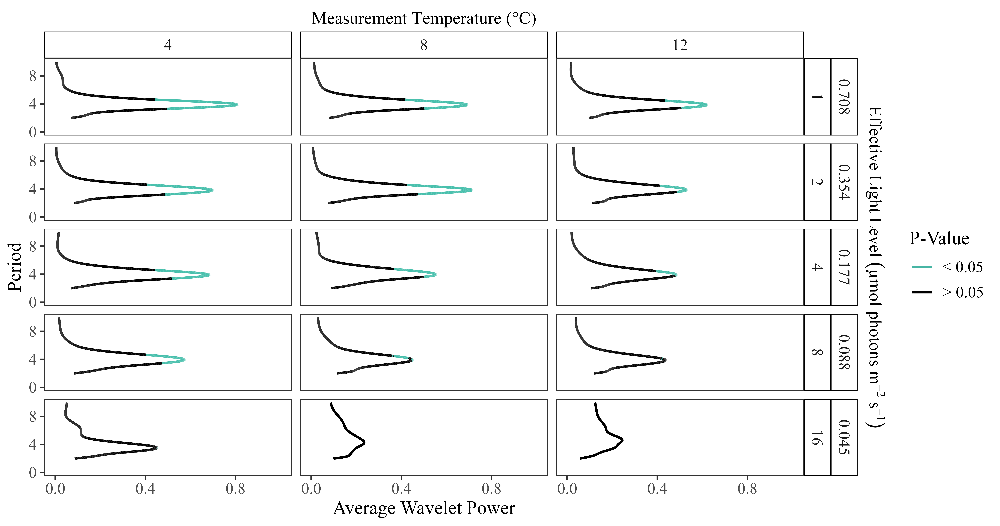
<p class="caption">(\#fig:cpriscuiwaveletpower)Sample plot of wavelet powers by period of oscillations in the maximum quantum yield of photochemistry Antarctic green algae *Chlamydomonas priscui*, grown at 4°C and 500 mM NaCl, and measured across a range of measurement temperatures and flash spacings, with the equivalent effective light levels. Regions where wavelet power reached statistical significance (p < 0.05) are shaded in blue.</p>
</div>

In contrast, in the temperate green algae *Chlamydomonas reinhardtii* (Figure \@ref(fig:creinhardtiiiwaveletpower)), the wavelet power is consistently lower, showing a weaker 4-step periodicity of ChlF in the temperate taxa, which only reaches statistical significance at shorter flash spacings, with higher equivalent effective light levels. 

<div class="figure">
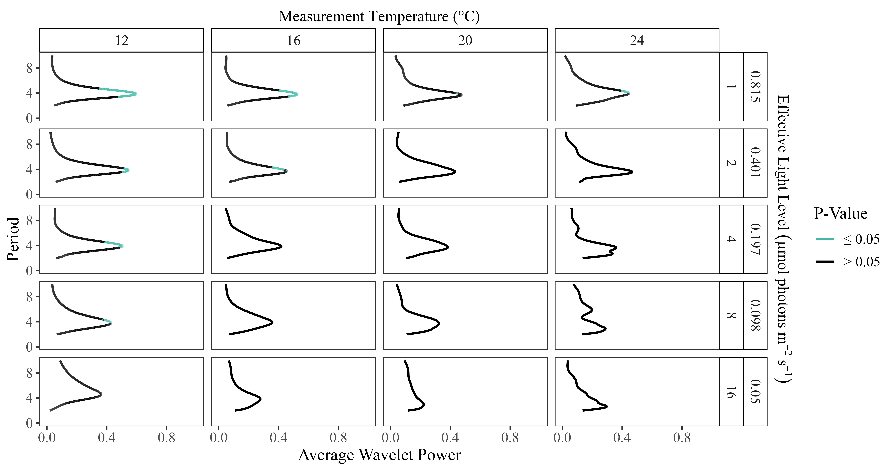
<p class="caption">(\#fig:creinhardtiiiwaveletpower)Sample plot of wavelet powers by period of oscillations in the maximum quantum yield of photochemistry in the temperate green algae *Chlamydomonas reinhardtii*, grown at 24°C and 0.43 mM NaCl, and measured across a range of measurement temperatures and flash spacings, with the equivalent effective light levels. Regions where wavelet power reached statistical significance (p < 0.05) shaded in blue.</p>
</div>


## Generalized Additive Modelling of Damping of 4-step oscillations By Measurement Temperature {.unnumbered}

Predictions from generalized additive modelling were generated for the damping of S-State-induced chlorophyll fluorescence oscillations, as predicted by the tensor product smooth of the temperature during measurements (°C) and the equivalent effective light level (µmol photons m^-2^s^-1^) set by flash spacing, for each strain; Table \@ref(tab:fluormeas); Table \@ref(tab:gammodeltemp).  All of the model fits explained over 50% of the variation in the response variable, damping index, except the GAM fits for *C. euryale*, which failed to fit. Both diatom taxa exhibited the longest predicted periodic oscillations in ChlF at higher effective light levels and lower temperatures. Notably, the polar *Fragilariopsis cylindrus* sustained cycling longer than its temperate counterpart, *Thalassiosira pseudonana*, under comparable conditions. This disparity was particularly prevalent at measurements taken above the growth temperature and when longer spacing between flashes produced lower effective light levels (Fig \@ref(fig:diatomsgamtemp)), where *Thalassiosira pseudonana* cultures did not retain the significant 4-step oscillation in ChlF indicative of synchronized S-State cycling. 

Similarly the GAM outputs varied  among the green algae tested (Table \@ref(tab:gammodeltemp)). The polar, saline strains *Chlamydomonas* ICEMDV, *Chlamydomonas malina* and *Chlamydomonas priscui* showed GAM model predictions of maximum damping indices of ~ 10-11 flashes, centred at lower temperatures  but extending over a wide range of effective light levels
(Fig \@ref(fig:greensgamtemp)). The polar freshwater **Chlamydomonas klinobasis* also showed maximum damping indices at lower temperatures, across a range of effective light levels.  Further, much like the temperate diatoms, the freshwater temperate algae *Chlamydomonas reinhardtii* and *Chlorella vulgaris* did not exhibit significant periodic oscillations in ChlF at measurement temperatures near or above their growth temperature, under longer flash spacings equivalent to lower light. The marine temperate *Chlamydomonas klinobasis* did not generate a statistically significant GAM model, consistent with limited evidence for periodic oscillations from *Chlamydomonas klinobasis*.

<table>
 <thead>
  <tr>
   <th style="text-align:left;"> Strain </th>
   <th style="text-align:left;"> term </th>
   <th style="text-align:right;"> edf </th>
   <th style="text-align:right;"> ref.df </th>
   <th style="text-align:right;"> statistic </th>
   <th style="text-align:right;"> p.value </th>
  </tr>
 </thead>
<tbody>
  <tr>
   <td style="text-align:left;"> Fragilariopsis_cylindrus </td>
   <td style="text-align:left;"> s(LightLevel_ue) </td>
   <td style="text-align:right;"> 1.829 </td>
   <td style="text-align:right;"> 1.971 </td>
   <td style="text-align:right;"> 4.714 </td>
   <td style="text-align:right;"> 0.032 </td>
  </tr>
  <tr>
   <td style="text-align:left;"> Fragilariopsis_cylindrus </td>
   <td style="text-align:left;"> s(Temp_C) </td>
   <td style="text-align:right;"> 1.000 </td>
   <td style="text-align:right;"> 1.000 </td>
   <td style="text-align:right;"> 0.056 </td>
   <td style="text-align:right;"> 0.817 </td>
  </tr>
  <tr>
   <td style="text-align:left;"> Fragilariopsis_cylindrus </td>
   <td style="text-align:left;"> ti(Temp_C,LightLevel_ue) </td>
   <td style="text-align:right;"> 1.000 </td>
   <td style="text-align:right;"> 1.000 </td>
   <td style="text-align:right;"> 0.032 </td>
   <td style="text-align:right;"> 0.860 </td>
  </tr>
  <tr>
   <td style="text-align:left;"> Fragilariopsis_cylindrus </td>
   <td style="text-align:left;"> s(LightLevel_ue) </td>
   <td style="text-align:right;"> 1.105 </td>
   <td style="text-align:right;"> 1.196 </td>
   <td style="text-align:right;"> 3.267 </td>
   <td style="text-align:right;"> 0.069 </td>
  </tr>
  <tr>
   <td style="text-align:left;"> Fragilariopsis_cylindrus </td>
   <td style="text-align:left;"> s(Temp_C) </td>
   <td style="text-align:right;"> 1.000 </td>
   <td style="text-align:right;"> 1.000 </td>
   <td style="text-align:right;"> 2.355 </td>
   <td style="text-align:right;"> 0.146 </td>
  </tr>
  <tr>
   <td style="text-align:left;"> Fragilariopsis_cylindrus </td>
   <td style="text-align:left;"> ti(Temp_C,LightLevel_ue) </td>
   <td style="text-align:right;"> 1.457 </td>
   <td style="text-align:right;"> 1.702 </td>
   <td style="text-align:right;"> 2.817 </td>
   <td style="text-align:right;"> 0.178 </td>
  </tr>
  <tr>
   <td style="text-align:left;"> Chlorella_vulgaris </td>
   <td style="text-align:left;"> s(LightLevel_ue) </td>
   <td style="text-align:right;"> 1.943 </td>
   <td style="text-align:right;"> 1.997 </td>
   <td style="text-align:right;"> 8.412 </td>
   <td style="text-align:right;"> 0.002 </td>
  </tr>
  <tr>
   <td style="text-align:left;"> Chlorella_vulgaris </td>
   <td style="text-align:left;"> s(Temp_C) </td>
   <td style="text-align:right;"> 1.893 </td>
   <td style="text-align:right;"> 1.989 </td>
   <td style="text-align:right;"> 4.706 </td>
   <td style="text-align:right;"> 0.022 </td>
  </tr>
  <tr>
   <td style="text-align:left;"> Chlorella_vulgaris </td>
   <td style="text-align:left;"> ti(Temp_C,LightLevel_ue) </td>
   <td style="text-align:right;"> 1.000 </td>
   <td style="text-align:right;"> 1.000 </td>
   <td style="text-align:right;"> 0.710 </td>
   <td style="text-align:right;"> 0.410 </td>
  </tr>
  <tr>
   <td style="text-align:left;"> Thalassiosira_pseudonana </td>
   <td style="text-align:left;"> s(LightLevel_ue) </td>
   <td style="text-align:right;"> 1.955 </td>
   <td style="text-align:right;"> 1.993 </td>
   <td style="text-align:right;"> 10.252 </td>
   <td style="text-align:right;"> 0.000 </td>
  </tr>
  <tr>
   <td style="text-align:left;"> Thalassiosira_pseudonana </td>
   <td style="text-align:left;"> s(Temp_C) </td>
   <td style="text-align:right;"> 1.000 </td>
   <td style="text-align:right;"> 1.001 </td>
   <td style="text-align:right;"> 2.834 </td>
   <td style="text-align:right;"> 0.103 </td>
  </tr>
  <tr>
   <td style="text-align:left;"> Thalassiosira_pseudonana </td>
   <td style="text-align:left;"> ti(Temp_C,LightLevel_ue) </td>
   <td style="text-align:right;"> 2.174 </td>
   <td style="text-align:right;"> 2.631 </td>
   <td style="text-align:right;"> 3.957 </td>
   <td style="text-align:right;"> 0.038 </td>
  </tr>
  <tr>
   <td style="text-align:left;"> Chlamydomonas_euryale </td>
   <td style="text-align:left;"> s(LightLevel_ue) </td>
   <td style="text-align:right;"> 1.000 </td>
   <td style="text-align:right;"> 1.000 </td>
   <td style="text-align:right;"> 188.809 </td>
   <td style="text-align:right;"> 0.000 </td>
  </tr>
  <tr>
   <td style="text-align:left;"> Chlamydomonas_euryale </td>
   <td style="text-align:left;"> s(Temp_C) </td>
   <td style="text-align:right;"> 1.963 </td>
   <td style="text-align:right;"> 1.000 </td>
   <td style="text-align:right;"> 537.239 </td>
   <td style="text-align:right;"> 0.000 </td>
  </tr>
  <tr>
   <td style="text-align:left;"> Chlamydomonas_euryale </td>
   <td style="text-align:left;"> ti(Temp_C,LightLevel_ue) </td>
   <td style="text-align:right;"> 1.000 </td>
   <td style="text-align:right;"> 1.000 </td>
   <td style="text-align:right;"> 42.557 </td>
   <td style="text-align:right;"> 0.000 </td>
  </tr>
  <tr>
   <td style="text-align:left;"> Chlamydomonas_ICEMDV </td>
   <td style="text-align:left;"> s(LightLevel_ue) </td>
   <td style="text-align:right;"> 1.736 </td>
   <td style="text-align:right;"> 1.930 </td>
   <td style="text-align:right;"> 3.331 </td>
   <td style="text-align:right;"> 0.067 </td>
  </tr>
  <tr>
   <td style="text-align:left;"> Chlamydomonas_ICEMDV </td>
   <td style="text-align:left;"> s(Temp_C) </td>
   <td style="text-align:right;"> 1.000 </td>
   <td style="text-align:right;"> 1.000 </td>
   <td style="text-align:right;"> 0.305 </td>
   <td style="text-align:right;"> 0.593 </td>
  </tr>
  <tr>
   <td style="text-align:left;"> Chlamydomonas_ICEMDV </td>
   <td style="text-align:left;"> ti(Temp_C,LightLevel_ue) </td>
   <td style="text-align:right;"> 1.000 </td>
   <td style="text-align:right;"> 1.000 </td>
   <td style="text-align:right;"> 0.029 </td>
   <td style="text-align:right;"> 0.868 </td>
  </tr>
  <tr>
   <td style="text-align:left;"> Chlamydomonas_klinobasis </td>
   <td style="text-align:left;"> s(LightLevel_ue) </td>
   <td style="text-align:right;"> 1.849 </td>
   <td style="text-align:right;"> 1.977 </td>
   <td style="text-align:right;"> 5.809 </td>
   <td style="text-align:right;"> 0.013 </td>
  </tr>
  <tr>
   <td style="text-align:left;"> Chlamydomonas_klinobasis </td>
   <td style="text-align:left;"> s(Temp_C) </td>
   <td style="text-align:right;"> 1.253 </td>
   <td style="text-align:right;"> 1.442 </td>
   <td style="text-align:right;"> 2.066 </td>
   <td style="text-align:right;"> 0.148 </td>
  </tr>
  <tr>
   <td style="text-align:left;"> Chlamydomonas_klinobasis </td>
   <td style="text-align:left;"> ti(Temp_C,LightLevel_ue) </td>
   <td style="text-align:right;"> 1.000 </td>
   <td style="text-align:right;"> 1.000 </td>
   <td style="text-align:right;"> 2.758 </td>
   <td style="text-align:right;"> 0.119 </td>
  </tr>
  <tr>
   <td style="text-align:left;"> Chlamydomonas_malina </td>
   <td style="text-align:left;"> s(LightLevel_ue) </td>
   <td style="text-align:right;"> 1.839 </td>
   <td style="text-align:right;"> 1.974 </td>
   <td style="text-align:right;"> 3.735 </td>
   <td style="text-align:right;"> 0.057 </td>
  </tr>
  <tr>
   <td style="text-align:left;"> Chlamydomonas_malina </td>
   <td style="text-align:left;"> s(Temp_C) </td>
   <td style="text-align:right;"> 1.000 </td>
   <td style="text-align:right;"> 1.000 </td>
   <td style="text-align:right;"> 0.537 </td>
   <td style="text-align:right;"> 0.477 </td>
  </tr>
  <tr>
   <td style="text-align:left;"> Chlamydomonas_malina </td>
   <td style="text-align:left;"> ti(Temp_C,LightLevel_ue) </td>
   <td style="text-align:right;"> 1.000 </td>
   <td style="text-align:right;"> 1.000 </td>
   <td style="text-align:right;"> 0.989 </td>
   <td style="text-align:right;"> 0.338 </td>
  </tr>
  <tr>
   <td style="text-align:left;"> Chlamydomonas_priscui </td>
   <td style="text-align:left;"> s(LightLevel_ue) </td>
   <td style="text-align:right;"> 1.904 </td>
   <td style="text-align:right;"> 1.991 </td>
   <td style="text-align:right;"> 11.072 </td>
   <td style="text-align:right;"> 0.000 </td>
  </tr>
  <tr>
   <td style="text-align:left;"> Chlamydomonas_priscui </td>
   <td style="text-align:left;"> s(Temp_C) </td>
   <td style="text-align:right;"> 1.767 </td>
   <td style="text-align:right;"> 1.946 </td>
   <td style="text-align:right;"> 7.211 </td>
   <td style="text-align:right;"> 0.002 </td>
  </tr>
  <tr>
   <td style="text-align:left;"> Chlamydomonas_priscui </td>
   <td style="text-align:left;"> ti(Temp_C,LightLevel_ue) </td>
   <td style="text-align:right;"> 1.000 </td>
   <td style="text-align:right;"> 1.000 </td>
   <td style="text-align:right;"> 7.782 </td>
   <td style="text-align:right;"> 0.008 </td>
  </tr>
  <tr>
   <td style="text-align:left;"> Chlamydomonas_reinhardtii </td>
   <td style="text-align:left;"> s(LightLevel_ue) </td>
   <td style="text-align:right;"> 1.866 </td>
   <td style="text-align:right;"> 1.934 </td>
   <td style="text-align:right;"> 2.549 </td>
   <td style="text-align:right;"> 0.107 </td>
  </tr>
  <tr>
   <td style="text-align:left;"> Chlamydomonas_reinhardtii </td>
   <td style="text-align:left;"> s(Temp_C) </td>
   <td style="text-align:right;"> 1.000 </td>
   <td style="text-align:right;"> 1.000 </td>
   <td style="text-align:right;"> 6.538 </td>
   <td style="text-align:right;"> 0.015 </td>
  </tr>
  <tr>
   <td style="text-align:left;"> Chlamydomonas_reinhardtii </td>
   <td style="text-align:left;"> ti(Temp_C,LightLevel_ue) </td>
   <td style="text-align:right;"> 2.194 </td>
   <td style="text-align:right;"> 2.649 </td>
   <td style="text-align:right;"> 1.076 </td>
   <td style="text-align:right;"> 0.485 </td>
  </tr>
</tbody>
</table>


<div class="figure">

<p class="caption">(\#fig:diatomsgamtemp)GAM models for polar and temperate diatoms, of consecutive flashes before damping of SState induced chlorophyll fluorescence oscillations. GAM model predicted by the temperature (°C) imposed during measurements and the effective light level (µmol photons m^-2^s^-1^, estimated from flash spacings in seconds). Black dashed vertical lines represent the growth temperatures.  Measurement temperatures varied across taxa but the temperature scaling range is comparable across plots.</p>
</div>


<div class="figure">

<p class="caption">(\#fig:greensgamtemp)GAM models for polar and temperate green algae, of consecutive flashes before damping of SState induced chlorophyll fluorescence oscillations. GAM model predicted by the difference from growth temperature (Δ°C) during measurements and the effective light level (µmol photons m^-2^s^-1^, estimated from flash spacings in seconds). Black dashed vertical lines represent the growth temperatures. Measurement temperatures varied across taxa but the temperature scaling range is comparable across plots.</p>
</div>

Within, and across, species of *Chlamydomonas* XXXXCITE Pomona PaperXXXX growth under higher salinities increases maintenance of F~V~/F~M~ and photosynthetic capacity during stress.  We therefore grew each *Chlamydomonas* strain across three growth-permissive salinities \@ref(tab:taxacultures)  and performed saturating flash trains over a range of flash spacings, and at measurement temperatures flanking the growth temperature for each taxa.  We ran an ANOVA for damping indices testing effects of taxa, effective equivalent light level (derived from the saturating flash spacing and 𝛔~PSII~), measurement temperature, and the growth concentration of NaCl, with interactions among all factors \@ref(tab:chlamyaovfullinteract).  As expected, taxa, effective equivalent light level and measurement temperature all showed strongly significant influences on damping indices.  NaCl concentration also showed a significant influence on damping indices across strains, with a significant interaction with effective equivalent light level.


```
##                                      Df Sum Sq Mean Sq F value   Pr(>F)    
## Strain                                4 2128.0   532.0  78.485  < 2e-16 ***
## LightLevel_ue                         1  576.5   576.5  85.051  < 2e-16 ***
## Temp_C                                1  488.2   488.2  72.015 1.18e-15 ***
## NaCl_mM                               1   35.2    35.2   5.198   0.0233 *  
## Strain:LightLevel_ue                  4  368.9    92.2  13.606 3.65e-10 ***
## Strain:Temp_C                         4  203.3    50.8   7.498 9.36e-06 ***
## LightLevel_ue:Temp_C                  1    1.4     1.4   0.211   0.6463    
## Strain:NaCl_mM                        4   39.2     9.8   1.445   0.2193    
## LightLevel_ue:NaCl_mM                 1   26.9    26.9   3.967   0.0474 *  
## Temp_C:NaCl_mM                        1   10.9    10.9   1.604   0.2064    
## Strain:LightLevel_ue:Temp_C           4   74.0    18.5   2.729   0.0295 *  
## Strain:LightLevel_ue:NaCl_mM          4    8.2     2.0   0.302   0.8767    
## Strain:Temp_C:NaCl_mM                 4   46.7    11.7   1.721   0.1454    
## LightLevel_ue:Temp_C:NaCl_mM          1    5.4     5.4   0.797   0.3727    
## Strain:LightLevel_ue:Temp_C:NaCl_mM   4   37.8     9.5   1.396   0.2355    
## Residuals                           285 1931.9     6.8                     
## ---
## Signif. codes:  0 '***' 0.001 '**' 0.01 '*' 0.05 '.' 0.1 ' ' 1
```


We then ran the ANOVA for each taxa separately \@ref(tab:chlamystrainsaovinteract).  Within a taxa only *Chlamydomonas priscui* showed a significant effect of NaCl on damping indices, suggesting the statistical influence of NaCl detected across taxa derives from different taxa growing at different salinites and showing different responses of damping indices, rather than a direct effect of NaCl on damping indices in most strains.


```
## # A tibble: 8 x 7
##   Strain    Strains_aovinteract_~1 Strains_aovinteract_~2 Strains_aovinteract_~3
##   <chr>     <chr>                                   <dbl>                  <dbl>
## 1 Chlamydo~ LightLevel_ue                               1                   30.5
## 2 Chlamydo~ LightLevel_ue                               1                  550. 
## 3 Chlamydo~ Temp_C                                      1                  137. 
## 4 Chlamydo~ LightLevel_ue                               1                  140. 
## 5 Chlamydo~ LightLevel_ue                               1                  255. 
## 6 Chlamydo~ Temp_C                                      1                  476. 
## 7 Chlamydo~ NaCl_mM                                     1                   39.6
## 8 Chlamydo~ Temp_C                                      1                   18.5
## # i abbreviated names: 1: Strains_aovinteract_Param_term,
## #   2: Strains_aovinteract_Param_df, 3: Strains_aovinteract_Param_sumsq
## # i 3 more variables: Strains_aovinteract_Param_meansq <dbl>,
## #   Strains_aovinteract_Param_statistic <dbl>,
## #   Strains_aovinteract_Param_p.value <dbl>
```

# Discussion {.unnumbered}

Across all study strains ChlF oscillations, provoked by a series of single turnover saturating flashes, showed wavelet power at a period of four, that declined with increasing measurement temperatures and increasing spacing of flashes, equivalent to decreasing light. Thus sustained synchronized S-State cycling of PSII decayed faster under higher temperatures and lower equivalent light (Figures \@ref(fig:cpriscuiwaveletpower)) [@dewijnSstateDependenceMiss2002]. While light absorption and excitation energy transfer within PSII are not temperature-sensitive, the redox reactions associated with downstream electron transport are highly temperature-dependent [@hunerPhotosyntheticAdaptationMulticellularity2023]. Furthermore, the probabilities of charge recombinations decrease as temperature drops below the activation energies for recombination paths, 21 - 29 °C for recombination to S2 from Q~A~^-^, or  35 - 41 for recombination to S2 from Q~B~^-^ [@ivanovAcclimationTemperatureIrradiance2006; ]. This temperature dependence may interact with acclimatory mechanisms to regulate photosynthetic electron flow, S-State transitions, and energy partitioning [@hunerPhotosyntheticAdaptationMulticellularity2023].

The desynchronization of S-State cycling among the PSII in a population indicates that sufficient photochemical misses, including charge recombinations, have taken place to create a PSII population with a randomized distribution of S-States. Thus, if this desynchronization occurs after fewer consecutive flashes, it signifies an increased proportion of PSII undergoing photochemical misses for each flash. By inference, PSII populations with increased incidence of energetically wasteful misses, including charge recombinations, such as those under high temperatures and low light levels, are less efficient in their photosynthetic energy conversion [@rappaportChargeRecombinationThermoluminescence2005], which becomes a critical factor for maintaining photosynthesis under low light, with wide spacings between sequential excitations of each PSII.  While light absorption and excitation energy transfer within PSII are not temperature-sensitive, the redox reactions associated with downstream electron transport are highly temperature-dependent [@hunerPhotosyntheticAdaptationMulticellularity2023]. Furthermore, the probability of charge recombinations decrease below room temperature [@ivanovAcclimationTemperatureIrradiance2006; @hanDirectQuantificationFour2008], as temperature drops below the activation energies for recombination paths. This temperature dependence may interact with acclimatory mechanisms to regulate photosynthetic electron flow, S-State transitions, and energy partitioning [@hunerPhotosyntheticAdaptationMulticellularity2023].

These results are consistent with previous literature evaluating the responses of photochemical misses to light conditions. As light levels decline, there are longer intervals between successive PSII excitations, pushing fewer electrons through the electron transport chain [@kerenMechanismPhotosystemII1997]. Consequently, the probability of energetically wasteful charge recombinations is higher over the longer intervals between excitations, leading to weaker maintenance of S-State cycling [@kerenMechanismPhotosystemII1997; @dewijnSstateDependenceMiss2002]. These findings are consistent with recombination reactions decreasing with temperature [@ivanovAcclimationTemperatureIrradiance2006] as ambient temperature falls below the activation temperatures of the recombinations.  In contrast, in PSII-enriched membrane fractions isolated from spinach, the average miss probability of S-State transitions was highest at -10 °C and lowest at 10 °C [@hanMolecularBasisTurnover2022].

*Chlamydomonas* sp. ICE-MDV, *Chlamydomonas malina* and  *Chlamydomonas priscui* originate from Lake Bonney in Antarctica, but previous work found differential responses to light among the strains.  Unlike the obligately shade-adapted *Chlamydomonas priscui* that is only present in the deep photic zone, *Chlamydomonas* sp. ICE-MDV has been isolated from various depths within the lake (@liInfluenceEnvironmentalDrivers2019) including shallow and seasonally open waters (@sherwellAntarcticLakePhytoplankton2022) where it encounters a wider range of light conditions. Thus, in contrast with *Chlamydomonas priscui* that has a “locked” physiology, *Chlamydomonas* sp. ICE-MDV has retained the ability to balance excitation pressure through state transitions (@kalraHighSaltinducedPSIsupercomplex2023), can modify its photosynthetic apparatus due to nutrient availability (@cookAntarcticPsychrophilesChlamydomonas2019), exhibits phototactic motility in response to light signals (@poirierAberrantLightSensing) and can successfully acclimate to a range of wavelengths and light intensities (@poirierLightQualityAffects2025). It is evident that physiological differences exist among polar species, likely as a result of life in comparably cold, but otherwise differing environments. 

Nevertheless, strong, sustained periodicity of ChlF emissions is a common trait across the diverse polar strains of diatoms and green algae  (Figures \@ref(fig:cpriscuiwaveletpower);  \@ref(fig:creinhardtiiiwaveletpower);  \@ref(fig:diatomsgamtemp);  \@ref(fig:greensgamtemp). Further, the polar exhibited significant 4-step ChlF oscillations under a broader range of measurement conditions around their growth temperatures than did their temperate counterparts. These findings illustrate that polar phytoplankton species, at and around their lower growth temperatures, show higher capacity to maintain synchronized S-State cycling than do temperate strains around their higher growth temperatures.  The rates of photochemical misses, notably through charge recombinations, relative to productive photochemistry, increase under lower light and higher temperatures [@kerenMechanismPhotosystemII1997; @ivanovAcclimationTemperatureIrradiance2006]. Thus, sustained synchronized S-State cycling reflects suppression of energetically wasteful photochemical misses in the polar strains, measured at the lower growth temperatures possible for poalr strains. Stable S-State cycling and minimizing energy losses through charge recombination support electron flow, sustaining ATP and NADPH production, and minimizing the risk of photodamage to the photosynthetic machinery [@rappaportChargeRecombinationThermoluminescence2005; @kerenMechanismPhotosystemII1997]. Thus, sustaining PSII function even under widely spaced excitations appears as an emergent property for the productivity of polar phytoplankton under the ice during the polar night. 

Salinities vary widely across the habitats of the tested strains, and fluctuate within some habitats during ice formation and melting XXXMACKENZIE CITATIONSXXXX.  Higher salinity stabilizes PSII function under stress across strains of *Chlamydomonas* XXXXPOMONA CITATIONXXX. 
NaCl concentration showed an influence on dampening indices when analyzed across all tested *Chlamydomonas* taxa, but when tested within taxa, NaCl only showed an influence within *Chlamydomonas priscui*.  It is important to note that faster desynchronization of S-State cycling does not indicate a loss nor instability of PSII function *per se*. Instad, desynchronization reflects randomization of the S-States of the PSII population. Prolonged synchronization under low effective light levels is thus an indicator of the capacity of PSII to exploit widely spaced photons under low light, not the stability of PSII function.

Understanding and detecting mechanisms enabling polar phytoplankton to sustain slow, but significant, productivity under the ice in the winter can help predict the changing dynamics of spring phytoplankton blooms, in the face of rapid warming [@ardynaPhytoplanktonDynamicsChanging2020]. Beyond direct temperature changes, polar aquatic ecosystems are experiencing declines in sea ice extent and thickness, escalating freshwater inputs, acidification, and increased winds and storms [@ardynaPhytoplanktonDynamicsChanging2020; @cvetkovskaTemperatureStressPsychrophilic2022]. These pressures are altering the productivity and seasonal peaks of phytoplankton blooms [@ardynaPhytoplanktonDynamicsChanging2020]. Maintaining photosynthetic energy conversion over winter is crucial for the timing and speed of spring bloom initiation [@hanckeExtremeLowLight2018]. Our findings indicate that low growth temperature is a factor enabling phytoplankton to exploit extreme low light. Taxa with this capacity then possess a competitive advantage in quickly initiating spring growth, giving them first access to the nutrients required to form an extensive bloom and in turn, exert bottom-up effects on changing polar ecosystems [@ardynaPhytoplanktonDynamicsChanging2020]. 


# Acknowledgements {.unnumbered}

# Supporting information {.unnumbered}

<table class=" lightable-classic" style='font-family: "Arial Narrow", "Source Sans Pro", sans-serif; margin-left: auto; margin-right: auto;'>
<caption>(\#tab:fluormeas)Study taxa and single turnover saturating flash measurement conditions, with equivalent effective light levels (µmol photons m^-2^s^-1^).</caption>
 <thead>
  <tr>
   <th style="text-align:left;"> Taxa </th>
   <th style="text-align:right;"> Flash Spacings (s) </th>
   <th style="text-align:right;"> Measurement Temperatures (°C) </th>
   <th style="text-align:right;"> Equivalent Light (µE) </th>
   <th style="text-align:right;"> Growth Temperatures (°C) </th>
   <th style="text-align:right;"> NaCl (mM) </th>
  </tr>
 </thead>
<tbody>
  <tr>
   <td style="text-align:left;font-style: italic;"> Chlamydomonas_euryale </td>
   <td style="text-align:right;"> 1 </td>
   <td style="text-align:right;"> 16 </td>
   <td style="text-align:right;"> 0.70619 </td>
   <td style="text-align:right;"> 24 </td>
   <td style="text-align:right;"> 30.00 </td>
  </tr>
  <tr>
   <td style="text-align:left;font-style: italic;"> Chlamydomonas_euryale </td>
   <td style="text-align:right;"> 1 </td>
   <td style="text-align:right;"> 16 </td>
   <td style="text-align:right;"> 0.73733 </td>
   <td style="text-align:right;"> 24 </td>
   <td style="text-align:right;"> 70.00 </td>
  </tr>
  <tr>
   <td style="text-align:left;font-style: italic;"> Chlamydomonas_euryale </td>
   <td style="text-align:right;"> 1 </td>
   <td style="text-align:right;"> 16 </td>
   <td style="text-align:right;"> 0.76025 </td>
   <td style="text-align:right;"> 24 </td>
   <td style="text-align:right;"> 500.00 </td>
  </tr>
  <tr>
   <td style="text-align:left;font-style: italic;"> Chlamydomonas_euryale </td>
   <td style="text-align:right;"> 1 </td>
   <td style="text-align:right;"> 20 </td>
   <td style="text-align:right;"> 0.70195 </td>
   <td style="text-align:right;"> 24 </td>
   <td style="text-align:right;"> 30.00 </td>
  </tr>
  <tr>
   <td style="text-align:left;font-style: italic;"> Chlamydomonas_euryale </td>
   <td style="text-align:right;"> 1 </td>
   <td style="text-align:right;"> 20 </td>
   <td style="text-align:right;"> 0.71115 </td>
   <td style="text-align:right;"> 24 </td>
   <td style="text-align:right;"> 70.00 </td>
  </tr>
  <tr>
   <td style="text-align:left;font-style: italic;"> Chlamydomonas_euryale </td>
   <td style="text-align:right;"> 1 </td>
   <td style="text-align:right;"> 20 </td>
   <td style="text-align:right;"> 0.74576 </td>
   <td style="text-align:right;"> 24 </td>
   <td style="text-align:right;"> 500.00 </td>
  </tr>
  <tr>
   <td style="text-align:left;font-style: italic;"> Chlamydomonas_euryale </td>
   <td style="text-align:right;"> 1 </td>
   <td style="text-align:right;"> 24 </td>
   <td style="text-align:right;"> 0.71579 </td>
   <td style="text-align:right;"> 24 </td>
   <td style="text-align:right;"> 30.00 </td>
  </tr>
  <tr>
   <td style="text-align:left;font-style: italic;"> Chlamydomonas_euryale </td>
   <td style="text-align:right;"> 1 </td>
   <td style="text-align:right;"> 24 </td>
   <td style="text-align:right;"> 0.74750 </td>
   <td style="text-align:right;"> 24 </td>
   <td style="text-align:right;"> 70.00 </td>
  </tr>
  <tr>
   <td style="text-align:left;font-style: italic;"> Chlamydomonas_euryale </td>
   <td style="text-align:right;"> 1 </td>
   <td style="text-align:right;"> 24 </td>
   <td style="text-align:right;"> 0.75646 </td>
   <td style="text-align:right;"> 24 </td>
   <td style="text-align:right;"> 500.00 </td>
  </tr>
  <tr>
   <td style="text-align:left;font-style: italic;"> Chlamydomonas_euryale </td>
   <td style="text-align:right;"> 1 </td>
   <td style="text-align:right;"> 28 </td>
   <td style="text-align:right;"> 0.69095 </td>
   <td style="text-align:right;"> 24 </td>
   <td style="text-align:right;"> 30.00 </td>
  </tr>
  <tr>
   <td style="text-align:left;font-style: italic;"> Chlamydomonas_euryale </td>
   <td style="text-align:right;"> 1 </td>
   <td style="text-align:right;"> 28 </td>
   <td style="text-align:right;"> 0.71163 </td>
   <td style="text-align:right;"> 24 </td>
   <td style="text-align:right;"> 70.00 </td>
  </tr>
  <tr>
   <td style="text-align:left;font-style: italic;"> Chlamydomonas_euryale </td>
   <td style="text-align:right;"> 1 </td>
   <td style="text-align:right;"> 28 </td>
   <td style="text-align:right;"> 0.71551 </td>
   <td style="text-align:right;"> 24 </td>
   <td style="text-align:right;"> 500.00 </td>
  </tr>
  <tr>
   <td style="text-align:left;font-style: italic;"> Chlamydomonas_euryale </td>
   <td style="text-align:right;"> 2 </td>
   <td style="text-align:right;"> 16 </td>
   <td style="text-align:right;"> 0.35324 </td>
   <td style="text-align:right;"> 24 </td>
   <td style="text-align:right;"> 30.00 </td>
  </tr>
  <tr>
   <td style="text-align:left;font-style: italic;"> Chlamydomonas_euryale </td>
   <td style="text-align:right;"> 2 </td>
   <td style="text-align:right;"> 16 </td>
   <td style="text-align:right;"> 0.37070 </td>
   <td style="text-align:right;"> 24 </td>
   <td style="text-align:right;"> 500.00 </td>
  </tr>
  <tr>
   <td style="text-align:left;font-style: italic;"> Chlamydomonas_euryale </td>
   <td style="text-align:right;"> 2 </td>
   <td style="text-align:right;"> 20 </td>
   <td style="text-align:right;"> 0.34453 </td>
   <td style="text-align:right;"> 24 </td>
   <td style="text-align:right;"> 30.00 </td>
  </tr>
  <tr>
   <td style="text-align:left;font-style: italic;"> Chlamydomonas_euryale </td>
   <td style="text-align:right;"> 2 </td>
   <td style="text-align:right;"> 20 </td>
   <td style="text-align:right;"> 0.34781 </td>
   <td style="text-align:right;"> 24 </td>
   <td style="text-align:right;"> 70.00 </td>
  </tr>
  <tr>
   <td style="text-align:left;font-style: italic;"> Chlamydomonas_euryale </td>
   <td style="text-align:right;"> 2 </td>
   <td style="text-align:right;"> 20 </td>
   <td style="text-align:right;"> 0.35646 </td>
   <td style="text-align:right;"> 24 </td>
   <td style="text-align:right;"> 500.00 </td>
  </tr>
  <tr>
   <td style="text-align:left;font-style: italic;"> Chlamydomonas_euryale </td>
   <td style="text-align:right;"> 2 </td>
   <td style="text-align:right;"> 24 </td>
   <td style="text-align:right;"> 0.36837 </td>
   <td style="text-align:right;"> 24 </td>
   <td style="text-align:right;"> 70.00 </td>
  </tr>
  <tr>
   <td style="text-align:left;font-style: italic;"> Chlamydomonas_euryale </td>
   <td style="text-align:right;"> 2 </td>
   <td style="text-align:right;"> 24 </td>
   <td style="text-align:right;"> 0.36973 </td>
   <td style="text-align:right;"> 24 </td>
   <td style="text-align:right;"> 500.00 </td>
  </tr>
  <tr>
   <td style="text-align:left;font-style: italic;"> Chlamydomonas_euryale </td>
   <td style="text-align:right;"> 2 </td>
   <td style="text-align:right;"> 24 </td>
   <td style="text-align:right;"> 0.37018 </td>
   <td style="text-align:right;"> 24 </td>
   <td style="text-align:right;"> 30.00 </td>
  </tr>
  <tr>
   <td style="text-align:left;font-style: italic;"> Chlamydomonas_euryale </td>
   <td style="text-align:right;"> 2 </td>
   <td style="text-align:right;"> 28 </td>
   <td style="text-align:right;"> 0.31991 </td>
   <td style="text-align:right;"> 24 </td>
   <td style="text-align:right;"> 30.00 </td>
  </tr>
  <tr>
   <td style="text-align:left;font-style: italic;"> Chlamydomonas_euryale </td>
   <td style="text-align:right;"> 2 </td>
   <td style="text-align:right;"> 28 </td>
   <td style="text-align:right;"> 0.35392 </td>
   <td style="text-align:right;"> 24 </td>
   <td style="text-align:right;"> 70.00 </td>
  </tr>
  <tr>
   <td style="text-align:left;font-style: italic;"> Chlamydomonas_euryale </td>
   <td style="text-align:right;"> 2 </td>
   <td style="text-align:right;"> 28 </td>
   <td style="text-align:right;"> 0.35483 </td>
   <td style="text-align:right;"> 24 </td>
   <td style="text-align:right;"> 500.00 </td>
  </tr>
  <tr>
   <td style="text-align:left;font-style: italic;"> Chlamydomonas_euryale </td>
   <td style="text-align:right;"> 4 </td>
   <td style="text-align:right;"> 16 </td>
   <td style="text-align:right;"> 0.17211 </td>
   <td style="text-align:right;"> 24 </td>
   <td style="text-align:right;"> 30.00 </td>
  </tr>
  <tr>
   <td style="text-align:left;font-style: italic;"> Chlamydomonas_euryale </td>
   <td style="text-align:right;"> 4 </td>
   <td style="text-align:right;"> 16 </td>
   <td style="text-align:right;"> 0.18028 </td>
   <td style="text-align:right;"> 24 </td>
   <td style="text-align:right;"> 70.00 </td>
  </tr>
  <tr>
   <td style="text-align:left;font-style: italic;"> Chlamydomonas_euryale </td>
   <td style="text-align:right;"> 4 </td>
   <td style="text-align:right;"> 16 </td>
   <td style="text-align:right;"> 0.18390 </td>
   <td style="text-align:right;"> 24 </td>
   <td style="text-align:right;"> 500.00 </td>
  </tr>
  <tr>
   <td style="text-align:left;font-style: italic;"> Chlamydomonas_euryale </td>
   <td style="text-align:right;"> 4 </td>
   <td style="text-align:right;"> 20 </td>
   <td style="text-align:right;"> 0.16972 </td>
   <td style="text-align:right;"> 24 </td>
   <td style="text-align:right;"> 30.00 </td>
  </tr>
  <tr>
   <td style="text-align:left;font-style: italic;"> Chlamydomonas_euryale </td>
   <td style="text-align:right;"> 4 </td>
   <td style="text-align:right;"> 20 </td>
   <td style="text-align:right;"> 0.17013 </td>
   <td style="text-align:right;"> 24 </td>
   <td style="text-align:right;"> 70.00 </td>
  </tr>
  <tr>
   <td style="text-align:left;font-style: italic;"> Chlamydomonas_euryale </td>
   <td style="text-align:right;"> 4 </td>
   <td style="text-align:right;"> 20 </td>
   <td style="text-align:right;"> 0.17835 </td>
   <td style="text-align:right;"> 24 </td>
   <td style="text-align:right;"> 500.00 </td>
  </tr>
  <tr>
   <td style="text-align:left;font-style: italic;"> Chlamydomonas_euryale </td>
   <td style="text-align:right;"> 4 </td>
   <td style="text-align:right;"> 24 </td>
   <td style="text-align:right;"> 0.17743 </td>
   <td style="text-align:right;"> 24 </td>
   <td style="text-align:right;"> 30.00 </td>
  </tr>
  <tr>
   <td style="text-align:left;font-style: italic;"> Chlamydomonas_euryale </td>
   <td style="text-align:right;"> 4 </td>
   <td style="text-align:right;"> 24 </td>
   <td style="text-align:right;"> 0.17970 </td>
   <td style="text-align:right;"> 24 </td>
   <td style="text-align:right;"> 70.00 </td>
  </tr>
  <tr>
   <td style="text-align:left;font-style: italic;"> Chlamydomonas_euryale </td>
   <td style="text-align:right;"> 4 </td>
   <td style="text-align:right;"> 24 </td>
   <td style="text-align:right;"> 0.18311 </td>
   <td style="text-align:right;"> 24 </td>
   <td style="text-align:right;"> 500.00 </td>
  </tr>
  <tr>
   <td style="text-align:left;font-style: italic;"> Chlamydomonas_euryale </td>
   <td style="text-align:right;"> 4 </td>
   <td style="text-align:right;"> 28 </td>
   <td style="text-align:right;"> 0.17541 </td>
   <td style="text-align:right;"> 24 </td>
   <td style="text-align:right;"> 70.00 </td>
  </tr>
  <tr>
   <td style="text-align:left;font-style: italic;"> Chlamydomonas_euryale </td>
   <td style="text-align:right;"> 4 </td>
   <td style="text-align:right;"> 28 </td>
   <td style="text-align:right;"> 0.17756 </td>
   <td style="text-align:right;"> 24 </td>
   <td style="text-align:right;"> 500.00 </td>
  </tr>
  <tr>
   <td style="text-align:left;font-style: italic;"> Chlamydomonas_euryale </td>
   <td style="text-align:right;"> 8 </td>
   <td style="text-align:right;"> 16 </td>
   <td style="text-align:right;"> 0.08293 </td>
   <td style="text-align:right;"> 24 </td>
   <td style="text-align:right;"> 30.00 </td>
  </tr>
  <tr>
   <td style="text-align:left;font-style: italic;"> Chlamydomonas_euryale </td>
   <td style="text-align:right;"> 8 </td>
   <td style="text-align:right;"> 16 </td>
   <td style="text-align:right;"> 0.08883 </td>
   <td style="text-align:right;"> 24 </td>
   <td style="text-align:right;"> 70.00 </td>
  </tr>
  <tr>
   <td style="text-align:left;font-style: italic;"> Chlamydomonas_euryale </td>
   <td style="text-align:right;"> 8 </td>
   <td style="text-align:right;"> 16 </td>
   <td style="text-align:right;"> 0.09005 </td>
   <td style="text-align:right;"> 24 </td>
   <td style="text-align:right;"> 500.00 </td>
  </tr>
  <tr>
   <td style="text-align:left;font-style: italic;"> Chlamydomonas_euryale </td>
   <td style="text-align:right;"> 8 </td>
   <td style="text-align:right;"> 20 </td>
   <td style="text-align:right;"> 0.08460 </td>
   <td style="text-align:right;"> 24 </td>
   <td style="text-align:right;"> 70.00 </td>
  </tr>
  <tr>
   <td style="text-align:left;font-style: italic;"> Chlamydomonas_euryale </td>
   <td style="text-align:right;"> 8 </td>
   <td style="text-align:right;"> 20 </td>
   <td style="text-align:right;"> 0.08532 </td>
   <td style="text-align:right;"> 24 </td>
   <td style="text-align:right;"> 30.00 </td>
  </tr>
  <tr>
   <td style="text-align:left;font-style: italic;"> Chlamydomonas_euryale </td>
   <td style="text-align:right;"> 8 </td>
   <td style="text-align:right;"> 20 </td>
   <td style="text-align:right;"> 0.08600 </td>
   <td style="text-align:right;"> 24 </td>
   <td style="text-align:right;"> 500.00 </td>
  </tr>
  <tr>
   <td style="text-align:left;font-style: italic;"> Chlamydomonas_euryale </td>
   <td style="text-align:right;"> 8 </td>
   <td style="text-align:right;"> 24 </td>
   <td style="text-align:right;"> 0.08677 </td>
   <td style="text-align:right;"> 24 </td>
   <td style="text-align:right;"> 70.00 </td>
  </tr>
  <tr>
   <td style="text-align:left;font-style: italic;"> Chlamydomonas_euryale </td>
   <td style="text-align:right;"> 8 </td>
   <td style="text-align:right;"> 24 </td>
   <td style="text-align:right;"> 0.09158 </td>
   <td style="text-align:right;"> 24 </td>
   <td style="text-align:right;"> 500.00 </td>
  </tr>
  <tr>
   <td style="text-align:left;font-style: italic;"> Chlamydomonas_euryale </td>
   <td style="text-align:right;"> 8 </td>
   <td style="text-align:right;"> 24 </td>
   <td style="text-align:right;"> 0.09232 </td>
   <td style="text-align:right;"> 24 </td>
   <td style="text-align:right;"> 30.00 </td>
  </tr>
  <tr>
   <td style="text-align:left;font-style: italic;"> Chlamydomonas_euryale </td>
   <td style="text-align:right;"> 8 </td>
   <td style="text-align:right;"> 28 </td>
   <td style="text-align:right;"> 0.08155 </td>
   <td style="text-align:right;"> 24 </td>
   <td style="text-align:right;"> 30.00 </td>
  </tr>
  <tr>
   <td style="text-align:left;font-style: italic;"> Chlamydomonas_euryale </td>
   <td style="text-align:right;"> 8 </td>
   <td style="text-align:right;"> 28 </td>
   <td style="text-align:right;"> 0.08850 </td>
   <td style="text-align:right;"> 24 </td>
   <td style="text-align:right;"> 70.00 </td>
  </tr>
  <tr>
   <td style="text-align:left;font-style: italic;"> Chlamydomonas_euryale </td>
   <td style="text-align:right;"> 8 </td>
   <td style="text-align:right;"> 28 </td>
   <td style="text-align:right;"> 0.08943 </td>
   <td style="text-align:right;"> 24 </td>
   <td style="text-align:right;"> 500.00 </td>
  </tr>
  <tr>
   <td style="text-align:left;font-style: italic;"> Chlamydomonas_euryale </td>
   <td style="text-align:right;"> 16 </td>
   <td style="text-align:right;"> 16 </td>
   <td style="text-align:right;"> 0.04380 </td>
   <td style="text-align:right;"> 24 </td>
   <td style="text-align:right;"> 30.00 </td>
  </tr>
  <tr>
   <td style="text-align:left;font-style: italic;"> Chlamydomonas_euryale </td>
   <td style="text-align:right;"> 16 </td>
   <td style="text-align:right;"> 16 </td>
   <td style="text-align:right;"> 0.04410 </td>
   <td style="text-align:right;"> 24 </td>
   <td style="text-align:right;"> 70.00 </td>
  </tr>
  <tr>
   <td style="text-align:left;font-style: italic;"> Chlamydomonas_euryale </td>
   <td style="text-align:right;"> 16 </td>
   <td style="text-align:right;"> 16 </td>
   <td style="text-align:right;"> 0.04515 </td>
   <td style="text-align:right;"> 24 </td>
   <td style="text-align:right;"> 500.00 </td>
  </tr>
  <tr>
   <td style="text-align:left;font-style: italic;"> Chlamydomonas_euryale </td>
   <td style="text-align:right;"> 16 </td>
   <td style="text-align:right;"> 20 </td>
   <td style="text-align:right;"> 0.04265 </td>
   <td style="text-align:right;"> 24 </td>
   <td style="text-align:right;"> 70.00 </td>
  </tr>
  <tr>
   <td style="text-align:left;font-style: italic;"> Chlamydomonas_euryale </td>
   <td style="text-align:right;"> 16 </td>
   <td style="text-align:right;"> 20 </td>
   <td style="text-align:right;"> 0.04311 </td>
   <td style="text-align:right;"> 24 </td>
   <td style="text-align:right;"> 500.00 </td>
  </tr>
  <tr>
   <td style="text-align:left;font-style: italic;"> Chlamydomonas_euryale </td>
   <td style="text-align:right;"> 16 </td>
   <td style="text-align:right;"> 20 </td>
   <td style="text-align:right;"> 0.04359 </td>
   <td style="text-align:right;"> 24 </td>
   <td style="text-align:right;"> 30.00 </td>
  </tr>
  <tr>
   <td style="text-align:left;font-style: italic;"> Chlamydomonas_euryale </td>
   <td style="text-align:right;"> 16 </td>
   <td style="text-align:right;"> 24 </td>
   <td style="text-align:right;"> 0.04598 </td>
   <td style="text-align:right;"> 24 </td>
   <td style="text-align:right;"> 70.00 </td>
  </tr>
  <tr>
   <td style="text-align:left;font-style: italic;"> Chlamydomonas_euryale </td>
   <td style="text-align:right;"> 16 </td>
   <td style="text-align:right;"> 24 </td>
   <td style="text-align:right;"> 0.04651 </td>
   <td style="text-align:right;"> 24 </td>
   <td style="text-align:right;"> 500.00 </td>
  </tr>
  <tr>
   <td style="text-align:left;font-style: italic;"> Chlamydomonas_euryale </td>
   <td style="text-align:right;"> 16 </td>
   <td style="text-align:right;"> 24 </td>
   <td style="text-align:right;"> 0.04738 </td>
   <td style="text-align:right;"> 24 </td>
   <td style="text-align:right;"> 30.00 </td>
  </tr>
  <tr>
   <td style="text-align:left;font-style: italic;"> Chlamydomonas_euryale </td>
   <td style="text-align:right;"> 16 </td>
   <td style="text-align:right;"> 28 </td>
   <td style="text-align:right;"> 0.04323 </td>
   <td style="text-align:right;"> 24 </td>
   <td style="text-align:right;"> 30.00 </td>
  </tr>
  <tr>
   <td style="text-align:left;font-style: italic;"> Chlamydomonas_euryale </td>
   <td style="text-align:right;"> 16 </td>
   <td style="text-align:right;"> 28 </td>
   <td style="text-align:right;"> 0.04505 </td>
   <td style="text-align:right;"> 24 </td>
   <td style="text-align:right;"> 500.00 </td>
  </tr>
  <tr>
   <td style="text-align:left;font-style: italic;"> Chlamydomonas_euryale </td>
   <td style="text-align:right;"> 16 </td>
   <td style="text-align:right;"> 28 </td>
   <td style="text-align:right;"> 0.04612 </td>
   <td style="text-align:right;"> 24 </td>
   <td style="text-align:right;"> 70.00 </td>
  </tr>
  <tr>
   <td style="text-align:left;font-style: italic;"> Chlamydomonas_ICEMDV </td>
   <td style="text-align:right;"> 1 </td>
   <td style="text-align:right;"> 4 </td>
   <td style="text-align:right;"> 0.73733 </td>
   <td style="text-align:right;"> 4 </td>
   <td style="text-align:right;"> 70.00 </td>
  </tr>
  <tr>
   <td style="text-align:left;font-style: italic;"> Chlamydomonas_ICEMDV </td>
   <td style="text-align:right;"> 1 </td>
   <td style="text-align:right;"> 8 </td>
   <td style="text-align:right;"> 0.71644 </td>
   <td style="text-align:right;"> 4 </td>
   <td style="text-align:right;"> 70.00 </td>
  </tr>
  <tr>
   <td style="text-align:left;font-style: italic;"> Chlamydomonas_ICEMDV </td>
   <td style="text-align:right;"> 1 </td>
   <td style="text-align:right;"> 12 </td>
   <td style="text-align:right;"> 0.67904 </td>
   <td style="text-align:right;"> 4 </td>
   <td style="text-align:right;"> 70.00 </td>
  </tr>
  <tr>
   <td style="text-align:left;font-style: italic;"> Chlamydomonas_ICEMDV </td>
   <td style="text-align:right;"> 2 </td>
   <td style="text-align:right;"> 4 </td>
   <td style="text-align:right;"> 0.36369 </td>
   <td style="text-align:right;"> 4 </td>
   <td style="text-align:right;"> 70.00 </td>
  </tr>
  <tr>
   <td style="text-align:left;font-style: italic;"> Chlamydomonas_ICEMDV </td>
   <td style="text-align:right;"> 2 </td>
   <td style="text-align:right;"> 8 </td>
   <td style="text-align:right;"> 0.35457 </td>
   <td style="text-align:right;"> 4 </td>
   <td style="text-align:right;"> 70.00 </td>
  </tr>
  <tr>
   <td style="text-align:left;font-style: italic;"> Chlamydomonas_ICEMDV </td>
   <td style="text-align:right;"> 2 </td>
   <td style="text-align:right;"> 12 </td>
   <td style="text-align:right;"> 0.33588 </td>
   <td style="text-align:right;"> 4 </td>
   <td style="text-align:right;"> 70.00 </td>
  </tr>
  <tr>
   <td style="text-align:left;font-style: italic;"> Chlamydomonas_ICEMDV </td>
   <td style="text-align:right;"> 4 </td>
   <td style="text-align:right;"> 4 </td>
   <td style="text-align:right;"> 0.17929 </td>
   <td style="text-align:right;"> 4 </td>
   <td style="text-align:right;"> 70.00 </td>
  </tr>
  <tr>
   <td style="text-align:left;font-style: italic;"> Chlamydomonas_ICEMDV </td>
   <td style="text-align:right;"> 4 </td>
   <td style="text-align:right;"> 8 </td>
   <td style="text-align:right;"> 0.17562 </td>
   <td style="text-align:right;"> 4 </td>
   <td style="text-align:right;"> 70.00 </td>
  </tr>
  <tr>
   <td style="text-align:left;font-style: italic;"> Chlamydomonas_ICEMDV </td>
   <td style="text-align:right;"> 4 </td>
   <td style="text-align:right;"> 12 </td>
   <td style="text-align:right;"> 0.16533 </td>
   <td style="text-align:right;"> 4 </td>
   <td style="text-align:right;"> 70.00 </td>
  </tr>
  <tr>
   <td style="text-align:left;font-style: italic;"> Chlamydomonas_ICEMDV </td>
   <td style="text-align:right;"> 8 </td>
   <td style="text-align:right;"> 4 </td>
   <td style="text-align:right;"> 0.08936 </td>
   <td style="text-align:right;"> 4 </td>
   <td style="text-align:right;"> 70.00 </td>
  </tr>
  <tr>
   <td style="text-align:left;font-style: italic;"> Chlamydomonas_ICEMDV </td>
   <td style="text-align:right;"> 8 </td>
   <td style="text-align:right;"> 8 </td>
   <td style="text-align:right;"> 0.08720 </td>
   <td style="text-align:right;"> 4 </td>
   <td style="text-align:right;"> 70.00 </td>
  </tr>
  <tr>
   <td style="text-align:left;font-style: italic;"> Chlamydomonas_ICEMDV </td>
   <td style="text-align:right;"> 8 </td>
   <td style="text-align:right;"> 12 </td>
   <td style="text-align:right;"> 0.08271 </td>
   <td style="text-align:right;"> 4 </td>
   <td style="text-align:right;"> 70.00 </td>
  </tr>
  <tr>
   <td style="text-align:left;font-style: italic;"> Chlamydomonas_ICEMDV </td>
   <td style="text-align:right;"> 16 </td>
   <td style="text-align:right;"> 4 </td>
   <td style="text-align:right;"> 0.04471 </td>
   <td style="text-align:right;"> 4 </td>
   <td style="text-align:right;"> 70.00 </td>
  </tr>
  <tr>
   <td style="text-align:left;font-style: italic;"> Chlamydomonas_ICEMDV </td>
   <td style="text-align:right;"> 16 </td>
   <td style="text-align:right;"> 8 </td>
   <td style="text-align:right;"> 0.04432 </td>
   <td style="text-align:right;"> 4 </td>
   <td style="text-align:right;"> 70.00 </td>
  </tr>
  <tr>
   <td style="text-align:left;font-style: italic;"> Chlamydomonas_ICEMDV </td>
   <td style="text-align:right;"> 16 </td>
   <td style="text-align:right;"> 12 </td>
   <td style="text-align:right;"> 0.04252 </td>
   <td style="text-align:right;"> 4 </td>
   <td style="text-align:right;"> 70.00 </td>
  </tr>
  <tr>
   <td style="text-align:left;font-style: italic;"> Chlamydomonas_klinobasis </td>
   <td style="text-align:right;"> 1 </td>
   <td style="text-align:right;"> 2 </td>
   <td style="text-align:right;"> 0.74547 </td>
   <td style="text-align:right;"> 4 </td>
   <td style="text-align:right;"> 10.00 </td>
  </tr>
  <tr>
   <td style="text-align:left;font-style: italic;"> Chlamydomonas_klinobasis </td>
   <td style="text-align:right;"> 1 </td>
   <td style="text-align:right;"> 2 </td>
   <td style="text-align:right;"> 0.75323 </td>
   <td style="text-align:right;"> 4 </td>
   <td style="text-align:right;"> 0.43 </td>
  </tr>
  <tr>
   <td style="text-align:left;font-style: italic;"> Chlamydomonas_klinobasis </td>
   <td style="text-align:right;"> 1 </td>
   <td style="text-align:right;"> 2 </td>
   <td style="text-align:right;"> 0.80500 </td>
   <td style="text-align:right;"> 4 </td>
   <td style="text-align:right;"> 30.00 </td>
  </tr>
  <tr>
   <td style="text-align:left;font-style: italic;"> Chlamydomonas_klinobasis </td>
   <td style="text-align:right;"> 1 </td>
   <td style="text-align:right;"> 4 </td>
   <td style="text-align:right;"> 0.74450 </td>
   <td style="text-align:right;"> 4 </td>
   <td style="text-align:right;"> 0.43 </td>
  </tr>
  <tr>
   <td style="text-align:left;font-style: italic;"> Chlamydomonas_klinobasis </td>
   <td style="text-align:right;"> 1 </td>
   <td style="text-align:right;"> 4 </td>
   <td style="text-align:right;"> 0.75012 </td>
   <td style="text-align:right;"> 4 </td>
   <td style="text-align:right;"> 10.00 </td>
  </tr>
  <tr>
   <td style="text-align:left;font-style: italic;"> Chlamydomonas_klinobasis </td>
   <td style="text-align:right;"> 1 </td>
   <td style="text-align:right;"> 4 </td>
   <td style="text-align:right;"> 0.80484 </td>
   <td style="text-align:right;"> 4 </td>
   <td style="text-align:right;"> 30.00 </td>
  </tr>
  <tr>
   <td style="text-align:left;font-style: italic;"> Chlamydomonas_klinobasis </td>
   <td style="text-align:right;"> 1 </td>
   <td style="text-align:right;"> 8 </td>
   <td style="text-align:right;"> 0.71713 </td>
   <td style="text-align:right;"> 4 </td>
   <td style="text-align:right;"> 0.43 </td>
  </tr>
  <tr>
   <td style="text-align:left;font-style: italic;"> Chlamydomonas_klinobasis </td>
   <td style="text-align:right;"> 1 </td>
   <td style="text-align:right;"> 8 </td>
   <td style="text-align:right;"> 0.73108 </td>
   <td style="text-align:right;"> 4 </td>
   <td style="text-align:right;"> 10.00 </td>
  </tr>
  <tr>
   <td style="text-align:left;font-style: italic;"> Chlamydomonas_klinobasis </td>
   <td style="text-align:right;"> 1 </td>
   <td style="text-align:right;"> 8 </td>
   <td style="text-align:right;"> 0.77089 </td>
   <td style="text-align:right;"> 4 </td>
   <td style="text-align:right;"> 30.00 </td>
  </tr>
  <tr>
   <td style="text-align:left;font-style: italic;"> Chlamydomonas_klinobasis </td>
   <td style="text-align:right;"> 1 </td>
   <td style="text-align:right;"> 12 </td>
   <td style="text-align:right;"> 0.70120 </td>
   <td style="text-align:right;"> 4 </td>
   <td style="text-align:right;"> 0.43 </td>
  </tr>
  <tr>
   <td style="text-align:left;font-style: italic;"> Chlamydomonas_klinobasis </td>
   <td style="text-align:right;"> 1 </td>
   <td style="text-align:right;"> 12 </td>
   <td style="text-align:right;"> 0.70328 </td>
   <td style="text-align:right;"> 4 </td>
   <td style="text-align:right;"> 10.00 </td>
  </tr>
  <tr>
   <td style="text-align:left;font-style: italic;"> Chlamydomonas_klinobasis </td>
   <td style="text-align:right;"> 1 </td>
   <td style="text-align:right;"> 12 </td>
   <td style="text-align:right;"> 0.74429 </td>
   <td style="text-align:right;"> 4 </td>
   <td style="text-align:right;"> 30.00 </td>
  </tr>
  <tr>
   <td style="text-align:left;font-style: italic;"> Chlamydomonas_klinobasis </td>
   <td style="text-align:right;"> 1 </td>
   <td style="text-align:right;"> 16 </td>
   <td style="text-align:right;"> 0.79330 </td>
   <td style="text-align:right;"> 4 </td>
   <td style="text-align:right;"> 30.00 </td>
  </tr>
  <tr>
   <td style="text-align:left;font-style: italic;"> Chlamydomonas_klinobasis </td>
   <td style="text-align:right;"> 2 </td>
   <td style="text-align:right;"> 2 </td>
   <td style="text-align:right;"> 0.37796 </td>
   <td style="text-align:right;"> 4 </td>
   <td style="text-align:right;"> 10.00 </td>
  </tr>
  <tr>
   <td style="text-align:left;font-style: italic;"> Chlamydomonas_klinobasis </td>
   <td style="text-align:right;"> 2 </td>
   <td style="text-align:right;"> 2 </td>
   <td style="text-align:right;"> 0.37948 </td>
   <td style="text-align:right;"> 4 </td>
   <td style="text-align:right;"> 0.43 </td>
  </tr>
  <tr>
   <td style="text-align:left;font-style: italic;"> Chlamydomonas_klinobasis </td>
   <td style="text-align:right;"> 2 </td>
   <td style="text-align:right;"> 2 </td>
   <td style="text-align:right;"> 0.40574 </td>
   <td style="text-align:right;"> 4 </td>
   <td style="text-align:right;"> 30.00 </td>
  </tr>
  <tr>
   <td style="text-align:left;font-style: italic;"> Chlamydomonas_klinobasis </td>
   <td style="text-align:right;"> 2 </td>
   <td style="text-align:right;"> 4 </td>
   <td style="text-align:right;"> 0.37628 </td>
   <td style="text-align:right;"> 4 </td>
   <td style="text-align:right;"> 0.43 </td>
  </tr>
  <tr>
   <td style="text-align:left;font-style: italic;"> Chlamydomonas_klinobasis </td>
   <td style="text-align:right;"> 2 </td>
   <td style="text-align:right;"> 4 </td>
   <td style="text-align:right;"> 0.37973 </td>
   <td style="text-align:right;"> 4 </td>
   <td style="text-align:right;"> 10.00 </td>
  </tr>
  <tr>
   <td style="text-align:left;font-style: italic;"> Chlamydomonas_klinobasis </td>
   <td style="text-align:right;"> 2 </td>
   <td style="text-align:right;"> 4 </td>
   <td style="text-align:right;"> 0.40446 </td>
   <td style="text-align:right;"> 4 </td>
   <td style="text-align:right;"> 30.00 </td>
  </tr>
  <tr>
   <td style="text-align:left;font-style: italic;"> Chlamydomonas_klinobasis </td>
   <td style="text-align:right;"> 2 </td>
   <td style="text-align:right;"> 8 </td>
   <td style="text-align:right;"> 0.36172 </td>
   <td style="text-align:right;"> 4 </td>
   <td style="text-align:right;"> 0.43 </td>
  </tr>
  <tr>
   <td style="text-align:left;font-style: italic;"> Chlamydomonas_klinobasis </td>
   <td style="text-align:right;"> 2 </td>
   <td style="text-align:right;"> 8 </td>
   <td style="text-align:right;"> 0.36810 </td>
   <td style="text-align:right;"> 4 </td>
   <td style="text-align:right;"> 10.00 </td>
  </tr>
  <tr>
   <td style="text-align:left;font-style: italic;"> Chlamydomonas_klinobasis </td>
   <td style="text-align:right;"> 2 </td>
   <td style="text-align:right;"> 8 </td>
   <td style="text-align:right;"> 0.38681 </td>
   <td style="text-align:right;"> 4 </td>
   <td style="text-align:right;"> 30.00 </td>
  </tr>
  <tr>
   <td style="text-align:left;font-style: italic;"> Chlamydomonas_klinobasis </td>
   <td style="text-align:right;"> 4 </td>
   <td style="text-align:right;"> 2 </td>
   <td style="text-align:right;"> 0.19017 </td>
   <td style="text-align:right;"> 4 </td>
   <td style="text-align:right;"> 0.43 </td>
  </tr>
  <tr>
   <td style="text-align:left;font-style: italic;"> Chlamydomonas_klinobasis </td>
   <td style="text-align:right;"> 4 </td>
   <td style="text-align:right;"> 2 </td>
   <td style="text-align:right;"> 0.19031 </td>
   <td style="text-align:right;"> 4 </td>
   <td style="text-align:right;"> 10.00 </td>
  </tr>
  <tr>
   <td style="text-align:left;font-style: italic;"> Chlamydomonas_klinobasis </td>
   <td style="text-align:right;"> 4 </td>
   <td style="text-align:right;"> 2 </td>
   <td style="text-align:right;"> 0.20088 </td>
   <td style="text-align:right;"> 4 </td>
   <td style="text-align:right;"> 30.00 </td>
  </tr>
  <tr>
   <td style="text-align:left;font-style: italic;"> Chlamydomonas_klinobasis </td>
   <td style="text-align:right;"> 4 </td>
   <td style="text-align:right;"> 4 </td>
   <td style="text-align:right;"> 0.18882 </td>
   <td style="text-align:right;"> 4 </td>
   <td style="text-align:right;"> 0.43 </td>
  </tr>
  <tr>
   <td style="text-align:left;font-style: italic;"> Chlamydomonas_klinobasis </td>
   <td style="text-align:right;"> 4 </td>
   <td style="text-align:right;"> 4 </td>
   <td style="text-align:right;"> 0.18927 </td>
   <td style="text-align:right;"> 4 </td>
   <td style="text-align:right;"> 10.00 </td>
  </tr>
  <tr>
   <td style="text-align:left;font-style: italic;"> Chlamydomonas_klinobasis </td>
   <td style="text-align:right;"> 4 </td>
   <td style="text-align:right;"> 4 </td>
   <td style="text-align:right;"> 0.20074 </td>
   <td style="text-align:right;"> 4 </td>
   <td style="text-align:right;"> 30.00 </td>
  </tr>
  <tr>
   <td style="text-align:left;font-style: italic;"> Chlamydomonas_klinobasis </td>
   <td style="text-align:right;"> 4 </td>
   <td style="text-align:right;"> 8 </td>
   <td style="text-align:right;"> 0.18045 </td>
   <td style="text-align:right;"> 4 </td>
   <td style="text-align:right;"> 0.43 </td>
  </tr>
  <tr>
   <td style="text-align:left;font-style: italic;"> Chlamydomonas_klinobasis </td>
   <td style="text-align:right;"> 4 </td>
   <td style="text-align:right;"> 8 </td>
   <td style="text-align:right;"> 0.18250 </td>
   <td style="text-align:right;"> 4 </td>
   <td style="text-align:right;"> 10.00 </td>
  </tr>
  <tr>
   <td style="text-align:left;font-style: italic;"> Chlamydomonas_klinobasis </td>
   <td style="text-align:right;"> 4 </td>
   <td style="text-align:right;"> 8 </td>
   <td style="text-align:right;"> 0.19023 </td>
   <td style="text-align:right;"> 4 </td>
   <td style="text-align:right;"> 30.00 </td>
  </tr>
  <tr>
   <td style="text-align:left;font-style: italic;"> Chlamydomonas_klinobasis </td>
   <td style="text-align:right;"> 4 </td>
   <td style="text-align:right;"> 12 </td>
   <td style="text-align:right;"> 0.17588 </td>
   <td style="text-align:right;"> 4 </td>
   <td style="text-align:right;"> 10.00 </td>
  </tr>
  <tr>
   <td style="text-align:left;font-style: italic;"> Chlamydomonas_klinobasis </td>
   <td style="text-align:right;"> 4 </td>
   <td style="text-align:right;"> 12 </td>
   <td style="text-align:right;"> 0.17686 </td>
   <td style="text-align:right;"> 4 </td>
   <td style="text-align:right;"> 0.43 </td>
  </tr>
  <tr>
   <td style="text-align:left;font-style: italic;"> Chlamydomonas_klinobasis </td>
   <td style="text-align:right;"> 4 </td>
   <td style="text-align:right;"> 12 </td>
   <td style="text-align:right;"> 0.18326 </td>
   <td style="text-align:right;"> 4 </td>
   <td style="text-align:right;"> 30.00 </td>
  </tr>
  <tr>
   <td style="text-align:left;font-style: italic;"> Chlamydomonas_klinobasis </td>
   <td style="text-align:right;"> 4 </td>
   <td style="text-align:right;"> 16 </td>
   <td style="text-align:right;"> 0.19167 </td>
   <td style="text-align:right;"> 4 </td>
   <td style="text-align:right;"> 30.00 </td>
  </tr>
  <tr>
   <td style="text-align:left;font-style: italic;"> Chlamydomonas_klinobasis </td>
   <td style="text-align:right;"> 8 </td>
   <td style="text-align:right;"> 2 </td>
   <td style="text-align:right;"> 0.09451 </td>
   <td style="text-align:right;"> 4 </td>
   <td style="text-align:right;"> 10.00 </td>
  </tr>
  <tr>
   <td style="text-align:left;font-style: italic;"> Chlamydomonas_klinobasis </td>
   <td style="text-align:right;"> 8 </td>
   <td style="text-align:right;"> 2 </td>
   <td style="text-align:right;"> 0.09547 </td>
   <td style="text-align:right;"> 4 </td>
   <td style="text-align:right;"> 0.43 </td>
  </tr>
  <tr>
   <td style="text-align:left;font-style: italic;"> Chlamydomonas_klinobasis </td>
   <td style="text-align:right;"> 8 </td>
   <td style="text-align:right;"> 2 </td>
   <td style="text-align:right;"> 0.09934 </td>
   <td style="text-align:right;"> 4 </td>
   <td style="text-align:right;"> 30.00 </td>
  </tr>
  <tr>
   <td style="text-align:left;font-style: italic;"> Chlamydomonas_klinobasis </td>
   <td style="text-align:right;"> 8 </td>
   <td style="text-align:right;"> 4 </td>
   <td style="text-align:right;"> 0.09364 </td>
   <td style="text-align:right;"> 4 </td>
   <td style="text-align:right;"> 10.00 </td>
  </tr>
  <tr>
   <td style="text-align:left;font-style: italic;"> Chlamydomonas_klinobasis </td>
   <td style="text-align:right;"> 8 </td>
   <td style="text-align:right;"> 4 </td>
   <td style="text-align:right;"> 0.09368 </td>
   <td style="text-align:right;"> 4 </td>
   <td style="text-align:right;"> 0.43 </td>
  </tr>
  <tr>
   <td style="text-align:left;font-style: italic;"> Chlamydomonas_klinobasis </td>
   <td style="text-align:right;"> 8 </td>
   <td style="text-align:right;"> 4 </td>
   <td style="text-align:right;"> 0.09829 </td>
   <td style="text-align:right;"> 4 </td>
   <td style="text-align:right;"> 30.00 </td>
  </tr>
  <tr>
   <td style="text-align:left;font-style: italic;"> Chlamydomonas_klinobasis </td>
   <td style="text-align:right;"> 8 </td>
   <td style="text-align:right;"> 8 </td>
   <td style="text-align:right;"> 0.08929 </td>
   <td style="text-align:right;"> 4 </td>
   <td style="text-align:right;"> 0.43 </td>
  </tr>
  <tr>
   <td style="text-align:left;font-style: italic;"> Chlamydomonas_klinobasis </td>
   <td style="text-align:right;"> 8 </td>
   <td style="text-align:right;"> 8 </td>
   <td style="text-align:right;"> 0.08956 </td>
   <td style="text-align:right;"> 4 </td>
   <td style="text-align:right;"> 10.00 </td>
  </tr>
  <tr>
   <td style="text-align:left;font-style: italic;"> Chlamydomonas_klinobasis </td>
   <td style="text-align:right;"> 8 </td>
   <td style="text-align:right;"> 8 </td>
   <td style="text-align:right;"> 0.09322 </td>
   <td style="text-align:right;"> 4 </td>
   <td style="text-align:right;"> 30.00 </td>
  </tr>
  <tr>
   <td style="text-align:left;font-style: italic;"> Chlamydomonas_klinobasis </td>
   <td style="text-align:right;"> 8 </td>
   <td style="text-align:right;"> 12 </td>
   <td style="text-align:right;"> 0.08648 </td>
   <td style="text-align:right;"> 4 </td>
   <td style="text-align:right;"> 10.00 </td>
  </tr>
  <tr>
   <td style="text-align:left;font-style: italic;"> Chlamydomonas_klinobasis </td>
   <td style="text-align:right;"> 8 </td>
   <td style="text-align:right;"> 12 </td>
   <td style="text-align:right;"> 0.08807 </td>
   <td style="text-align:right;"> 4 </td>
   <td style="text-align:right;"> 0.43 </td>
  </tr>
  <tr>
   <td style="text-align:left;font-style: italic;"> Chlamydomonas_klinobasis </td>
   <td style="text-align:right;"> 8 </td>
   <td style="text-align:right;"> 12 </td>
   <td style="text-align:right;"> 0.08920 </td>
   <td style="text-align:right;"> 4 </td>
   <td style="text-align:right;"> 30.00 </td>
  </tr>
  <tr>
   <td style="text-align:left;font-style: italic;"> Chlamydomonas_klinobasis </td>
   <td style="text-align:right;"> 8 </td>
   <td style="text-align:right;"> 16 </td>
   <td style="text-align:right;"> 0.09427 </td>
   <td style="text-align:right;"> 4 </td>
   <td style="text-align:right;"> 30.00 </td>
  </tr>
  <tr>
   <td style="text-align:left;font-style: italic;"> Chlamydomonas_klinobasis </td>
   <td style="text-align:right;"> 16 </td>
   <td style="text-align:right;"> 2 </td>
   <td style="text-align:right;"> 0.04650 </td>
   <td style="text-align:right;"> 4 </td>
   <td style="text-align:right;"> 10.00 </td>
  </tr>
  <tr>
   <td style="text-align:left;font-style: italic;"> Chlamydomonas_klinobasis </td>
   <td style="text-align:right;"> 16 </td>
   <td style="text-align:right;"> 2 </td>
   <td style="text-align:right;"> 0.04726 </td>
   <td style="text-align:right;"> 4 </td>
   <td style="text-align:right;"> 0.43 </td>
  </tr>
  <tr>
   <td style="text-align:left;font-style: italic;"> Chlamydomonas_klinobasis </td>
   <td style="text-align:right;"> 16 </td>
   <td style="text-align:right;"> 2 </td>
   <td style="text-align:right;"> 0.04878 </td>
   <td style="text-align:right;"> 4 </td>
   <td style="text-align:right;"> 30.00 </td>
  </tr>
  <tr>
   <td style="text-align:left;font-style: italic;"> Chlamydomonas_klinobasis </td>
   <td style="text-align:right;"> 16 </td>
   <td style="text-align:right;"> 4 </td>
   <td style="text-align:right;"> 0.04608 </td>
   <td style="text-align:right;"> 4 </td>
   <td style="text-align:right;"> 10.00 </td>
  </tr>
  <tr>
   <td style="text-align:left;font-style: italic;"> Chlamydomonas_klinobasis </td>
   <td style="text-align:right;"> 16 </td>
   <td style="text-align:right;"> 4 </td>
   <td style="text-align:right;"> 0.04620 </td>
   <td style="text-align:right;"> 4 </td>
   <td style="text-align:right;"> 0.43 </td>
  </tr>
  <tr>
   <td style="text-align:left;font-style: italic;"> Chlamydomonas_klinobasis </td>
   <td style="text-align:right;"> 16 </td>
   <td style="text-align:right;"> 4 </td>
   <td style="text-align:right;"> 0.04790 </td>
   <td style="text-align:right;"> 4 </td>
   <td style="text-align:right;"> 30.00 </td>
  </tr>
  <tr>
   <td style="text-align:left;font-style: italic;"> Chlamydomonas_klinobasis </td>
   <td style="text-align:right;"> 16 </td>
   <td style="text-align:right;"> 8 </td>
   <td style="text-align:right;"> 0.04400 </td>
   <td style="text-align:right;"> 4 </td>
   <td style="text-align:right;"> 10.00 </td>
  </tr>
  <tr>
   <td style="text-align:left;font-style: italic;"> Chlamydomonas_klinobasis </td>
   <td style="text-align:right;"> 16 </td>
   <td style="text-align:right;"> 8 </td>
   <td style="text-align:right;"> 0.04469 </td>
   <td style="text-align:right;"> 4 </td>
   <td style="text-align:right;"> 0.43 </td>
  </tr>
  <tr>
   <td style="text-align:left;font-style: italic;"> Chlamydomonas_klinobasis </td>
   <td style="text-align:right;"> 16 </td>
   <td style="text-align:right;"> 8 </td>
   <td style="text-align:right;"> 0.04594 </td>
   <td style="text-align:right;"> 4 </td>
   <td style="text-align:right;"> 30.00 </td>
  </tr>
  <tr>
   <td style="text-align:left;font-style: italic;"> Chlamydomonas_klinobasis </td>
   <td style="text-align:right;"> 16 </td>
   <td style="text-align:right;"> 12 </td>
   <td style="text-align:right;"> 0.04382 </td>
   <td style="text-align:right;"> 4 </td>
   <td style="text-align:right;"> 10.00 </td>
  </tr>
  <tr>
   <td style="text-align:left;font-style: italic;"> Chlamydomonas_klinobasis </td>
   <td style="text-align:right;"> 16 </td>
   <td style="text-align:right;"> 12 </td>
   <td style="text-align:right;"> 0.04441 </td>
   <td style="text-align:right;"> 4 </td>
   <td style="text-align:right;"> 30.00 </td>
  </tr>
  <tr>
   <td style="text-align:left;font-style: italic;"> Chlamydomonas_klinobasis </td>
   <td style="text-align:right;"> 16 </td>
   <td style="text-align:right;"> 12 </td>
   <td style="text-align:right;"> 0.04442 </td>
   <td style="text-align:right;"> 4 </td>
   <td style="text-align:right;"> 0.43 </td>
  </tr>
  <tr>
   <td style="text-align:left;font-style: italic;"> Chlamydomonas_klinobasis </td>
   <td style="text-align:right;"> 16 </td>
   <td style="text-align:right;"> 16 </td>
   <td style="text-align:right;"> 0.04734 </td>
   <td style="text-align:right;"> 4 </td>
   <td style="text-align:right;"> 30.00 </td>
  </tr>
  <tr>
   <td style="text-align:left;font-style: italic;"> Chlamydomonas_malina </td>
   <td style="text-align:right;"> 1 </td>
   <td style="text-align:right;"> 2 </td>
   <td style="text-align:right;"> 0.64326 </td>
   <td style="text-align:right;"> 4 </td>
   <td style="text-align:right;"> 500.00 </td>
  </tr>
  <tr>
   <td style="text-align:left;font-style: italic;"> Chlamydomonas_malina </td>
   <td style="text-align:right;"> 1 </td>
   <td style="text-align:right;"> 2 </td>
   <td style="text-align:right;"> 0.74445 </td>
   <td style="text-align:right;"> 4 </td>
   <td style="text-align:right;"> 70.00 </td>
  </tr>
  <tr>
   <td style="text-align:left;font-style: italic;"> Chlamydomonas_malina </td>
   <td style="text-align:right;"> 1 </td>
   <td style="text-align:right;"> 2 </td>
   <td style="text-align:right;"> 0.78258 </td>
   <td style="text-align:right;"> 4 </td>
   <td style="text-align:right;"> 30.00 </td>
  </tr>
  <tr>
   <td style="text-align:left;font-style: italic;"> Chlamydomonas_malina </td>
   <td style="text-align:right;"> 1 </td>
   <td style="text-align:right;"> 4 </td>
   <td style="text-align:right;"> 0.64944 </td>
   <td style="text-align:right;"> 4 </td>
   <td style="text-align:right;"> 70.00 </td>
  </tr>
  <tr>
   <td style="text-align:left;font-style: italic;"> Chlamydomonas_malina </td>
   <td style="text-align:right;"> 1 </td>
   <td style="text-align:right;"> 4 </td>
   <td style="text-align:right;"> 0.65549 </td>
   <td style="text-align:right;"> 4 </td>
   <td style="text-align:right;"> 500.00 </td>
  </tr>
  <tr>
   <td style="text-align:left;font-style: italic;"> Chlamydomonas_malina </td>
   <td style="text-align:right;"> 1 </td>
   <td style="text-align:right;"> 4 </td>
   <td style="text-align:right;"> 0.72400 </td>
   <td style="text-align:right;"> 4 </td>
   <td style="text-align:right;"> 30.00 </td>
  </tr>
  <tr>
   <td style="text-align:left;font-style: italic;"> Chlamydomonas_malina </td>
   <td style="text-align:right;"> 1 </td>
   <td style="text-align:right;"> 4 </td>
   <td style="text-align:right;"> 0.73611 </td>
   <td style="text-align:right;"> 4 </td>
   <td style="text-align:right;"> 70.00 </td>
  </tr>
  <tr>
   <td style="text-align:left;font-style: italic;"> Chlamydomonas_malina </td>
   <td style="text-align:right;"> 1 </td>
   <td style="text-align:right;"> 8 </td>
   <td style="text-align:right;"> 0.59352 </td>
   <td style="text-align:right;"> 4 </td>
   <td style="text-align:right;"> 500.00 </td>
  </tr>
  <tr>
   <td style="text-align:left;font-style: italic;"> Chlamydomonas_malina </td>
   <td style="text-align:right;"> 1 </td>
   <td style="text-align:right;"> 8 </td>
   <td style="text-align:right;"> 0.65817 </td>
   <td style="text-align:right;"> 4 </td>
   <td style="text-align:right;"> 70.00 </td>
  </tr>
  <tr>
   <td style="text-align:left;font-style: italic;"> Chlamydomonas_malina </td>
   <td style="text-align:right;"> 1 </td>
   <td style="text-align:right;"> 8 </td>
   <td style="text-align:right;"> 0.69658 </td>
   <td style="text-align:right;"> 4 </td>
   <td style="text-align:right;"> 30.00 </td>
  </tr>
  <tr>
   <td style="text-align:left;font-style: italic;"> Chlamydomonas_malina </td>
   <td style="text-align:right;"> 1 </td>
   <td style="text-align:right;"> 8 </td>
   <td style="text-align:right;"> 0.70403 </td>
   <td style="text-align:right;"> 4 </td>
   <td style="text-align:right;"> 70.00 </td>
  </tr>
  <tr>
   <td style="text-align:left;font-style: italic;"> Chlamydomonas_malina </td>
   <td style="text-align:right;"> 1 </td>
   <td style="text-align:right;"> 12 </td>
   <td style="text-align:right;"> 0.57065 </td>
   <td style="text-align:right;"> 4 </td>
   <td style="text-align:right;"> 500.00 </td>
  </tr>
  <tr>
   <td style="text-align:left;font-style: italic;"> Chlamydomonas_malina </td>
   <td style="text-align:right;"> 1 </td>
   <td style="text-align:right;"> 12 </td>
   <td style="text-align:right;"> 0.60195 </td>
   <td style="text-align:right;"> 4 </td>
   <td style="text-align:right;"> 70.00 </td>
  </tr>
  <tr>
   <td style="text-align:left;font-style: italic;"> Chlamydomonas_malina </td>
   <td style="text-align:right;"> 1 </td>
   <td style="text-align:right;"> 12 </td>
   <td style="text-align:right;"> 0.69271 </td>
   <td style="text-align:right;"> 4 </td>
   <td style="text-align:right;"> 30.00 </td>
  </tr>
  <tr>
   <td style="text-align:left;font-style: italic;"> Chlamydomonas_malina </td>
   <td style="text-align:right;"> 1 </td>
   <td style="text-align:right;"> 12 </td>
   <td style="text-align:right;"> 0.69536 </td>
   <td style="text-align:right;"> 4 </td>
   <td style="text-align:right;"> 70.00 </td>
  </tr>
  <tr>
   <td style="text-align:left;font-style: italic;"> Chlamydomonas_malina </td>
   <td style="text-align:right;"> 2 </td>
   <td style="text-align:right;"> 2 </td>
   <td style="text-align:right;"> 0.32434 </td>
   <td style="text-align:right;"> 4 </td>
   <td style="text-align:right;"> 500.00 </td>
  </tr>
  <tr>
   <td style="text-align:left;font-style: italic;"> Chlamydomonas_malina </td>
   <td style="text-align:right;"> 2 </td>
   <td style="text-align:right;"> 2 </td>
   <td style="text-align:right;"> 0.37749 </td>
   <td style="text-align:right;"> 4 </td>
   <td style="text-align:right;"> 70.00 </td>
  </tr>
  <tr>
   <td style="text-align:left;font-style: italic;"> Chlamydomonas_malina </td>
   <td style="text-align:right;"> 2 </td>
   <td style="text-align:right;"> 2 </td>
   <td style="text-align:right;"> 0.39601 </td>
   <td style="text-align:right;"> 4 </td>
   <td style="text-align:right;"> 30.00 </td>
  </tr>
  <tr>
   <td style="text-align:left;font-style: italic;"> Chlamydomonas_malina </td>
   <td style="text-align:right;"> 2 </td>
   <td style="text-align:right;"> 4 </td>
   <td style="text-align:right;"> 0.31635 </td>
   <td style="text-align:right;"> 4 </td>
   <td style="text-align:right;"> 500.00 </td>
  </tr>
  <tr>
   <td style="text-align:left;font-style: italic;"> Chlamydomonas_malina </td>
   <td style="text-align:right;"> 2 </td>
   <td style="text-align:right;"> 4 </td>
   <td style="text-align:right;"> 0.32365 </td>
   <td style="text-align:right;"> 4 </td>
   <td style="text-align:right;"> 70.00 </td>
  </tr>
  <tr>
   <td style="text-align:left;font-style: italic;"> Chlamydomonas_malina </td>
   <td style="text-align:right;"> 2 </td>
   <td style="text-align:right;"> 4 </td>
   <td style="text-align:right;"> 0.36867 </td>
   <td style="text-align:right;"> 4 </td>
   <td style="text-align:right;"> 30.00 </td>
  </tr>
  <tr>
   <td style="text-align:left;font-style: italic;"> Chlamydomonas_malina </td>
   <td style="text-align:right;"> 2 </td>
   <td style="text-align:right;"> 4 </td>
   <td style="text-align:right;"> 0.37276 </td>
   <td style="text-align:right;"> 4 </td>
   <td style="text-align:right;"> 70.00 </td>
  </tr>
  <tr>
   <td style="text-align:left;font-style: italic;"> Chlamydomonas_malina </td>
   <td style="text-align:right;"> 2 </td>
   <td style="text-align:right;"> 8 </td>
   <td style="text-align:right;"> 0.30068 </td>
   <td style="text-align:right;"> 4 </td>
   <td style="text-align:right;"> 500.00 </td>
  </tr>
  <tr>
   <td style="text-align:left;font-style: italic;"> Chlamydomonas_malina </td>
   <td style="text-align:right;"> 2 </td>
   <td style="text-align:right;"> 8 </td>
   <td style="text-align:right;"> 0.32339 </td>
   <td style="text-align:right;"> 4 </td>
   <td style="text-align:right;"> 70.00 </td>
  </tr>
  <tr>
   <td style="text-align:left;font-style: italic;"> Chlamydomonas_malina </td>
   <td style="text-align:right;"> 2 </td>
   <td style="text-align:right;"> 8 </td>
   <td style="text-align:right;"> 0.35373 </td>
   <td style="text-align:right;"> 4 </td>
   <td style="text-align:right;"> 30.00 </td>
  </tr>
  <tr>
   <td style="text-align:left;font-style: italic;"> Chlamydomonas_malina </td>
   <td style="text-align:right;"> 2 </td>
   <td style="text-align:right;"> 8 </td>
   <td style="text-align:right;"> 0.35643 </td>
   <td style="text-align:right;"> 4 </td>
   <td style="text-align:right;"> 70.00 </td>
  </tr>
  <tr>
   <td style="text-align:left;font-style: italic;"> Chlamydomonas_malina </td>
   <td style="text-align:right;"> 2 </td>
   <td style="text-align:right;"> 12 </td>
   <td style="text-align:right;"> 0.29669 </td>
   <td style="text-align:right;"> 4 </td>
   <td style="text-align:right;"> 70.00 </td>
  </tr>
  <tr>
   <td style="text-align:left;font-style: italic;"> Chlamydomonas_malina </td>
   <td style="text-align:right;"> 4 </td>
   <td style="text-align:right;"> 2 </td>
   <td style="text-align:right;"> 0.16420 </td>
   <td style="text-align:right;"> 4 </td>
   <td style="text-align:right;"> 500.00 </td>
  </tr>
  <tr>
   <td style="text-align:left;font-style: italic;"> Chlamydomonas_malina </td>
   <td style="text-align:right;"> 4 </td>
   <td style="text-align:right;"> 2 </td>
   <td style="text-align:right;"> 0.19367 </td>
   <td style="text-align:right;"> 4 </td>
   <td style="text-align:right;"> 70.00 </td>
  </tr>
  <tr>
   <td style="text-align:left;font-style: italic;"> Chlamydomonas_malina </td>
   <td style="text-align:right;"> 4 </td>
   <td style="text-align:right;"> 2 </td>
   <td style="text-align:right;"> 0.19903 </td>
   <td style="text-align:right;"> 4 </td>
   <td style="text-align:right;"> 30.00 </td>
  </tr>
  <tr>
   <td style="text-align:left;font-style: italic;"> Chlamydomonas_malina </td>
   <td style="text-align:right;"> 4 </td>
   <td style="text-align:right;"> 4 </td>
   <td style="text-align:right;"> 0.16128 </td>
   <td style="text-align:right;"> 4 </td>
   <td style="text-align:right;"> 70.00 </td>
  </tr>
  <tr>
   <td style="text-align:left;font-style: italic;"> Chlamydomonas_malina </td>
   <td style="text-align:right;"> 4 </td>
   <td style="text-align:right;"> 4 </td>
   <td style="text-align:right;"> 0.16230 </td>
   <td style="text-align:right;"> 4 </td>
   <td style="text-align:right;"> 500.00 </td>
  </tr>
  <tr>
   <td style="text-align:left;font-style: italic;"> Chlamydomonas_malina </td>
   <td style="text-align:right;"> 4 </td>
   <td style="text-align:right;"> 4 </td>
   <td style="text-align:right;"> 0.18699 </td>
   <td style="text-align:right;"> 4 </td>
   <td style="text-align:right;"> 30.00 </td>
  </tr>
  <tr>
   <td style="text-align:left;font-style: italic;"> Chlamydomonas_malina </td>
   <td style="text-align:right;"> 4 </td>
   <td style="text-align:right;"> 4 </td>
   <td style="text-align:right;"> 0.18764 </td>
   <td style="text-align:right;"> 4 </td>
   <td style="text-align:right;"> 70.00 </td>
  </tr>
  <tr>
   <td style="text-align:left;font-style: italic;"> Chlamydomonas_malina </td>
   <td style="text-align:right;"> 4 </td>
   <td style="text-align:right;"> 8 </td>
   <td style="text-align:right;"> 0.15032 </td>
   <td style="text-align:right;"> 4 </td>
   <td style="text-align:right;"> 500.00 </td>
  </tr>
  <tr>
   <td style="text-align:left;font-style: italic;"> Chlamydomonas_malina </td>
   <td style="text-align:right;"> 4 </td>
   <td style="text-align:right;"> 8 </td>
   <td style="text-align:right;"> 0.16084 </td>
   <td style="text-align:right;"> 4 </td>
   <td style="text-align:right;"> 70.00 </td>
  </tr>
  <tr>
   <td style="text-align:left;font-style: italic;"> Chlamydomonas_malina </td>
   <td style="text-align:right;"> 4 </td>
   <td style="text-align:right;"> 8 </td>
   <td style="text-align:right;"> 0.17698 </td>
   <td style="text-align:right;"> 4 </td>
   <td style="text-align:right;"> 70.00 </td>
  </tr>
  <tr>
   <td style="text-align:left;font-style: italic;"> Chlamydomonas_malina </td>
   <td style="text-align:right;"> 4 </td>
   <td style="text-align:right;"> 8 </td>
   <td style="text-align:right;"> 0.17820 </td>
   <td style="text-align:right;"> 4 </td>
   <td style="text-align:right;"> 30.00 </td>
  </tr>
  <tr>
   <td style="text-align:left;font-style: italic;"> Chlamydomonas_malina </td>
   <td style="text-align:right;"> 4 </td>
   <td style="text-align:right;"> 12 </td>
   <td style="text-align:right;"> 0.14637 </td>
   <td style="text-align:right;"> 4 </td>
   <td style="text-align:right;"> 500.00 </td>
  </tr>
  <tr>
   <td style="text-align:left;font-style: italic;"> Chlamydomonas_malina </td>
   <td style="text-align:right;"> 4 </td>
   <td style="text-align:right;"> 12 </td>
   <td style="text-align:right;"> 0.14752 </td>
   <td style="text-align:right;"> 4 </td>
   <td style="text-align:right;"> 70.00 </td>
  </tr>
  <tr>
   <td style="text-align:left;font-style: italic;"> Chlamydomonas_malina </td>
   <td style="text-align:right;"> 4 </td>
   <td style="text-align:right;"> 12 </td>
   <td style="text-align:right;"> 0.17194 </td>
   <td style="text-align:right;"> 4 </td>
   <td style="text-align:right;"> 70.00 </td>
  </tr>
  <tr>
   <td style="text-align:left;font-style: italic;"> Chlamydomonas_malina </td>
   <td style="text-align:right;"> 4 </td>
   <td style="text-align:right;"> 12 </td>
   <td style="text-align:right;"> 0.17375 </td>
   <td style="text-align:right;"> 4 </td>
   <td style="text-align:right;"> 30.00 </td>
  </tr>
  <tr>
   <td style="text-align:left;font-style: italic;"> Chlamydomonas_malina </td>
   <td style="text-align:right;"> 8 </td>
   <td style="text-align:right;"> 2 </td>
   <td style="text-align:right;"> 0.08173 </td>
   <td style="text-align:right;"> 4 </td>
   <td style="text-align:right;"> 500.00 </td>
  </tr>
  <tr>
   <td style="text-align:left;font-style: italic;"> Chlamydomonas_malina </td>
   <td style="text-align:right;"> 8 </td>
   <td style="text-align:right;"> 2 </td>
   <td style="text-align:right;"> 0.09981 </td>
   <td style="text-align:right;"> 4 </td>
   <td style="text-align:right;"> 30.00 </td>
  </tr>
  <tr>
   <td style="text-align:left;font-style: italic;"> Chlamydomonas_malina </td>
   <td style="text-align:right;"> 8 </td>
   <td style="text-align:right;"> 2 </td>
   <td style="text-align:right;"> 0.10038 </td>
   <td style="text-align:right;"> 4 </td>
   <td style="text-align:right;"> 70.00 </td>
  </tr>
  <tr>
   <td style="text-align:left;font-style: italic;"> Chlamydomonas_malina </td>
   <td style="text-align:right;"> 8 </td>
   <td style="text-align:right;"> 4 </td>
   <td style="text-align:right;"> 0.08023 </td>
   <td style="text-align:right;"> 4 </td>
   <td style="text-align:right;"> 70.00 </td>
  </tr>
  <tr>
   <td style="text-align:left;font-style: italic;"> Chlamydomonas_malina </td>
   <td style="text-align:right;"> 8 </td>
   <td style="text-align:right;"> 4 </td>
   <td style="text-align:right;"> 0.08260 </td>
   <td style="text-align:right;"> 4 </td>
   <td style="text-align:right;"> 500.00 </td>
  </tr>
  <tr>
   <td style="text-align:left;font-style: italic;"> Chlamydomonas_malina </td>
   <td style="text-align:right;"> 8 </td>
   <td style="text-align:right;"> 4 </td>
   <td style="text-align:right;"> 0.09246 </td>
   <td style="text-align:right;"> 4 </td>
   <td style="text-align:right;"> 30.00 </td>
  </tr>
  <tr>
   <td style="text-align:left;font-style: italic;"> Chlamydomonas_malina </td>
   <td style="text-align:right;"> 8 </td>
   <td style="text-align:right;"> 4 </td>
   <td style="text-align:right;"> 0.09298 </td>
   <td style="text-align:right;"> 4 </td>
   <td style="text-align:right;"> 70.00 </td>
  </tr>
  <tr>
   <td style="text-align:left;font-style: italic;"> Chlamydomonas_malina </td>
   <td style="text-align:right;"> 8 </td>
   <td style="text-align:right;"> 8 </td>
   <td style="text-align:right;"> 0.07425 </td>
   <td style="text-align:right;"> 4 </td>
   <td style="text-align:right;"> 500.00 </td>
  </tr>
  <tr>
   <td style="text-align:left;font-style: italic;"> Chlamydomonas_malina </td>
   <td style="text-align:right;"> 8 </td>
   <td style="text-align:right;"> 8 </td>
   <td style="text-align:right;"> 0.07944 </td>
   <td style="text-align:right;"> 4 </td>
   <td style="text-align:right;"> 70.00 </td>
  </tr>
  <tr>
   <td style="text-align:left;font-style: italic;"> Chlamydomonas_malina </td>
   <td style="text-align:right;"> 8 </td>
   <td style="text-align:right;"> 8 </td>
   <td style="text-align:right;"> 0.08759 </td>
   <td style="text-align:right;"> 4 </td>
   <td style="text-align:right;"> 30.00 </td>
  </tr>
  <tr>
   <td style="text-align:left;font-style: italic;"> Chlamydomonas_malina </td>
   <td style="text-align:right;"> 8 </td>
   <td style="text-align:right;"> 8 </td>
   <td style="text-align:right;"> 0.08763 </td>
   <td style="text-align:right;"> 4 </td>
   <td style="text-align:right;"> 70.00 </td>
  </tr>
  <tr>
   <td style="text-align:left;font-style: italic;"> Chlamydomonas_malina </td>
   <td style="text-align:right;"> 8 </td>
   <td style="text-align:right;"> 12 </td>
   <td style="text-align:right;"> 0.07154 </td>
   <td style="text-align:right;"> 4 </td>
   <td style="text-align:right;"> 500.00 </td>
  </tr>
  <tr>
   <td style="text-align:left;font-style: italic;"> Chlamydomonas_malina </td>
   <td style="text-align:right;"> 8 </td>
   <td style="text-align:right;"> 12 </td>
   <td style="text-align:right;"> 0.07333 </td>
   <td style="text-align:right;"> 4 </td>
   <td style="text-align:right;"> 70.00 </td>
  </tr>
  <tr>
   <td style="text-align:left;font-style: italic;"> Chlamydomonas_malina </td>
   <td style="text-align:right;"> 8 </td>
   <td style="text-align:right;"> 12 </td>
   <td style="text-align:right;"> 0.08287 </td>
   <td style="text-align:right;"> 4 </td>
   <td style="text-align:right;"> 30.00 </td>
  </tr>
  <tr>
   <td style="text-align:left;font-style: italic;"> Chlamydomonas_malina </td>
   <td style="text-align:right;"> 8 </td>
   <td style="text-align:right;"> 12 </td>
   <td style="text-align:right;"> 0.08548 </td>
   <td style="text-align:right;"> 4 </td>
   <td style="text-align:right;"> 70.00 </td>
  </tr>
  <tr>
   <td style="text-align:left;font-style: italic;"> Chlamydomonas_malina </td>
   <td style="text-align:right;"> 16 </td>
   <td style="text-align:right;"> 2 </td>
   <td style="text-align:right;"> 0.04966 </td>
   <td style="text-align:right;"> 4 </td>
   <td style="text-align:right;"> 30.00 </td>
  </tr>
  <tr>
   <td style="text-align:left;font-style: italic;"> Chlamydomonas_malina </td>
   <td style="text-align:right;"> 16 </td>
   <td style="text-align:right;"> 2 </td>
   <td style="text-align:right;"> 0.04969 </td>
   <td style="text-align:right;"> 4 </td>
   <td style="text-align:right;"> 70.00 </td>
  </tr>
  <tr>
   <td style="text-align:left;font-style: italic;"> Chlamydomonas_malina </td>
   <td style="text-align:right;"> 16 </td>
   <td style="text-align:right;"> 4 </td>
   <td style="text-align:right;"> 0.03987 </td>
   <td style="text-align:right;"> 4 </td>
   <td style="text-align:right;"> 70.00 </td>
  </tr>
  <tr>
   <td style="text-align:left;font-style: italic;"> Chlamydomonas_malina </td>
   <td style="text-align:right;"> 16 </td>
   <td style="text-align:right;"> 4 </td>
   <td style="text-align:right;"> 0.04002 </td>
   <td style="text-align:right;"> 4 </td>
   <td style="text-align:right;"> 500.00 </td>
  </tr>
  <tr>
   <td style="text-align:left;font-style: italic;"> Chlamydomonas_malina </td>
   <td style="text-align:right;"> 16 </td>
   <td style="text-align:right;"> 4 </td>
   <td style="text-align:right;"> 0.04499 </td>
   <td style="text-align:right;"> 4 </td>
   <td style="text-align:right;"> 30.00 </td>
  </tr>
  <tr>
   <td style="text-align:left;font-style: italic;"> Chlamydomonas_malina </td>
   <td style="text-align:right;"> 16 </td>
   <td style="text-align:right;"> 4 </td>
   <td style="text-align:right;"> 0.04549 </td>
   <td style="text-align:right;"> 4 </td>
   <td style="text-align:right;"> 70.00 </td>
  </tr>
  <tr>
   <td style="text-align:left;font-style: italic;"> Chlamydomonas_malina </td>
   <td style="text-align:right;"> 16 </td>
   <td style="text-align:right;"> 8 </td>
   <td style="text-align:right;"> 0.03654 </td>
   <td style="text-align:right;"> 4 </td>
   <td style="text-align:right;"> 500.00 </td>
  </tr>
  <tr>
   <td style="text-align:left;font-style: italic;"> Chlamydomonas_malina </td>
   <td style="text-align:right;"> 16 </td>
   <td style="text-align:right;"> 8 </td>
   <td style="text-align:right;"> 0.04035 </td>
   <td style="text-align:right;"> 4 </td>
   <td style="text-align:right;"> 70.00 </td>
  </tr>
  <tr>
   <td style="text-align:left;font-style: italic;"> Chlamydomonas_malina </td>
   <td style="text-align:right;"> 16 </td>
   <td style="text-align:right;"> 8 </td>
   <td style="text-align:right;"> 0.04251 </td>
   <td style="text-align:right;"> 4 </td>
   <td style="text-align:right;"> 30.00 </td>
  </tr>
  <tr>
   <td style="text-align:left;font-style: italic;"> Chlamydomonas_malina </td>
   <td style="text-align:right;"> 16 </td>
   <td style="text-align:right;"> 8 </td>
   <td style="text-align:right;"> 0.04258 </td>
   <td style="text-align:right;"> 4 </td>
   <td style="text-align:right;"> 70.00 </td>
  </tr>
  <tr>
   <td style="text-align:left;font-style: italic;"> Chlamydomonas_malina </td>
   <td style="text-align:right;"> 16 </td>
   <td style="text-align:right;"> 12 </td>
   <td style="text-align:right;"> 0.03488 </td>
   <td style="text-align:right;"> 4 </td>
   <td style="text-align:right;"> 500.00 </td>
  </tr>
  <tr>
   <td style="text-align:left;font-style: italic;"> Chlamydomonas_malina </td>
   <td style="text-align:right;"> 16 </td>
   <td style="text-align:right;"> 12 </td>
   <td style="text-align:right;"> 0.03705 </td>
   <td style="text-align:right;"> 4 </td>
   <td style="text-align:right;"> 70.00 </td>
  </tr>
  <tr>
   <td style="text-align:left;font-style: italic;"> Chlamydomonas_malina </td>
   <td style="text-align:right;"> 16 </td>
   <td style="text-align:right;"> 12 </td>
   <td style="text-align:right;"> 0.04046 </td>
   <td style="text-align:right;"> 4 </td>
   <td style="text-align:right;"> 30.00 </td>
  </tr>
  <tr>
   <td style="text-align:left;font-style: italic;"> Chlamydomonas_malina </td>
   <td style="text-align:right;"> 16 </td>
   <td style="text-align:right;"> 12 </td>
   <td style="text-align:right;"> 0.04219 </td>
   <td style="text-align:right;"> 4 </td>
   <td style="text-align:right;"> 70.00 </td>
  </tr>
  <tr>
   <td style="text-align:left;font-style: italic;"> Chlamydomonas_priscui </td>
   <td style="text-align:right;"> 1 </td>
   <td style="text-align:right;"> 2 </td>
   <td style="text-align:right;"> 0.68203 </td>
   <td style="text-align:right;"> 4 </td>
   <td style="text-align:right;"> 500.00 </td>
  </tr>
  <tr>
   <td style="text-align:left;font-style: italic;"> Chlamydomonas_priscui </td>
   <td style="text-align:right;"> 1 </td>
   <td style="text-align:right;"> 2 </td>
   <td style="text-align:right;"> 0.78891 </td>
   <td style="text-align:right;"> 4 </td>
   <td style="text-align:right;"> 70.00 </td>
  </tr>
  <tr>
   <td style="text-align:left;font-style: italic;"> Chlamydomonas_priscui </td>
   <td style="text-align:right;"> 1 </td>
   <td style="text-align:right;"> 2 </td>
   <td style="text-align:right;"> 0.82135 </td>
   <td style="text-align:right;"> 4 </td>
   <td style="text-align:right;"> 30.00 </td>
  </tr>
  <tr>
   <td style="text-align:left;font-style: italic;"> Chlamydomonas_priscui </td>
   <td style="text-align:right;"> 1 </td>
   <td style="text-align:right;"> 4 </td>
   <td style="text-align:right;"> 0.70549 </td>
   <td style="text-align:right;"> 4 </td>
   <td style="text-align:right;"> 500.00 </td>
  </tr>
  <tr>
   <td style="text-align:left;font-style: italic;"> Chlamydomonas_priscui </td>
   <td style="text-align:right;"> 1 </td>
   <td style="text-align:right;"> 4 </td>
   <td style="text-align:right;"> 0.77084 </td>
   <td style="text-align:right;"> 4 </td>
   <td style="text-align:right;"> 70.00 </td>
  </tr>
  <tr>
   <td style="text-align:left;font-style: italic;"> Chlamydomonas_priscui </td>
   <td style="text-align:right;"> 1 </td>
   <td style="text-align:right;"> 4 </td>
   <td style="text-align:right;"> 0.77084 </td>
   <td style="text-align:right;"> 4 </td>
   <td style="text-align:right;"> 700.00 </td>
  </tr>
  <tr>
   <td style="text-align:left;font-style: italic;"> Chlamydomonas_priscui </td>
   <td style="text-align:right;"> 1 </td>
   <td style="text-align:right;"> 4 </td>
   <td style="text-align:right;"> 0.78265 </td>
   <td style="text-align:right;"> 4 </td>
   <td style="text-align:right;"> 70.00 </td>
  </tr>
  <tr>
   <td style="text-align:left;font-style: italic;"> Chlamydomonas_priscui </td>
   <td style="text-align:right;"> 1 </td>
   <td style="text-align:right;"> 4 </td>
   <td style="text-align:right;"> 0.81319 </td>
   <td style="text-align:right;"> 4 </td>
   <td style="text-align:right;"> 30.00 </td>
  </tr>
  <tr>
   <td style="text-align:left;font-style: italic;"> Chlamydomonas_priscui </td>
   <td style="text-align:right;"> 1 </td>
   <td style="text-align:right;"> 8 </td>
   <td style="text-align:right;"> 0.65205 </td>
   <td style="text-align:right;"> 4 </td>
   <td style="text-align:right;"> 500.00 </td>
  </tr>
  <tr>
   <td style="text-align:left;font-style: italic;"> Chlamydomonas_priscui </td>
   <td style="text-align:right;"> 1 </td>
   <td style="text-align:right;"> 8 </td>
   <td style="text-align:right;"> 0.69822 </td>
   <td style="text-align:right;"> 4 </td>
   <td style="text-align:right;"> 70.00 </td>
  </tr>
  <tr>
   <td style="text-align:left;font-style: italic;"> Chlamydomonas_priscui </td>
   <td style="text-align:right;"> 1 </td>
   <td style="text-align:right;"> 8 </td>
   <td style="text-align:right;"> 0.69822 </td>
   <td style="text-align:right;"> 4 </td>
   <td style="text-align:right;"> 700.00 </td>
  </tr>
  <tr>
   <td style="text-align:left;font-style: italic;"> Chlamydomonas_priscui </td>
   <td style="text-align:right;"> 1 </td>
   <td style="text-align:right;"> 8 </td>
   <td style="text-align:right;"> 0.76142 </td>
   <td style="text-align:right;"> 4 </td>
   <td style="text-align:right;"> 70.00 </td>
  </tr>
  <tr>
   <td style="text-align:left;font-style: italic;"> Chlamydomonas_priscui </td>
   <td style="text-align:right;"> 1 </td>
   <td style="text-align:right;"> 8 </td>
   <td style="text-align:right;"> 0.76268 </td>
   <td style="text-align:right;"> 4 </td>
   <td style="text-align:right;"> 30.00 </td>
  </tr>
  <tr>
   <td style="text-align:left;font-style: italic;"> Chlamydomonas_priscui </td>
   <td style="text-align:right;"> 1 </td>
   <td style="text-align:right;"> 12 </td>
   <td style="text-align:right;"> 0.65410 </td>
   <td style="text-align:right;"> 4 </td>
   <td style="text-align:right;"> 70.00 </td>
  </tr>
  <tr>
   <td style="text-align:left;font-style: italic;"> Chlamydomonas_priscui </td>
   <td style="text-align:right;"> 1 </td>
   <td style="text-align:right;"> 12 </td>
   <td style="text-align:right;"> 0.65410 </td>
   <td style="text-align:right;"> 4 </td>
   <td style="text-align:right;"> 700.00 </td>
  </tr>
  <tr>
   <td style="text-align:left;font-style: italic;"> Chlamydomonas_priscui </td>
   <td style="text-align:right;"> 1 </td>
   <td style="text-align:right;"> 12 </td>
   <td style="text-align:right;"> 0.66985 </td>
   <td style="text-align:right;"> 4 </td>
   <td style="text-align:right;"> 500.00 </td>
  </tr>
  <tr>
   <td style="text-align:left;font-style: italic;"> Chlamydomonas_priscui </td>
   <td style="text-align:right;"> 1 </td>
   <td style="text-align:right;"> 12 </td>
   <td style="text-align:right;"> 0.78727 </td>
   <td style="text-align:right;"> 4 </td>
   <td style="text-align:right;"> 30.00 </td>
  </tr>
  <tr>
   <td style="text-align:left;font-style: italic;"> Chlamydomonas_priscui </td>
   <td style="text-align:right;"> 1 </td>
   <td style="text-align:right;"> 12 </td>
   <td style="text-align:right;"> 0.80266 </td>
   <td style="text-align:right;"> 4 </td>
   <td style="text-align:right;"> 70.00 </td>
  </tr>
  <tr>
   <td style="text-align:left;font-style: italic;"> Chlamydomonas_priscui </td>
   <td style="text-align:right;"> 1 </td>
   <td style="text-align:right;"> 16 </td>
   <td style="text-align:right;"> 0.65046 </td>
   <td style="text-align:right;"> 4 </td>
   <td style="text-align:right;"> 500.00 </td>
  </tr>
  <tr>
   <td style="text-align:left;font-style: italic;"> Chlamydomonas_priscui </td>
   <td style="text-align:right;"> 1 </td>
   <td style="text-align:right;"> 16 </td>
   <td style="text-align:right;"> 0.67108 </td>
   <td style="text-align:right;"> 4 </td>
   <td style="text-align:right;"> 70.00 </td>
  </tr>
  <tr>
   <td style="text-align:left;font-style: italic;"> Chlamydomonas_priscui </td>
   <td style="text-align:right;"> 1 </td>
   <td style="text-align:right;"> 16 </td>
   <td style="text-align:right;"> 0.79219 </td>
   <td style="text-align:right;"> 4 </td>
   <td style="text-align:right;"> 30.00 </td>
  </tr>
  <tr>
   <td style="text-align:left;font-style: italic;"> Chlamydomonas_priscui </td>
   <td style="text-align:right;"> 2 </td>
   <td style="text-align:right;"> 2 </td>
   <td style="text-align:right;"> 0.34937 </td>
   <td style="text-align:right;"> 4 </td>
   <td style="text-align:right;"> 500.00 </td>
  </tr>
  <tr>
   <td style="text-align:left;font-style: italic;"> Chlamydomonas_priscui </td>
   <td style="text-align:right;"> 2 </td>
   <td style="text-align:right;"> 2 </td>
   <td style="text-align:right;"> 0.40357 </td>
   <td style="text-align:right;"> 4 </td>
   <td style="text-align:right;"> 70.00 </td>
  </tr>
  <tr>
   <td style="text-align:left;font-style: italic;"> Chlamydomonas_priscui </td>
   <td style="text-align:right;"> 2 </td>
   <td style="text-align:right;"> 2 </td>
   <td style="text-align:right;"> 0.41525 </td>
   <td style="text-align:right;"> 4 </td>
   <td style="text-align:right;"> 30.00 </td>
  </tr>
  <tr>
   <td style="text-align:left;font-style: italic;"> Chlamydomonas_priscui </td>
   <td style="text-align:right;"> 2 </td>
   <td style="text-align:right;"> 4 </td>
   <td style="text-align:right;"> 0.33507 </td>
   <td style="text-align:right;"> 4 </td>
   <td style="text-align:right;"> 500.00 </td>
  </tr>
  <tr>
   <td style="text-align:left;font-style: italic;"> Chlamydomonas_priscui </td>
   <td style="text-align:right;"> 2 </td>
   <td style="text-align:right;"> 4 </td>
   <td style="text-align:right;"> 0.38457 </td>
   <td style="text-align:right;"> 4 </td>
   <td style="text-align:right;"> 70.00 </td>
  </tr>
  <tr>
   <td style="text-align:left;font-style: italic;"> Chlamydomonas_priscui </td>
   <td style="text-align:right;"> 2 </td>
   <td style="text-align:right;"> 4 </td>
   <td style="text-align:right;"> 0.38457 </td>
   <td style="text-align:right;"> 4 </td>
   <td style="text-align:right;"> 700.00 </td>
  </tr>
  <tr>
   <td style="text-align:left;font-style: italic;"> Chlamydomonas_priscui </td>
   <td style="text-align:right;"> 2 </td>
   <td style="text-align:right;"> 4 </td>
   <td style="text-align:right;"> 0.39734 </td>
   <td style="text-align:right;"> 4 </td>
   <td style="text-align:right;"> 70.00 </td>
  </tr>
  <tr>
   <td style="text-align:left;font-style: italic;"> Chlamydomonas_priscui </td>
   <td style="text-align:right;"> 2 </td>
   <td style="text-align:right;"> 4 </td>
   <td style="text-align:right;"> 0.40813 </td>
   <td style="text-align:right;"> 4 </td>
   <td style="text-align:right;"> 30.00 </td>
  </tr>
  <tr>
   <td style="text-align:left;font-style: italic;"> Chlamydomonas_priscui </td>
   <td style="text-align:right;"> 2 </td>
   <td style="text-align:right;"> 8 </td>
   <td style="text-align:right;"> 0.32823 </td>
   <td style="text-align:right;"> 4 </td>
   <td style="text-align:right;"> 500.00 </td>
  </tr>
  <tr>
   <td style="text-align:left;font-style: italic;"> Chlamydomonas_priscui </td>
   <td style="text-align:right;"> 2 </td>
   <td style="text-align:right;"> 8 </td>
   <td style="text-align:right;"> 0.35141 </td>
   <td style="text-align:right;"> 4 </td>
   <td style="text-align:right;"> 70.00 </td>
  </tr>
  <tr>
   <td style="text-align:left;font-style: italic;"> Chlamydomonas_priscui </td>
   <td style="text-align:right;"> 2 </td>
   <td style="text-align:right;"> 8 </td>
   <td style="text-align:right;"> 0.35141 </td>
   <td style="text-align:right;"> 4 </td>
   <td style="text-align:right;"> 700.00 </td>
  </tr>
  <tr>
   <td style="text-align:left;font-style: italic;"> Chlamydomonas_priscui </td>
   <td style="text-align:right;"> 2 </td>
   <td style="text-align:right;"> 8 </td>
   <td style="text-align:right;"> 0.37875 </td>
   <td style="text-align:right;"> 4 </td>
   <td style="text-align:right;"> 30.00 </td>
  </tr>
  <tr>
   <td style="text-align:left;font-style: italic;"> Chlamydomonas_priscui </td>
   <td style="text-align:right;"> 2 </td>
   <td style="text-align:right;"> 8 </td>
   <td style="text-align:right;"> 0.38475 </td>
   <td style="text-align:right;"> 4 </td>
   <td style="text-align:right;"> 70.00 </td>
  </tr>
  <tr>
   <td style="text-align:left;font-style: italic;"> Chlamydomonas_priscui </td>
   <td style="text-align:right;"> 2 </td>
   <td style="text-align:right;"> 12 </td>
   <td style="text-align:right;"> 0.32278 </td>
   <td style="text-align:right;"> 4 </td>
   <td style="text-align:right;"> 70.00 </td>
  </tr>
  <tr>
   <td style="text-align:left;font-style: italic;"> Chlamydomonas_priscui </td>
   <td style="text-align:right;"> 2 </td>
   <td style="text-align:right;"> 12 </td>
   <td style="text-align:right;"> 0.32662 </td>
   <td style="text-align:right;"> 4 </td>
   <td style="text-align:right;"> 70.00 </td>
  </tr>
  <tr>
   <td style="text-align:left;font-style: italic;"> Chlamydomonas_priscui </td>
   <td style="text-align:right;"> 2 </td>
   <td style="text-align:right;"> 12 </td>
   <td style="text-align:right;"> 0.32662 </td>
   <td style="text-align:right;"> 4 </td>
   <td style="text-align:right;"> 700.00 </td>
  </tr>
  <tr>
   <td style="text-align:left;font-style: italic;"> Chlamydomonas_priscui </td>
   <td style="text-align:right;"> 2 </td>
   <td style="text-align:right;"> 12 </td>
   <td style="text-align:right;"> 0.34593 </td>
   <td style="text-align:right;"> 4 </td>
   <td style="text-align:right;"> 30.00 </td>
  </tr>
  <tr>
   <td style="text-align:left;font-style: italic;"> Chlamydomonas_priscui </td>
   <td style="text-align:right;"> 2 </td>
   <td style="text-align:right;"> 12 </td>
   <td style="text-align:right;"> 0.36895 </td>
   <td style="text-align:right;"> 4 </td>
   <td style="text-align:right;"> 500.00 </td>
  </tr>
  <tr>
   <td style="text-align:left;font-style: italic;"> Chlamydomonas_priscui </td>
   <td style="text-align:right;"> 2 </td>
   <td style="text-align:right;"> 16 </td>
   <td style="text-align:right;"> 0.30769 </td>
   <td style="text-align:right;"> 4 </td>
   <td style="text-align:right;"> 500.00 </td>
  </tr>
  <tr>
   <td style="text-align:left;font-style: italic;"> Chlamydomonas_priscui </td>
   <td style="text-align:right;"> 2 </td>
   <td style="text-align:right;"> 16 </td>
   <td style="text-align:right;"> 0.35922 </td>
   <td style="text-align:right;"> 4 </td>
   <td style="text-align:right;"> 70.00 </td>
  </tr>
  <tr>
   <td style="text-align:left;font-style: italic;"> Chlamydomonas_priscui </td>
   <td style="text-align:right;"> 2 </td>
   <td style="text-align:right;"> 16 </td>
   <td style="text-align:right;"> 0.39011 </td>
   <td style="text-align:right;"> 4 </td>
   <td style="text-align:right;"> 70.00 </td>
  </tr>
  <tr>
   <td style="text-align:left;font-style: italic;"> Chlamydomonas_priscui </td>
   <td style="text-align:right;"> 2 </td>
   <td style="text-align:right;"> 16 </td>
   <td style="text-align:right;"> 0.39025 </td>
   <td style="text-align:right;"> 4 </td>
   <td style="text-align:right;"> 30.00 </td>
  </tr>
  <tr>
   <td style="text-align:left;font-style: italic;"> Chlamydomonas_priscui </td>
   <td style="text-align:right;"> 2 </td>
   <td style="text-align:right;"> 16 </td>
   <td style="text-align:right;"> 0.51235 </td>
   <td style="text-align:right;"> 4 </td>
   <td style="text-align:right;"> 500.00 </td>
  </tr>
  <tr>
   <td style="text-align:left;font-style: italic;"> Chlamydomonas_priscui </td>
   <td style="text-align:right;"> 4 </td>
   <td style="text-align:right;"> 2 </td>
   <td style="text-align:right;"> 0.17514 </td>
   <td style="text-align:right;"> 4 </td>
   <td style="text-align:right;"> 500.00 </td>
  </tr>
  <tr>
   <td style="text-align:left;font-style: italic;"> Chlamydomonas_priscui </td>
   <td style="text-align:right;"> 4 </td>
   <td style="text-align:right;"> 2 </td>
   <td style="text-align:right;"> 0.20122 </td>
   <td style="text-align:right;"> 4 </td>
   <td style="text-align:right;"> 70.00 </td>
  </tr>
  <tr>
   <td style="text-align:left;font-style: italic;"> Chlamydomonas_priscui </td>
   <td style="text-align:right;"> 4 </td>
   <td style="text-align:right;"> 2 </td>
   <td style="text-align:right;"> 0.20896 </td>
   <td style="text-align:right;"> 4 </td>
   <td style="text-align:right;"> 30.00 </td>
  </tr>
  <tr>
   <td style="text-align:left;font-style: italic;"> Chlamydomonas_priscui </td>
   <td style="text-align:right;"> 4 </td>
   <td style="text-align:right;"> 4 </td>
   <td style="text-align:right;"> 0.17948 </td>
   <td style="text-align:right;"> 4 </td>
   <td style="text-align:right;"> 500.00 </td>
  </tr>
  <tr>
   <td style="text-align:left;font-style: italic;"> Chlamydomonas_priscui </td>
   <td style="text-align:right;"> 4 </td>
   <td style="text-align:right;"> 4 </td>
   <td style="text-align:right;"> 0.19277 </td>
   <td style="text-align:right;"> 4 </td>
   <td style="text-align:right;"> 70.00 </td>
  </tr>
  <tr>
   <td style="text-align:left;font-style: italic;"> Chlamydomonas_priscui </td>
   <td style="text-align:right;"> 4 </td>
   <td style="text-align:right;"> 4 </td>
   <td style="text-align:right;"> 0.19277 </td>
   <td style="text-align:right;"> 4 </td>
   <td style="text-align:right;"> 700.00 </td>
  </tr>
  <tr>
   <td style="text-align:left;font-style: italic;"> Chlamydomonas_priscui </td>
   <td style="text-align:right;"> 4 </td>
   <td style="text-align:right;"> 4 </td>
   <td style="text-align:right;"> 0.19802 </td>
   <td style="text-align:right;"> 4 </td>
   <td style="text-align:right;"> 70.00 </td>
  </tr>
  <tr>
   <td style="text-align:left;font-style: italic;"> Chlamydomonas_priscui </td>
   <td style="text-align:right;"> 4 </td>
   <td style="text-align:right;"> 4 </td>
   <td style="text-align:right;"> 0.20141 </td>
   <td style="text-align:right;"> 4 </td>
   <td style="text-align:right;"> 30.00 </td>
  </tr>
  <tr>
   <td style="text-align:left;font-style: italic;"> Chlamydomonas_priscui </td>
   <td style="text-align:right;"> 4 </td>
   <td style="text-align:right;"> 8 </td>
   <td style="text-align:right;"> 0.16319 </td>
   <td style="text-align:right;"> 4 </td>
   <td style="text-align:right;"> 500.00 </td>
  </tr>
  <tr>
   <td style="text-align:left;font-style: italic;"> Chlamydomonas_priscui </td>
   <td style="text-align:right;"> 4 </td>
   <td style="text-align:right;"> 8 </td>
   <td style="text-align:right;"> 0.17520 </td>
   <td style="text-align:right;"> 4 </td>
   <td style="text-align:right;"> 70.00 </td>
  </tr>
  <tr>
   <td style="text-align:left;font-style: italic;"> Chlamydomonas_priscui </td>
   <td style="text-align:right;"> 4 </td>
   <td style="text-align:right;"> 8 </td>
   <td style="text-align:right;"> 0.17520 </td>
   <td style="text-align:right;"> 4 </td>
   <td style="text-align:right;"> 700.00 </td>
  </tr>
  <tr>
   <td style="text-align:left;font-style: italic;"> Chlamydomonas_priscui </td>
   <td style="text-align:right;"> 4 </td>
   <td style="text-align:right;"> 8 </td>
   <td style="text-align:right;"> 0.18819 </td>
   <td style="text-align:right;"> 4 </td>
   <td style="text-align:right;"> 30.00 </td>
  </tr>
  <tr>
   <td style="text-align:left;font-style: italic;"> Chlamydomonas_priscui </td>
   <td style="text-align:right;"> 4 </td>
   <td style="text-align:right;"> 8 </td>
   <td style="text-align:right;"> 0.19212 </td>
   <td style="text-align:right;"> 4 </td>
   <td style="text-align:right;"> 70.00 </td>
  </tr>
  <tr>
   <td style="text-align:left;font-style: italic;"> Chlamydomonas_priscui </td>
   <td style="text-align:right;"> 4 </td>
   <td style="text-align:right;"> 12 </td>
   <td style="text-align:right;"> 0.16321 </td>
   <td style="text-align:right;"> 4 </td>
   <td style="text-align:right;"> 70.00 </td>
  </tr>
  <tr>
   <td style="text-align:left;font-style: italic;"> Chlamydomonas_priscui </td>
   <td style="text-align:right;"> 4 </td>
   <td style="text-align:right;"> 12 </td>
   <td style="text-align:right;"> 0.16321 </td>
   <td style="text-align:right;"> 4 </td>
   <td style="text-align:right;"> 700.00 </td>
  </tr>
  <tr>
   <td style="text-align:left;font-style: italic;"> Chlamydomonas_priscui </td>
   <td style="text-align:right;"> 4 </td>
   <td style="text-align:right;"> 12 </td>
   <td style="text-align:right;"> 0.16723 </td>
   <td style="text-align:right;"> 4 </td>
   <td style="text-align:right;"> 500.00 </td>
  </tr>
  <tr>
   <td style="text-align:left;font-style: italic;"> Chlamydomonas_priscui </td>
   <td style="text-align:right;"> 4 </td>
   <td style="text-align:right;"> 12 </td>
   <td style="text-align:right;"> 0.19074 </td>
   <td style="text-align:right;"> 4 </td>
   <td style="text-align:right;"> 30.00 </td>
  </tr>
  <tr>
   <td style="text-align:left;font-style: italic;"> Chlamydomonas_priscui </td>
   <td style="text-align:right;"> 4 </td>
   <td style="text-align:right;"> 12 </td>
   <td style="text-align:right;"> 0.19644 </td>
   <td style="text-align:right;"> 4 </td>
   <td style="text-align:right;"> 70.00 </td>
  </tr>
  <tr>
   <td style="text-align:left;font-style: italic;"> Chlamydomonas_priscui </td>
   <td style="text-align:right;"> 4 </td>
   <td style="text-align:right;"> 16 </td>
   <td style="text-align:right;"> 0.16327 </td>
   <td style="text-align:right;"> 4 </td>
   <td style="text-align:right;"> 500.00 </td>
  </tr>
  <tr>
   <td style="text-align:left;font-style: italic;"> Chlamydomonas_priscui </td>
   <td style="text-align:right;"> 4 </td>
   <td style="text-align:right;"> 16 </td>
   <td style="text-align:right;"> 0.16513 </td>
   <td style="text-align:right;"> 4 </td>
   <td style="text-align:right;"> 70.00 </td>
  </tr>
  <tr>
   <td style="text-align:left;font-style: italic;"> Chlamydomonas_priscui </td>
   <td style="text-align:right;"> 4 </td>
   <td style="text-align:right;"> 16 </td>
   <td style="text-align:right;"> 0.19307 </td>
   <td style="text-align:right;"> 4 </td>
   <td style="text-align:right;"> 30.00 </td>
  </tr>
  <tr>
   <td style="text-align:left;font-style: italic;"> Chlamydomonas_priscui </td>
   <td style="text-align:right;"> 8 </td>
   <td style="text-align:right;"> 2 </td>
   <td style="text-align:right;"> 0.08950 </td>
   <td style="text-align:right;"> 4 </td>
   <td style="text-align:right;"> 500.00 </td>
  </tr>
  <tr>
   <td style="text-align:left;font-style: italic;"> Chlamydomonas_priscui </td>
   <td style="text-align:right;"> 8 </td>
   <td style="text-align:right;"> 2 </td>
   <td style="text-align:right;"> 0.10132 </td>
   <td style="text-align:right;"> 4 </td>
   <td style="text-align:right;"> 70.00 </td>
  </tr>
  <tr>
   <td style="text-align:left;font-style: italic;"> Chlamydomonas_priscui </td>
   <td style="text-align:right;"> 8 </td>
   <td style="text-align:right;"> 2 </td>
   <td style="text-align:right;"> 0.10249 </td>
   <td style="text-align:right;"> 4 </td>
   <td style="text-align:right;"> 30.00 </td>
  </tr>
  <tr>
   <td style="text-align:left;font-style: italic;"> Chlamydomonas_priscui </td>
   <td style="text-align:right;"> 8 </td>
   <td style="text-align:right;"> 4 </td>
   <td style="text-align:right;"> 0.09120 </td>
   <td style="text-align:right;"> 4 </td>
   <td style="text-align:right;"> 500.00 </td>
  </tr>
  <tr>
   <td style="text-align:left;font-style: italic;"> Chlamydomonas_priscui </td>
   <td style="text-align:right;"> 8 </td>
   <td style="text-align:right;"> 4 </td>
   <td style="text-align:right;"> 0.09560 </td>
   <td style="text-align:right;"> 4 </td>
   <td style="text-align:right;"> 70.00 </td>
  </tr>
  <tr>
   <td style="text-align:left;font-style: italic;"> Chlamydomonas_priscui </td>
   <td style="text-align:right;"> 8 </td>
   <td style="text-align:right;"> 4 </td>
   <td style="text-align:right;"> 0.09560 </td>
   <td style="text-align:right;"> 4 </td>
   <td style="text-align:right;"> 700.00 </td>
  </tr>
  <tr>
   <td style="text-align:left;font-style: italic;"> Chlamydomonas_priscui </td>
   <td style="text-align:right;"> 8 </td>
   <td style="text-align:right;"> 4 </td>
   <td style="text-align:right;"> 0.09934 </td>
   <td style="text-align:right;"> 4 </td>
   <td style="text-align:right;"> 30.00 </td>
  </tr>
  <tr>
   <td style="text-align:left;font-style: italic;"> Chlamydomonas_priscui </td>
   <td style="text-align:right;"> 8 </td>
   <td style="text-align:right;"> 4 </td>
   <td style="text-align:right;"> 0.10002 </td>
   <td style="text-align:right;"> 4 </td>
   <td style="text-align:right;"> 70.00 </td>
  </tr>
  <tr>
   <td style="text-align:left;font-style: italic;"> Chlamydomonas_priscui </td>
   <td style="text-align:right;"> 8 </td>
   <td style="text-align:right;"> 8 </td>
   <td style="text-align:right;"> 0.08298 </td>
   <td style="text-align:right;"> 4 </td>
   <td style="text-align:right;"> 500.00 </td>
  </tr>
  <tr>
   <td style="text-align:left;font-style: italic;"> Chlamydomonas_priscui </td>
   <td style="text-align:right;"> 8 </td>
   <td style="text-align:right;"> 8 </td>
   <td style="text-align:right;"> 0.08747 </td>
   <td style="text-align:right;"> 4 </td>
   <td style="text-align:right;"> 70.00 </td>
  </tr>
  <tr>
   <td style="text-align:left;font-style: italic;"> Chlamydomonas_priscui </td>
   <td style="text-align:right;"> 8 </td>
   <td style="text-align:right;"> 8 </td>
   <td style="text-align:right;"> 0.08747 </td>
   <td style="text-align:right;"> 4 </td>
   <td style="text-align:right;"> 700.00 </td>
  </tr>
  <tr>
   <td style="text-align:left;font-style: italic;"> Chlamydomonas_priscui </td>
   <td style="text-align:right;"> 8 </td>
   <td style="text-align:right;"> 8 </td>
   <td style="text-align:right;"> 0.09134 </td>
   <td style="text-align:right;"> 4 </td>
   <td style="text-align:right;"> 30.00 </td>
  </tr>
  <tr>
   <td style="text-align:left;font-style: italic;"> Chlamydomonas_priscui </td>
   <td style="text-align:right;"> 8 </td>
   <td style="text-align:right;"> 8 </td>
   <td style="text-align:right;"> 0.09536 </td>
   <td style="text-align:right;"> 4 </td>
   <td style="text-align:right;"> 70.00 </td>
  </tr>
  <tr>
   <td style="text-align:left;font-style: italic;"> Chlamydomonas_priscui </td>
   <td style="text-align:right;"> 8 </td>
   <td style="text-align:right;"> 12 </td>
   <td style="text-align:right;"> 0.08198 </td>
   <td style="text-align:right;"> 4 </td>
   <td style="text-align:right;"> 70.00 </td>
  </tr>
  <tr>
   <td style="text-align:left;font-style: italic;"> Chlamydomonas_priscui </td>
   <td style="text-align:right;"> 8 </td>
   <td style="text-align:right;"> 12 </td>
   <td style="text-align:right;"> 0.08198 </td>
   <td style="text-align:right;"> 4 </td>
   <td style="text-align:right;"> 700.00 </td>
  </tr>
  <tr>
   <td style="text-align:left;font-style: italic;"> Chlamydomonas_priscui </td>
   <td style="text-align:right;"> 8 </td>
   <td style="text-align:right;"> 12 </td>
   <td style="text-align:right;"> 0.08317 </td>
   <td style="text-align:right;"> 4 </td>
   <td style="text-align:right;"> 500.00 </td>
  </tr>
  <tr>
   <td style="text-align:left;font-style: italic;"> Chlamydomonas_priscui </td>
   <td style="text-align:right;"> 8 </td>
   <td style="text-align:right;"> 12 </td>
   <td style="text-align:right;"> 0.09279 </td>
   <td style="text-align:right;"> 4 </td>
   <td style="text-align:right;"> 30.00 </td>
  </tr>
  <tr>
   <td style="text-align:left;font-style: italic;"> Chlamydomonas_priscui </td>
   <td style="text-align:right;"> 8 </td>
   <td style="text-align:right;"> 12 </td>
   <td style="text-align:right;"> 0.09544 </td>
   <td style="text-align:right;"> 4 </td>
   <td style="text-align:right;"> 70.00 </td>
  </tr>
  <tr>
   <td style="text-align:left;font-style: italic;"> Chlamydomonas_priscui </td>
   <td style="text-align:right;"> 8 </td>
   <td style="text-align:right;"> 16 </td>
   <td style="text-align:right;"> 0.08186 </td>
   <td style="text-align:right;"> 4 </td>
   <td style="text-align:right;"> 500.00 </td>
  </tr>
  <tr>
   <td style="text-align:left;font-style: italic;"> Chlamydomonas_priscui </td>
   <td style="text-align:right;"> 8 </td>
   <td style="text-align:right;"> 16 </td>
   <td style="text-align:right;"> 0.08318 </td>
   <td style="text-align:right;"> 4 </td>
   <td style="text-align:right;"> 70.00 </td>
  </tr>
  <tr>
   <td style="text-align:left;font-style: italic;"> Chlamydomonas_priscui </td>
   <td style="text-align:right;"> 8 </td>
   <td style="text-align:right;"> 16 </td>
   <td style="text-align:right;"> 0.09356 </td>
   <td style="text-align:right;"> 4 </td>
   <td style="text-align:right;"> 30.00 </td>
  </tr>
  <tr>
   <td style="text-align:left;font-style: italic;"> Chlamydomonas_priscui </td>
   <td style="text-align:right;"> 16 </td>
   <td style="text-align:right;"> 2 </td>
   <td style="text-align:right;"> 0.04628 </td>
   <td style="text-align:right;"> 4 </td>
   <td style="text-align:right;"> 500.00 </td>
  </tr>
  <tr>
   <td style="text-align:left;font-style: italic;"> Chlamydomonas_priscui </td>
   <td style="text-align:right;"> 16 </td>
   <td style="text-align:right;"> 2 </td>
   <td style="text-align:right;"> 0.05054 </td>
   <td style="text-align:right;"> 4 </td>
   <td style="text-align:right;"> 70.00 </td>
  </tr>
  <tr>
   <td style="text-align:left;font-style: italic;"> Chlamydomonas_priscui </td>
   <td style="text-align:right;"> 16 </td>
   <td style="text-align:right;"> 2 </td>
   <td style="text-align:right;"> 0.05055 </td>
   <td style="text-align:right;"> 4 </td>
   <td style="text-align:right;"> 30.00 </td>
  </tr>
  <tr>
   <td style="text-align:left;font-style: italic;"> Chlamydomonas_priscui </td>
   <td style="text-align:right;"> 16 </td>
   <td style="text-align:right;"> 4 </td>
   <td style="text-align:right;"> 0.04565 </td>
   <td style="text-align:right;"> 4 </td>
   <td style="text-align:right;"> 70.00 </td>
  </tr>
  <tr>
   <td style="text-align:left;font-style: italic;"> Chlamydomonas_priscui </td>
   <td style="text-align:right;"> 16 </td>
   <td style="text-align:right;"> 4 </td>
   <td style="text-align:right;"> 0.04565 </td>
   <td style="text-align:right;"> 4 </td>
   <td style="text-align:right;"> 700.00 </td>
  </tr>
  <tr>
   <td style="text-align:left;font-style: italic;"> Chlamydomonas_priscui </td>
   <td style="text-align:right;"> 16 </td>
   <td style="text-align:right;"> 4 </td>
   <td style="text-align:right;"> 0.04648 </td>
   <td style="text-align:right;"> 4 </td>
   <td style="text-align:right;"> 500.00 </td>
  </tr>
  <tr>
   <td style="text-align:left;font-style: italic;"> Chlamydomonas_priscui </td>
   <td style="text-align:right;"> 16 </td>
   <td style="text-align:right;"> 4 </td>
   <td style="text-align:right;"> 0.04860 </td>
   <td style="text-align:right;"> 4 </td>
   <td style="text-align:right;"> 30.00 </td>
  </tr>
  <tr>
   <td style="text-align:left;font-style: italic;"> Chlamydomonas_priscui </td>
   <td style="text-align:right;"> 16 </td>
   <td style="text-align:right;"> 4 </td>
   <td style="text-align:right;"> 0.04907 </td>
   <td style="text-align:right;"> 4 </td>
   <td style="text-align:right;"> 70.00 </td>
  </tr>
  <tr>
   <td style="text-align:left;font-style: italic;"> Chlamydomonas_priscui </td>
   <td style="text-align:right;"> 16 </td>
   <td style="text-align:right;"> 8 </td>
   <td style="text-align:right;"> 0.04163 </td>
   <td style="text-align:right;"> 4 </td>
   <td style="text-align:right;"> 500.00 </td>
  </tr>
  <tr>
   <td style="text-align:left;font-style: italic;"> Chlamydomonas_priscui </td>
   <td style="text-align:right;"> 16 </td>
   <td style="text-align:right;"> 8 </td>
   <td style="text-align:right;"> 0.04418 </td>
   <td style="text-align:right;"> 4 </td>
   <td style="text-align:right;"> 70.00 </td>
  </tr>
  <tr>
   <td style="text-align:left;font-style: italic;"> Chlamydomonas_priscui </td>
   <td style="text-align:right;"> 16 </td>
   <td style="text-align:right;"> 8 </td>
   <td style="text-align:right;"> 0.04418 </td>
   <td style="text-align:right;"> 4 </td>
   <td style="text-align:right;"> 700.00 </td>
  </tr>
  <tr>
   <td style="text-align:left;font-style: italic;"> Chlamydomonas_priscui </td>
   <td style="text-align:right;"> 16 </td>
   <td style="text-align:right;"> 8 </td>
   <td style="text-align:right;"> 0.04454 </td>
   <td style="text-align:right;"> 4 </td>
   <td style="text-align:right;"> 30.00 </td>
  </tr>
  <tr>
   <td style="text-align:left;font-style: italic;"> Chlamydomonas_priscui </td>
   <td style="text-align:right;"> 16 </td>
   <td style="text-align:right;"> 8 </td>
   <td style="text-align:right;"> 0.04495 </td>
   <td style="text-align:right;"> 4 </td>
   <td style="text-align:right;"> 70.00 </td>
  </tr>
  <tr>
   <td style="text-align:left;font-style: italic;"> Chlamydomonas_priscui </td>
   <td style="text-align:right;"> 16 </td>
   <td style="text-align:right;"> 12 </td>
   <td style="text-align:right;"> 0.04169 </td>
   <td style="text-align:right;"> 4 </td>
   <td style="text-align:right;"> 500.00 </td>
  </tr>
  <tr>
   <td style="text-align:left;font-style: italic;"> Chlamydomonas_priscui </td>
   <td style="text-align:right;"> 16 </td>
   <td style="text-align:right;"> 12 </td>
   <td style="text-align:right;"> 0.04281 </td>
   <td style="text-align:right;"> 4 </td>
   <td style="text-align:right;"> 70.00 </td>
  </tr>
  <tr>
   <td style="text-align:left;font-style: italic;"> Chlamydomonas_priscui </td>
   <td style="text-align:right;"> 16 </td>
   <td style="text-align:right;"> 12 </td>
   <td style="text-align:right;"> 0.04281 </td>
   <td style="text-align:right;"> 4 </td>
   <td style="text-align:right;"> 700.00 </td>
  </tr>
  <tr>
   <td style="text-align:left;font-style: italic;"> Chlamydomonas_priscui </td>
   <td style="text-align:right;"> 16 </td>
   <td style="text-align:right;"> 12 </td>
   <td style="text-align:right;"> 0.04585 </td>
   <td style="text-align:right;"> 4 </td>
   <td style="text-align:right;"> 70.00 </td>
  </tr>
  <tr>
   <td style="text-align:left;font-style: italic;"> Chlamydomonas_priscui </td>
   <td style="text-align:right;"> 16 </td>
   <td style="text-align:right;"> 12 </td>
   <td style="text-align:right;"> 0.04617 </td>
   <td style="text-align:right;"> 4 </td>
   <td style="text-align:right;"> 30.00 </td>
  </tr>
  <tr>
   <td style="text-align:left;font-style: italic;"> Chlamydomonas_priscui </td>
   <td style="text-align:right;"> 16 </td>
   <td style="text-align:right;"> 16 </td>
   <td style="text-align:right;"> 0.04225 </td>
   <td style="text-align:right;"> 4 </td>
   <td style="text-align:right;"> 500.00 </td>
  </tr>
  <tr>
   <td style="text-align:left;font-style: italic;"> Chlamydomonas_priscui </td>
   <td style="text-align:right;"> 16 </td>
   <td style="text-align:right;"> 16 </td>
   <td style="text-align:right;"> 0.04312 </td>
   <td style="text-align:right;"> 4 </td>
   <td style="text-align:right;"> 70.00 </td>
  </tr>
  <tr>
   <td style="text-align:left;font-style: italic;"> Chlamydomonas_priscui </td>
   <td style="text-align:right;"> 16 </td>
   <td style="text-align:right;"> 16 </td>
   <td style="text-align:right;"> 0.04671 </td>
   <td style="text-align:right;"> 4 </td>
   <td style="text-align:right;"> 30.00 </td>
  </tr>
  <tr>
   <td style="text-align:left;font-style: italic;"> Chlamydomonas_priscui </td>
   <td style="text-align:right;"> NA </td>
   <td style="text-align:right;"> 4 </td>
   <td style="text-align:right;"> NA </td>
   <td style="text-align:right;"> 4 </td>
   <td style="text-align:right;"> 70.00 </td>
  </tr>
  <tr>
   <td style="text-align:left;font-style: italic;"> Chlamydomonas_reinhardtii </td>
   <td style="text-align:right;"> 1 </td>
   <td style="text-align:right;"> 12 </td>
   <td style="text-align:right;"> 0.83039 </td>
   <td style="text-align:right;"> 24 </td>
   <td style="text-align:right;"> 0.43 </td>
  </tr>
  <tr>
   <td style="text-align:left;font-style: italic;"> Chlamydomonas_reinhardtii </td>
   <td style="text-align:right;"> 1 </td>
   <td style="text-align:right;"> 12 </td>
   <td style="text-align:right;"> 1.00406 </td>
   <td style="text-align:right;"> 24 </td>
   <td style="text-align:right;"> 10.00 </td>
  </tr>
  <tr>
   <td style="text-align:left;font-style: italic;"> Chlamydomonas_reinhardtii </td>
   <td style="text-align:right;"> 1 </td>
   <td style="text-align:right;"> 12 </td>
   <td style="text-align:right;"> 1.00963 </td>
   <td style="text-align:right;"> 24 </td>
   <td style="text-align:right;"> 30.00 </td>
  </tr>
  <tr>
   <td style="text-align:left;font-style: italic;"> Chlamydomonas_reinhardtii </td>
   <td style="text-align:right;"> 1 </td>
   <td style="text-align:right;"> 12 </td>
   <td style="text-align:right;"> 1.02789 </td>
   <td style="text-align:right;"> 24 </td>
   <td style="text-align:right;"> 0.43 </td>
  </tr>
  <tr>
   <td style="text-align:left;font-style: italic;"> Chlamydomonas_reinhardtii </td>
   <td style="text-align:right;"> 1 </td>
   <td style="text-align:right;"> 16 </td>
   <td style="text-align:right;"> 0.77838 </td>
   <td style="text-align:right;"> 24 </td>
   <td style="text-align:right;"> 0.43 </td>
  </tr>
  <tr>
   <td style="text-align:left;font-style: italic;"> Chlamydomonas_reinhardtii </td>
   <td style="text-align:right;"> 1 </td>
   <td style="text-align:right;"> 16 </td>
   <td style="text-align:right;"> 0.96127 </td>
   <td style="text-align:right;"> 24 </td>
   <td style="text-align:right;"> 0.43 </td>
  </tr>
  <tr>
   <td style="text-align:left;font-style: italic;"> Chlamydomonas_reinhardtii </td>
   <td style="text-align:right;"> 1 </td>
   <td style="text-align:right;"> 16 </td>
   <td style="text-align:right;"> 1.06233 </td>
   <td style="text-align:right;"> 24 </td>
   <td style="text-align:right;"> 10.00 </td>
  </tr>
  <tr>
   <td style="text-align:left;font-style: italic;"> Chlamydomonas_reinhardtii </td>
   <td style="text-align:right;"> 1 </td>
   <td style="text-align:right;"> 16 </td>
   <td style="text-align:right;"> 1.07464 </td>
   <td style="text-align:right;"> 24 </td>
   <td style="text-align:right;"> 30.00 </td>
  </tr>
  <tr>
   <td style="text-align:left;font-style: italic;"> Chlamydomonas_reinhardtii </td>
   <td style="text-align:right;"> 1 </td>
   <td style="text-align:right;"> 20 </td>
   <td style="text-align:right;"> 0.80831 </td>
   <td style="text-align:right;"> 24 </td>
   <td style="text-align:right;"> 0.43 </td>
  </tr>
  <tr>
   <td style="text-align:left;font-style: italic;"> Chlamydomonas_reinhardtii </td>
   <td style="text-align:right;"> 1 </td>
   <td style="text-align:right;"> 20 </td>
   <td style="text-align:right;"> 1.03039 </td>
   <td style="text-align:right;"> 24 </td>
   <td style="text-align:right;"> 0.43 </td>
  </tr>
  <tr>
   <td style="text-align:left;font-style: italic;"> Chlamydomonas_reinhardtii </td>
   <td style="text-align:right;"> 1 </td>
   <td style="text-align:right;"> 20 </td>
   <td style="text-align:right;"> 1.03987 </td>
   <td style="text-align:right;"> 24 </td>
   <td style="text-align:right;"> 10.00 </td>
  </tr>
  <tr>
   <td style="text-align:left;font-style: italic;"> Chlamydomonas_reinhardtii </td>
   <td style="text-align:right;"> 1 </td>
   <td style="text-align:right;"> 20 </td>
   <td style="text-align:right;"> 1.05276 </td>
   <td style="text-align:right;"> 24 </td>
   <td style="text-align:right;"> 30.00 </td>
  </tr>
  <tr>
   <td style="text-align:left;font-style: italic;"> Chlamydomonas_reinhardtii </td>
   <td style="text-align:right;"> 1 </td>
   <td style="text-align:right;"> 24 </td>
   <td style="text-align:right;"> 0.84377 </td>
   <td style="text-align:right;"> 24 </td>
   <td style="text-align:right;"> 0.43 </td>
  </tr>
  <tr>
   <td style="text-align:left;font-style: italic;"> Chlamydomonas_reinhardtii </td>
   <td style="text-align:right;"> 1 </td>
   <td style="text-align:right;"> 24 </td>
   <td style="text-align:right;"> 0.92300 </td>
   <td style="text-align:right;"> 24 </td>
   <td style="text-align:right;"> 10.00 </td>
  </tr>
  <tr>
   <td style="text-align:left;font-style: italic;"> Chlamydomonas_reinhardtii </td>
   <td style="text-align:right;"> 1 </td>
   <td style="text-align:right;"> 24 </td>
   <td style="text-align:right;"> 1.02344 </td>
   <td style="text-align:right;"> 24 </td>
   <td style="text-align:right;"> 30.00 </td>
  </tr>
  <tr>
   <td style="text-align:left;font-style: italic;"> Chlamydomonas_reinhardtii </td>
   <td style="text-align:right;"> 1 </td>
   <td style="text-align:right;"> 24 </td>
   <td style="text-align:right;"> 1.03318 </td>
   <td style="text-align:right;"> 24 </td>
   <td style="text-align:right;"> 0.43 </td>
  </tr>
  <tr>
   <td style="text-align:left;font-style: italic;"> Chlamydomonas_reinhardtii </td>
   <td style="text-align:right;"> 1 </td>
   <td style="text-align:right;"> 28 </td>
   <td style="text-align:right;"> 0.95515 </td>
   <td style="text-align:right;"> 24 </td>
   <td style="text-align:right;"> 30.00 </td>
  </tr>
  <tr>
   <td style="text-align:left;font-style: italic;"> Chlamydomonas_reinhardtii </td>
   <td style="text-align:right;"> 1 </td>
   <td style="text-align:right;"> 28 </td>
   <td style="text-align:right;"> 1.00251 </td>
   <td style="text-align:right;"> 24 </td>
   <td style="text-align:right;"> 0.43 </td>
  </tr>
  <tr>
   <td style="text-align:left;font-style: italic;"> Chlamydomonas_reinhardtii </td>
   <td style="text-align:right;"> 1 </td>
   <td style="text-align:right;"> 28 </td>
   <td style="text-align:right;"> 1.01890 </td>
   <td style="text-align:right;"> 24 </td>
   <td style="text-align:right;"> 10.00 </td>
  </tr>
  <tr>
   <td style="text-align:left;font-style: italic;"> Chlamydomonas_reinhardtii </td>
   <td style="text-align:right;"> 1 </td>
   <td style="text-align:right;"> 28 </td>
   <td style="text-align:right;"> 1.01954 </td>
   <td style="text-align:right;"> 24 </td>
   <td style="text-align:right;"> 30.00 </td>
  </tr>
  <tr>
   <td style="text-align:left;font-style: italic;"> Chlamydomonas_reinhardtii </td>
   <td style="text-align:right;"> 2 </td>
   <td style="text-align:right;"> 12 </td>
   <td style="text-align:right;"> 0.41022 </td>
   <td style="text-align:right;"> 24 </td>
   <td style="text-align:right;"> 0.43 </td>
  </tr>
  <tr>
   <td style="text-align:left;font-style: italic;"> Chlamydomonas_reinhardtii </td>
   <td style="text-align:right;"> 2 </td>
   <td style="text-align:right;"> 16 </td>
   <td style="text-align:right;"> 0.38094 </td>
   <td style="text-align:right;"> 24 </td>
   <td style="text-align:right;"> 0.43 </td>
  </tr>
  <tr>
   <td style="text-align:left;font-style: italic;"> Chlamydomonas_reinhardtii </td>
   <td style="text-align:right;"> 2 </td>
   <td style="text-align:right;"> 16 </td>
   <td style="text-align:right;"> 0.45294 </td>
   <td style="text-align:right;"> 24 </td>
   <td style="text-align:right;"> 30.00 </td>
  </tr>
  <tr>
   <td style="text-align:left;font-style: italic;"> Chlamydomonas_reinhardtii </td>
   <td style="text-align:right;"> 2 </td>
   <td style="text-align:right;"> 16 </td>
   <td style="text-align:right;"> 0.46377 </td>
   <td style="text-align:right;"> 24 </td>
   <td style="text-align:right;"> 10.00 </td>
  </tr>
  <tr>
   <td style="text-align:left;font-style: italic;"> Chlamydomonas_reinhardtii </td>
   <td style="text-align:right;"> 2 </td>
   <td style="text-align:right;"> 16 </td>
   <td style="text-align:right;"> 0.51372 </td>
   <td style="text-align:right;"> 24 </td>
   <td style="text-align:right;"> 0.43 </td>
  </tr>
  <tr>
   <td style="text-align:left;font-style: italic;"> Chlamydomonas_reinhardtii </td>
   <td style="text-align:right;"> 2 </td>
   <td style="text-align:right;"> 20 </td>
   <td style="text-align:right;"> 0.40132 </td>
   <td style="text-align:right;"> 24 </td>
   <td style="text-align:right;"> 0.43 </td>
  </tr>
  <tr>
   <td style="text-align:left;font-style: italic;"> Chlamydomonas_reinhardtii </td>
   <td style="text-align:right;"> 2 </td>
   <td style="text-align:right;"> 20 </td>
   <td style="text-align:right;"> 0.48682 </td>
   <td style="text-align:right;"> 24 </td>
   <td style="text-align:right;"> 30.00 </td>
  </tr>
  <tr>
   <td style="text-align:left;font-style: italic;"> Chlamydomonas_reinhardtii </td>
   <td style="text-align:right;"> 2 </td>
   <td style="text-align:right;"> 20 </td>
   <td style="text-align:right;"> 0.49294 </td>
   <td style="text-align:right;"> 24 </td>
   <td style="text-align:right;"> 10.00 </td>
  </tr>
  <tr>
   <td style="text-align:left;font-style: italic;"> Chlamydomonas_reinhardtii </td>
   <td style="text-align:right;"> 2 </td>
   <td style="text-align:right;"> 20 </td>
   <td style="text-align:right;"> 0.51033 </td>
   <td style="text-align:right;"> 24 </td>
   <td style="text-align:right;"> 0.43 </td>
  </tr>
  <tr>
   <td style="text-align:left;font-style: italic;"> Chlamydomonas_reinhardtii </td>
   <td style="text-align:right;"> 2 </td>
   <td style="text-align:right;"> 24 </td>
   <td style="text-align:right;"> 0.41131 </td>
   <td style="text-align:right;"> 24 </td>
   <td style="text-align:right;"> 0.43 </td>
  </tr>
  <tr>
   <td style="text-align:left;font-style: italic;"> Chlamydomonas_reinhardtii </td>
   <td style="text-align:right;"> 2 </td>
   <td style="text-align:right;"> 24 </td>
   <td style="text-align:right;"> 0.49102 </td>
   <td style="text-align:right;"> 24 </td>
   <td style="text-align:right;"> 10.00 </td>
  </tr>
  <tr>
   <td style="text-align:left;font-style: italic;"> Chlamydomonas_reinhardtii </td>
   <td style="text-align:right;"> 2 </td>
   <td style="text-align:right;"> 24 </td>
   <td style="text-align:right;"> 0.49625 </td>
   <td style="text-align:right;"> 24 </td>
   <td style="text-align:right;"> 30.00 </td>
  </tr>
  <tr>
   <td style="text-align:left;font-style: italic;"> Chlamydomonas_reinhardtii </td>
   <td style="text-align:right;"> 2 </td>
   <td style="text-align:right;"> 24 </td>
   <td style="text-align:right;"> 0.50351 </td>
   <td style="text-align:right;"> 24 </td>
   <td style="text-align:right;"> 0.43 </td>
  </tr>
  <tr>
   <td style="text-align:left;font-style: italic;"> Chlamydomonas_reinhardtii </td>
   <td style="text-align:right;"> 2 </td>
   <td style="text-align:right;"> 28 </td>
   <td style="text-align:right;"> 0.47645 </td>
   <td style="text-align:right;"> 24 </td>
   <td style="text-align:right;"> 30.00 </td>
  </tr>
  <tr>
   <td style="text-align:left;font-style: italic;"> Chlamydomonas_reinhardtii </td>
   <td style="text-align:right;"> 2 </td>
   <td style="text-align:right;"> 28 </td>
   <td style="text-align:right;"> 0.49136 </td>
   <td style="text-align:right;"> 24 </td>
   <td style="text-align:right;"> 10.00 </td>
  </tr>
  <tr>
   <td style="text-align:left;font-style: italic;"> Chlamydomonas_reinhardtii </td>
   <td style="text-align:right;"> 2 </td>
   <td style="text-align:right;"> 28 </td>
   <td style="text-align:right;"> 0.49669 </td>
   <td style="text-align:right;"> 24 </td>
   <td style="text-align:right;"> 0.43 </td>
  </tr>
  <tr>
   <td style="text-align:left;font-style: italic;"> Chlamydomonas_reinhardtii </td>
   <td style="text-align:right;"> 4 </td>
   <td style="text-align:right;"> 12 </td>
   <td style="text-align:right;"> 0.19990 </td>
   <td style="text-align:right;"> 24 </td>
   <td style="text-align:right;"> 0.43 </td>
  </tr>
  <tr>
   <td style="text-align:left;font-style: italic;"> Chlamydomonas_reinhardtii </td>
   <td style="text-align:right;"> 4 </td>
   <td style="text-align:right;"> 12 </td>
   <td style="text-align:right;"> 0.24874 </td>
   <td style="text-align:right;"> 24 </td>
   <td style="text-align:right;"> 10.00 </td>
  </tr>
  <tr>
   <td style="text-align:left;font-style: italic;"> Chlamydomonas_reinhardtii </td>
   <td style="text-align:right;"> 4 </td>
   <td style="text-align:right;"> 12 </td>
   <td style="text-align:right;"> 0.25258 </td>
   <td style="text-align:right;"> 24 </td>
   <td style="text-align:right;"> 30.00 </td>
  </tr>
  <tr>
   <td style="text-align:left;font-style: italic;"> Chlamydomonas_reinhardtii </td>
   <td style="text-align:right;"> 4 </td>
   <td style="text-align:right;"> 12 </td>
   <td style="text-align:right;"> 0.25726 </td>
   <td style="text-align:right;"> 24 </td>
   <td style="text-align:right;"> 0.43 </td>
  </tr>
  <tr>
   <td style="text-align:left;font-style: italic;"> Chlamydomonas_reinhardtii </td>
   <td style="text-align:right;"> 4 </td>
   <td style="text-align:right;"> 16 </td>
   <td style="text-align:right;"> 0.18599 </td>
   <td style="text-align:right;"> 24 </td>
   <td style="text-align:right;"> 0.43 </td>
  </tr>
  <tr>
   <td style="text-align:left;font-style: italic;"> Chlamydomonas_reinhardtii </td>
   <td style="text-align:right;"> 4 </td>
   <td style="text-align:right;"> 16 </td>
   <td style="text-align:right;"> 0.25751 </td>
   <td style="text-align:right;"> 24 </td>
   <td style="text-align:right;"> 0.43 </td>
  </tr>
  <tr>
   <td style="text-align:left;font-style: italic;"> Chlamydomonas_reinhardtii </td>
   <td style="text-align:right;"> 4 </td>
   <td style="text-align:right;"> 16 </td>
   <td style="text-align:right;"> 0.26563 </td>
   <td style="text-align:right;"> 24 </td>
   <td style="text-align:right;"> 10.00 </td>
  </tr>
  <tr>
   <td style="text-align:left;font-style: italic;"> Chlamydomonas_reinhardtii </td>
   <td style="text-align:right;"> 4 </td>
   <td style="text-align:right;"> 16 </td>
   <td style="text-align:right;"> 0.26832 </td>
   <td style="text-align:right;"> 24 </td>
   <td style="text-align:right;"> 30.00 </td>
  </tr>
  <tr>
   <td style="text-align:left;font-style: italic;"> Chlamydomonas_reinhardtii </td>
   <td style="text-align:right;"> 4 </td>
   <td style="text-align:right;"> 20 </td>
   <td style="text-align:right;"> 0.19950 </td>
   <td style="text-align:right;"> 24 </td>
   <td style="text-align:right;"> 0.43 </td>
  </tr>
  <tr>
   <td style="text-align:left;font-style: italic;"> Chlamydomonas_reinhardtii </td>
   <td style="text-align:right;"> 4 </td>
   <td style="text-align:right;"> 20 </td>
   <td style="text-align:right;"> 0.23712 </td>
   <td style="text-align:right;"> 24 </td>
   <td style="text-align:right;"> 0.43 </td>
  </tr>
  <tr>
   <td style="text-align:left;font-style: italic;"> Chlamydomonas_reinhardtii </td>
   <td style="text-align:right;"> 4 </td>
   <td style="text-align:right;"> 20 </td>
   <td style="text-align:right;"> 0.25153 </td>
   <td style="text-align:right;"> 24 </td>
   <td style="text-align:right;"> 10.00 </td>
  </tr>
  <tr>
   <td style="text-align:left;font-style: italic;"> Chlamydomonas_reinhardtii </td>
   <td style="text-align:right;"> 4 </td>
   <td style="text-align:right;"> 20 </td>
   <td style="text-align:right;"> 0.26341 </td>
   <td style="text-align:right;"> 24 </td>
   <td style="text-align:right;"> 30.00 </td>
  </tr>
  <tr>
   <td style="text-align:left;font-style: italic;"> Chlamydomonas_reinhardtii </td>
   <td style="text-align:right;"> 4 </td>
   <td style="text-align:right;"> 24 </td>
   <td style="text-align:right;"> 0.20414 </td>
   <td style="text-align:right;"> 24 </td>
   <td style="text-align:right;"> 0.43 </td>
  </tr>
  <tr>
   <td style="text-align:left;font-style: italic;"> Chlamydomonas_reinhardtii </td>
   <td style="text-align:right;"> 4 </td>
   <td style="text-align:right;"> 24 </td>
   <td style="text-align:right;"> 0.23129 </td>
   <td style="text-align:right;"> 24 </td>
   <td style="text-align:right;"> 0.43 </td>
  </tr>
  <tr>
   <td style="text-align:left;font-style: italic;"> Chlamydomonas_reinhardtii </td>
   <td style="text-align:right;"> 4 </td>
   <td style="text-align:right;"> 24 </td>
   <td style="text-align:right;"> 0.23658 </td>
   <td style="text-align:right;"> 24 </td>
   <td style="text-align:right;"> 10.00 </td>
  </tr>
  <tr>
   <td style="text-align:left;font-style: italic;"> Chlamydomonas_reinhardtii </td>
   <td style="text-align:right;"> 4 </td>
   <td style="text-align:right;"> 24 </td>
   <td style="text-align:right;"> 0.25271 </td>
   <td style="text-align:right;"> 24 </td>
   <td style="text-align:right;"> 30.00 </td>
  </tr>
  <tr>
   <td style="text-align:left;font-style: italic;"> Chlamydomonas_reinhardtii </td>
   <td style="text-align:right;"> 4 </td>
   <td style="text-align:right;"> 28 </td>
   <td style="text-align:right;"> 0.24729 </td>
   <td style="text-align:right;"> 24 </td>
   <td style="text-align:right;"> 10.00 </td>
  </tr>
  <tr>
   <td style="text-align:left;font-style: italic;"> Chlamydomonas_reinhardtii </td>
   <td style="text-align:right;"> 4 </td>
   <td style="text-align:right;"> 28 </td>
   <td style="text-align:right;"> 0.24866 </td>
   <td style="text-align:right;"> 24 </td>
   <td style="text-align:right;"> 30.00 </td>
  </tr>
  <tr>
   <td style="text-align:left;font-style: italic;"> Chlamydomonas_reinhardtii </td>
   <td style="text-align:right;"> 4 </td>
   <td style="text-align:right;"> 28 </td>
   <td style="text-align:right;"> 0.25143 </td>
   <td style="text-align:right;"> 24 </td>
   <td style="text-align:right;"> 0.43 </td>
  </tr>
  <tr>
   <td style="text-align:left;font-style: italic;"> Chlamydomonas_reinhardtii </td>
   <td style="text-align:right;"> 8 </td>
   <td style="text-align:right;"> 12 </td>
   <td style="text-align:right;"> 0.09797 </td>
   <td style="text-align:right;"> 24 </td>
   <td style="text-align:right;"> 0.43 </td>
  </tr>
  <tr>
   <td style="text-align:left;font-style: italic;"> Chlamydomonas_reinhardtii </td>
   <td style="text-align:right;"> 8 </td>
   <td style="text-align:right;"> 12 </td>
   <td style="text-align:right;"> 0.12240 </td>
   <td style="text-align:right;"> 24 </td>
   <td style="text-align:right;"> 10.00 </td>
  </tr>
  <tr>
   <td style="text-align:left;font-style: italic;"> Chlamydomonas_reinhardtii </td>
   <td style="text-align:right;"> 8 </td>
   <td style="text-align:right;"> 12 </td>
   <td style="text-align:right;"> 0.12285 </td>
   <td style="text-align:right;"> 24 </td>
   <td style="text-align:right;"> 30.00 </td>
  </tr>
  <tr>
   <td style="text-align:left;font-style: italic;"> Chlamydomonas_reinhardtii </td>
   <td style="text-align:right;"> 8 </td>
   <td style="text-align:right;"> 12 </td>
   <td style="text-align:right;"> 0.12664 </td>
   <td style="text-align:right;"> 24 </td>
   <td style="text-align:right;"> 0.43 </td>
  </tr>
  <tr>
   <td style="text-align:left;font-style: italic;"> Chlamydomonas_reinhardtii </td>
   <td style="text-align:right;"> 8 </td>
   <td style="text-align:right;"> 16 </td>
   <td style="text-align:right;"> 0.09155 </td>
   <td style="text-align:right;"> 24 </td>
   <td style="text-align:right;"> 0.43 </td>
  </tr>
  <tr>
   <td style="text-align:left;font-style: italic;"> Chlamydomonas_reinhardtii </td>
   <td style="text-align:right;"> 8 </td>
   <td style="text-align:right;"> 16 </td>
   <td style="text-align:right;"> 0.12455 </td>
   <td style="text-align:right;"> 24 </td>
   <td style="text-align:right;"> 0.43 </td>
  </tr>
  <tr>
   <td style="text-align:left;font-style: italic;"> Chlamydomonas_reinhardtii </td>
   <td style="text-align:right;"> 8 </td>
   <td style="text-align:right;"> 16 </td>
   <td style="text-align:right;"> 0.12737 </td>
   <td style="text-align:right;"> 24 </td>
   <td style="text-align:right;"> 10.00 </td>
  </tr>
  <tr>
   <td style="text-align:left;font-style: italic;"> Chlamydomonas_reinhardtii </td>
   <td style="text-align:right;"> 8 </td>
   <td style="text-align:right;"> 16 </td>
   <td style="text-align:right;"> 0.13254 </td>
   <td style="text-align:right;"> 24 </td>
   <td style="text-align:right;"> 30.00 </td>
  </tr>
  <tr>
   <td style="text-align:left;font-style: italic;"> Chlamydomonas_reinhardtii </td>
   <td style="text-align:right;"> 8 </td>
   <td style="text-align:right;"> 20 </td>
   <td style="text-align:right;"> 0.09960 </td>
   <td style="text-align:right;"> 24 </td>
   <td style="text-align:right;"> 0.43 </td>
  </tr>
  <tr>
   <td style="text-align:left;font-style: italic;"> Chlamydomonas_reinhardtii </td>
   <td style="text-align:right;"> 8 </td>
   <td style="text-align:right;"> 20 </td>
   <td style="text-align:right;"> 0.11621 </td>
   <td style="text-align:right;"> 24 </td>
   <td style="text-align:right;"> 10.00 </td>
  </tr>
  <tr>
   <td style="text-align:left;font-style: italic;"> Chlamydomonas_reinhardtii </td>
   <td style="text-align:right;"> 8 </td>
   <td style="text-align:right;"> 20 </td>
   <td style="text-align:right;"> 0.12256 </td>
   <td style="text-align:right;"> 24 </td>
   <td style="text-align:right;"> 0.43 </td>
  </tr>
  <tr>
   <td style="text-align:left;font-style: italic;"> Chlamydomonas_reinhardtii </td>
   <td style="text-align:right;"> 8 </td>
   <td style="text-align:right;"> 20 </td>
   <td style="text-align:right;"> 0.12955 </td>
   <td style="text-align:right;"> 24 </td>
   <td style="text-align:right;"> 30.00 </td>
  </tr>
  <tr>
   <td style="text-align:left;font-style: italic;"> Chlamydomonas_reinhardtii </td>
   <td style="text-align:right;"> 8 </td>
   <td style="text-align:right;"> 24 </td>
   <td style="text-align:right;"> 0.10466 </td>
   <td style="text-align:right;"> 24 </td>
   <td style="text-align:right;"> 0.43 </td>
  </tr>
  <tr>
   <td style="text-align:left;font-style: italic;"> Chlamydomonas_reinhardtii </td>
   <td style="text-align:right;"> 8 </td>
   <td style="text-align:right;"> 24 </td>
   <td style="text-align:right;"> 0.12228 </td>
   <td style="text-align:right;"> 24 </td>
   <td style="text-align:right;"> 10.00 </td>
  </tr>
  <tr>
   <td style="text-align:left;font-style: italic;"> Chlamydomonas_reinhardtii </td>
   <td style="text-align:right;"> 8 </td>
   <td style="text-align:right;"> 24 </td>
   <td style="text-align:right;"> 0.12647 </td>
   <td style="text-align:right;"> 24 </td>
   <td style="text-align:right;"> 30.00 </td>
  </tr>
  <tr>
   <td style="text-align:left;font-style: italic;"> Chlamydomonas_reinhardtii </td>
   <td style="text-align:right;"> 8 </td>
   <td style="text-align:right;"> 24 </td>
   <td style="text-align:right;"> 0.12666 </td>
   <td style="text-align:right;"> 24 </td>
   <td style="text-align:right;"> 0.43 </td>
  </tr>
  <tr>
   <td style="text-align:left;font-style: italic;"> Chlamydomonas_reinhardtii </td>
   <td style="text-align:right;"> 8 </td>
   <td style="text-align:right;"> 28 </td>
   <td style="text-align:right;"> 0.12037 </td>
   <td style="text-align:right;"> 24 </td>
   <td style="text-align:right;"> 10.00 </td>
  </tr>
  <tr>
   <td style="text-align:left;font-style: italic;"> Chlamydomonas_reinhardtii </td>
   <td style="text-align:right;"> 8 </td>
   <td style="text-align:right;"> 28 </td>
   <td style="text-align:right;"> 0.12442 </td>
   <td style="text-align:right;"> 24 </td>
   <td style="text-align:right;"> 30.00 </td>
  </tr>
  <tr>
   <td style="text-align:left;font-style: italic;"> Chlamydomonas_reinhardtii </td>
   <td style="text-align:right;"> 8 </td>
   <td style="text-align:right;"> 28 </td>
   <td style="text-align:right;"> 0.12687 </td>
   <td style="text-align:right;"> 24 </td>
   <td style="text-align:right;"> 0.43 </td>
  </tr>
  <tr>
   <td style="text-align:left;font-style: italic;"> Chlamydomonas_reinhardtii </td>
   <td style="text-align:right;"> 16 </td>
   <td style="text-align:right;"> 12 </td>
   <td style="text-align:right;"> 0.04879 </td>
   <td style="text-align:right;"> 24 </td>
   <td style="text-align:right;"> 0.43 </td>
  </tr>
  <tr>
   <td style="text-align:left;font-style: italic;"> Chlamydomonas_reinhardtii </td>
   <td style="text-align:right;"> 16 </td>
   <td style="text-align:right;"> 12 </td>
   <td style="text-align:right;"> 0.05928 </td>
   <td style="text-align:right;"> 24 </td>
   <td style="text-align:right;"> 0.43 </td>
  </tr>
  <tr>
   <td style="text-align:left;font-style: italic;"> Chlamydomonas_reinhardtii </td>
   <td style="text-align:right;"> 16 </td>
   <td style="text-align:right;"> 12 </td>
   <td style="text-align:right;"> 0.06074 </td>
   <td style="text-align:right;"> 24 </td>
   <td style="text-align:right;"> 30.00 </td>
  </tr>
  <tr>
   <td style="text-align:left;font-style: italic;"> Chlamydomonas_reinhardtii </td>
   <td style="text-align:right;"> 16 </td>
   <td style="text-align:right;"> 12 </td>
   <td style="text-align:right;"> 0.06362 </td>
   <td style="text-align:right;"> 24 </td>
   <td style="text-align:right;"> 10.00 </td>
  </tr>
  <tr>
   <td style="text-align:left;font-style: italic;"> Chlamydomonas_reinhardtii </td>
   <td style="text-align:right;"> 16 </td>
   <td style="text-align:right;"> 16 </td>
   <td style="text-align:right;"> 0.04670 </td>
   <td style="text-align:right;"> 24 </td>
   <td style="text-align:right;"> 0.43 </td>
  </tr>
  <tr>
   <td style="text-align:left;font-style: italic;"> Chlamydomonas_reinhardtii </td>
   <td style="text-align:right;"> 16 </td>
   <td style="text-align:right;"> 16 </td>
   <td style="text-align:right;"> 0.05707 </td>
   <td style="text-align:right;"> 24 </td>
   <td style="text-align:right;"> 10.00 </td>
  </tr>
  <tr>
   <td style="text-align:left;font-style: italic;"> Chlamydomonas_reinhardtii </td>
   <td style="text-align:right;"> 16 </td>
   <td style="text-align:right;"> 16 </td>
   <td style="text-align:right;"> 0.06164 </td>
   <td style="text-align:right;"> 24 </td>
   <td style="text-align:right;"> 0.43 </td>
  </tr>
  <tr>
   <td style="text-align:left;font-style: italic;"> Chlamydomonas_reinhardtii </td>
   <td style="text-align:right;"> 16 </td>
   <td style="text-align:right;"> 16 </td>
   <td style="text-align:right;"> 0.06606 </td>
   <td style="text-align:right;"> 24 </td>
   <td style="text-align:right;"> 30.00 </td>
  </tr>
  <tr>
   <td style="text-align:left;font-style: italic;"> Chlamydomonas_reinhardtii </td>
   <td style="text-align:right;"> 16 </td>
   <td style="text-align:right;"> 20 </td>
   <td style="text-align:right;"> 0.05152 </td>
   <td style="text-align:right;"> 24 </td>
   <td style="text-align:right;"> 0.43 </td>
  </tr>
  <tr>
   <td style="text-align:left;font-style: italic;"> Chlamydomonas_reinhardtii </td>
   <td style="text-align:right;"> 16 </td>
   <td style="text-align:right;"> 20 </td>
   <td style="text-align:right;"> 0.06090 </td>
   <td style="text-align:right;"> 24 </td>
   <td style="text-align:right;"> 0.43 </td>
  </tr>
  <tr>
   <td style="text-align:left;font-style: italic;"> Chlamydomonas_reinhardtii </td>
   <td style="text-align:right;"> 16 </td>
   <td style="text-align:right;"> 20 </td>
   <td style="text-align:right;"> 0.06183 </td>
   <td style="text-align:right;"> 24 </td>
   <td style="text-align:right;"> 10.00 </td>
  </tr>
  <tr>
   <td style="text-align:left;font-style: italic;"> Chlamydomonas_reinhardtii </td>
   <td style="text-align:right;"> 16 </td>
   <td style="text-align:right;"> 20 </td>
   <td style="text-align:right;"> 0.06414 </td>
   <td style="text-align:right;"> 24 </td>
   <td style="text-align:right;"> 30.00 </td>
  </tr>
  <tr>
   <td style="text-align:left;font-style: italic;"> Chlamydomonas_reinhardtii </td>
   <td style="text-align:right;"> 16 </td>
   <td style="text-align:right;"> 24 </td>
   <td style="text-align:right;"> 0.05254 </td>
   <td style="text-align:right;"> 24 </td>
   <td style="text-align:right;"> 0.43 </td>
  </tr>
  <tr>
   <td style="text-align:left;font-style: italic;"> Chlamydomonas_reinhardtii </td>
   <td style="text-align:right;"> 16 </td>
   <td style="text-align:right;"> 24 </td>
   <td style="text-align:right;"> 0.06109 </td>
   <td style="text-align:right;"> 24 </td>
   <td style="text-align:right;"> 0.43 </td>
  </tr>
  <tr>
   <td style="text-align:left;font-style: italic;"> Chlamydomonas_reinhardtii </td>
   <td style="text-align:right;"> 16 </td>
   <td style="text-align:right;"> 24 </td>
   <td style="text-align:right;"> 0.06243 </td>
   <td style="text-align:right;"> 24 </td>
   <td style="text-align:right;"> 10.00 </td>
  </tr>
  <tr>
   <td style="text-align:left;font-style: italic;"> Chlamydomonas_reinhardtii </td>
   <td style="text-align:right;"> 16 </td>
   <td style="text-align:right;"> 24 </td>
   <td style="text-align:right;"> 0.06319 </td>
   <td style="text-align:right;"> 24 </td>
   <td style="text-align:right;"> 30.00 </td>
  </tr>
  <tr>
   <td style="text-align:left;font-style: italic;"> Chlamydomonas_reinhardtii </td>
   <td style="text-align:right;"> 16 </td>
   <td style="text-align:right;"> 28 </td>
   <td style="text-align:right;"> 0.06066 </td>
   <td style="text-align:right;"> 24 </td>
   <td style="text-align:right;"> 10.00 </td>
  </tr>
  <tr>
   <td style="text-align:left;font-style: italic;"> Chlamydomonas_reinhardtii </td>
   <td style="text-align:right;"> 16 </td>
   <td style="text-align:right;"> 28 </td>
   <td style="text-align:right;"> 0.06091 </td>
   <td style="text-align:right;"> 24 </td>
   <td style="text-align:right;"> 0.43 </td>
  </tr>
  <tr>
   <td style="text-align:left;font-style: italic;"> Chlamydomonas_reinhardtii </td>
   <td style="text-align:right;"> 16 </td>
   <td style="text-align:right;"> 28 </td>
   <td style="text-align:right;"> 0.06236 </td>
   <td style="text-align:right;"> 24 </td>
   <td style="text-align:right;"> 30.00 </td>
  </tr>
  <tr>
   <td style="text-align:left;font-style: italic;"> Fragilariopsis_cylindrus </td>
   <td style="text-align:right;"> 1 </td>
   <td style="text-align:right;"> 0 </td>
   <td style="text-align:right;"> 0.60264 </td>
   <td style="text-align:right;"> 0 </td>
   <td style="text-align:right;"> 500.00 </td>
  </tr>
  <tr>
   <td style="text-align:left;font-style: italic;"> Fragilariopsis_cylindrus </td>
   <td style="text-align:right;"> 1 </td>
   <td style="text-align:right;"> 0 </td>
   <td style="text-align:right;"> 0.65678 </td>
   <td style="text-align:right;"> 6 </td>
   <td style="text-align:right;"> 500.00 </td>
  </tr>
  <tr>
   <td style="text-align:left;font-style: italic;"> Fragilariopsis_cylindrus </td>
   <td style="text-align:right;"> 1 </td>
   <td style="text-align:right;"> 10 </td>
   <td style="text-align:right;"> 0.48962 </td>
   <td style="text-align:right;"> 6 </td>
   <td style="text-align:right;"> 500.00 </td>
  </tr>
  <tr>
   <td style="text-align:left;font-style: italic;"> Fragilariopsis_cylindrus </td>
   <td style="text-align:right;"> 1 </td>
   <td style="text-align:right;"> 10 </td>
   <td style="text-align:right;"> 0.54545 </td>
   <td style="text-align:right;"> 0 </td>
   <td style="text-align:right;"> 500.00 </td>
  </tr>
  <tr>
   <td style="text-align:left;font-style: italic;"> Fragilariopsis_cylindrus </td>
   <td style="text-align:right;"> 1 </td>
   <td style="text-align:right;"> 2 </td>
   <td style="text-align:right;"> 0.61098 </td>
   <td style="text-align:right;"> 0 </td>
   <td style="text-align:right;"> 500.00 </td>
  </tr>
  <tr>
   <td style="text-align:left;font-style: italic;"> Fragilariopsis_cylindrus </td>
   <td style="text-align:right;"> 1 </td>
   <td style="text-align:right;"> 2 </td>
   <td style="text-align:right;"> 0.64889 </td>
   <td style="text-align:right;"> 6 </td>
   <td style="text-align:right;"> 500.00 </td>
  </tr>
  <tr>
   <td style="text-align:left;font-style: italic;"> Fragilariopsis_cylindrus </td>
   <td style="text-align:right;"> 1 </td>
   <td style="text-align:right;"> 6 </td>
   <td style="text-align:right;"> 0.60264 </td>
   <td style="text-align:right;"> 6 </td>
   <td style="text-align:right;"> 500.00 </td>
  </tr>
  <tr>
   <td style="text-align:left;font-style: italic;"> Fragilariopsis_cylindrus </td>
   <td style="text-align:right;"> 1 </td>
   <td style="text-align:right;"> 6 </td>
   <td style="text-align:right;"> 0.77226 </td>
   <td style="text-align:right;"> 0 </td>
   <td style="text-align:right;"> 500.00 </td>
  </tr>
  <tr>
   <td style="text-align:left;font-style: italic;"> Fragilariopsis_cylindrus </td>
   <td style="text-align:right;"> 16 </td>
   <td style="text-align:right;"> 0 </td>
   <td style="text-align:right;"> 0.03644 </td>
   <td style="text-align:right;"> 0 </td>
   <td style="text-align:right;"> 500.00 </td>
  </tr>
  <tr>
   <td style="text-align:left;font-style: italic;"> Fragilariopsis_cylindrus </td>
   <td style="text-align:right;"> 16 </td>
   <td style="text-align:right;"> 0 </td>
   <td style="text-align:right;"> 0.03965 </td>
   <td style="text-align:right;"> 6 </td>
   <td style="text-align:right;"> 500.00 </td>
  </tr>
  <tr>
   <td style="text-align:left;font-style: italic;"> Fragilariopsis_cylindrus </td>
   <td style="text-align:right;"> 16 </td>
   <td style="text-align:right;"> 10 </td>
   <td style="text-align:right;"> 0.02981 </td>
   <td style="text-align:right;"> 6 </td>
   <td style="text-align:right;"> 500.00 </td>
  </tr>
  <tr>
   <td style="text-align:left;font-style: italic;"> Fragilariopsis_cylindrus </td>
   <td style="text-align:right;"> 16 </td>
   <td style="text-align:right;"> 10 </td>
   <td style="text-align:right;"> 0.03384 </td>
   <td style="text-align:right;"> 0 </td>
   <td style="text-align:right;"> 500.00 </td>
  </tr>
  <tr>
   <td style="text-align:left;font-style: italic;"> Fragilariopsis_cylindrus </td>
   <td style="text-align:right;"> 16 </td>
   <td style="text-align:right;"> 2 </td>
   <td style="text-align:right;"> 0.03476 </td>
   <td style="text-align:right;"> 0 </td>
   <td style="text-align:right;"> 500.00 </td>
  </tr>
  <tr>
   <td style="text-align:left;font-style: italic;"> Fragilariopsis_cylindrus </td>
   <td style="text-align:right;"> 16 </td>
   <td style="text-align:right;"> 2 </td>
   <td style="text-align:right;"> 0.03863 </td>
   <td style="text-align:right;"> 6 </td>
   <td style="text-align:right;"> 500.00 </td>
  </tr>
  <tr>
   <td style="text-align:left;font-style: italic;"> Fragilariopsis_cylindrus </td>
   <td style="text-align:right;"> 16 </td>
   <td style="text-align:right;"> 6 </td>
   <td style="text-align:right;"> 0.03644 </td>
   <td style="text-align:right;"> 6 </td>
   <td style="text-align:right;"> 500.00 </td>
  </tr>
  <tr>
   <td style="text-align:left;font-style: italic;"> Fragilariopsis_cylindrus </td>
   <td style="text-align:right;"> 16 </td>
   <td style="text-align:right;"> 6 </td>
   <td style="text-align:right;"> 0.04774 </td>
   <td style="text-align:right;"> 0 </td>
   <td style="text-align:right;"> 500.00 </td>
  </tr>
  <tr>
   <td style="text-align:left;font-style: italic;"> Fragilariopsis_cylindrus </td>
   <td style="text-align:right;"> 2 </td>
   <td style="text-align:right;"> 0 </td>
   <td style="text-align:right;"> 0.30029 </td>
   <td style="text-align:right;"> 0 </td>
   <td style="text-align:right;"> 500.00 </td>
  </tr>
  <tr>
   <td style="text-align:left;font-style: italic;"> Fragilariopsis_cylindrus </td>
   <td style="text-align:right;"> 2 </td>
   <td style="text-align:right;"> 0 </td>
   <td style="text-align:right;"> 0.32826 </td>
   <td style="text-align:right;"> 6 </td>
   <td style="text-align:right;"> 500.00 </td>
  </tr>
  <tr>
   <td style="text-align:left;font-style: italic;"> Fragilariopsis_cylindrus </td>
   <td style="text-align:right;"> 2 </td>
   <td style="text-align:right;"> 10 </td>
   <td style="text-align:right;"> 0.24346 </td>
   <td style="text-align:right;"> 6 </td>
   <td style="text-align:right;"> 500.00 </td>
  </tr>
  <tr>
   <td style="text-align:left;font-style: italic;"> Fragilariopsis_cylindrus </td>
   <td style="text-align:right;"> 2 </td>
   <td style="text-align:right;"> 10 </td>
   <td style="text-align:right;"> 0.27117 </td>
   <td style="text-align:right;"> 0 </td>
   <td style="text-align:right;"> 500.00 </td>
  </tr>
  <tr>
   <td style="text-align:left;font-style: italic;"> Fragilariopsis_cylindrus </td>
   <td style="text-align:right;"> 2 </td>
   <td style="text-align:right;"> 2 </td>
   <td style="text-align:right;"> 0.30507 </td>
   <td style="text-align:right;"> 0 </td>
   <td style="text-align:right;"> 500.00 </td>
  </tr>
  <tr>
   <td style="text-align:left;font-style: italic;"> Fragilariopsis_cylindrus </td>
   <td style="text-align:right;"> 2 </td>
   <td style="text-align:right;"> 2 </td>
   <td style="text-align:right;"> 0.32415 </td>
   <td style="text-align:right;"> 6 </td>
   <td style="text-align:right;"> 500.00 </td>
  </tr>
  <tr>
   <td style="text-align:left;font-style: italic;"> Fragilariopsis_cylindrus </td>
   <td style="text-align:right;"> 2 </td>
   <td style="text-align:right;"> 6 </td>
   <td style="text-align:right;"> 0.30029 </td>
   <td style="text-align:right;"> 6 </td>
   <td style="text-align:right;"> 500.00 </td>
  </tr>
  <tr>
   <td style="text-align:left;font-style: italic;"> Fragilariopsis_cylindrus </td>
   <td style="text-align:right;"> 2 </td>
   <td style="text-align:right;"> 6 </td>
   <td style="text-align:right;"> 0.38422 </td>
   <td style="text-align:right;"> 0 </td>
   <td style="text-align:right;"> 500.00 </td>
  </tr>
  <tr>
   <td style="text-align:left;font-style: italic;"> Fragilariopsis_cylindrus </td>
   <td style="text-align:right;"> 4 </td>
   <td style="text-align:right;"> 0 </td>
   <td style="text-align:right;"> 0.14881 </td>
   <td style="text-align:right;"> 0 </td>
   <td style="text-align:right;"> 500.00 </td>
  </tr>
  <tr>
   <td style="text-align:left;font-style: italic;"> Fragilariopsis_cylindrus </td>
   <td style="text-align:right;"> 4 </td>
   <td style="text-align:right;"> 0 </td>
   <td style="text-align:right;"> 0.16276 </td>
   <td style="text-align:right;"> 6 </td>
   <td style="text-align:right;"> 500.00 </td>
  </tr>
  <tr>
   <td style="text-align:left;font-style: italic;"> Fragilariopsis_cylindrus </td>
   <td style="text-align:right;"> 4 </td>
   <td style="text-align:right;"> 10 </td>
   <td style="text-align:right;"> 0.12075 </td>
   <td style="text-align:right;"> 6 </td>
   <td style="text-align:right;"> 500.00 </td>
  </tr>
  <tr>
   <td style="text-align:left;font-style: italic;"> Fragilariopsis_cylindrus </td>
   <td style="text-align:right;"> 4 </td>
   <td style="text-align:right;"> 10 </td>
   <td style="text-align:right;"> 0.13375 </td>
   <td style="text-align:right;"> 0 </td>
   <td style="text-align:right;"> 500.00 </td>
  </tr>
  <tr>
   <td style="text-align:left;font-style: italic;"> Fragilariopsis_cylindrus </td>
   <td style="text-align:right;"> 4 </td>
   <td style="text-align:right;"> 2 </td>
   <td style="text-align:right;"> 0.15186 </td>
   <td style="text-align:right;"> 0 </td>
   <td style="text-align:right;"> 500.00 </td>
  </tr>
  <tr>
   <td style="text-align:left;font-style: italic;"> Fragilariopsis_cylindrus </td>
   <td style="text-align:right;"> 4 </td>
   <td style="text-align:right;"> 2 </td>
   <td style="text-align:right;"> 0.16169 </td>
   <td style="text-align:right;"> 6 </td>
   <td style="text-align:right;"> 500.00 </td>
  </tr>
  <tr>
   <td style="text-align:left;font-style: italic;"> Fragilariopsis_cylindrus </td>
   <td style="text-align:right;"> 4 </td>
   <td style="text-align:right;"> 6 </td>
   <td style="text-align:right;"> 0.14881 </td>
   <td style="text-align:right;"> 6 </td>
   <td style="text-align:right;"> 500.00 </td>
  </tr>
  <tr>
   <td style="text-align:left;font-style: italic;"> Fragilariopsis_cylindrus </td>
   <td style="text-align:right;"> 4 </td>
   <td style="text-align:right;"> 6 </td>
   <td style="text-align:right;"> 0.19033 </td>
   <td style="text-align:right;"> 0 </td>
   <td style="text-align:right;"> 500.00 </td>
  </tr>
  <tr>
   <td style="text-align:left;font-style: italic;"> Fragilariopsis_cylindrus </td>
   <td style="text-align:right;"> 8 </td>
   <td style="text-align:right;"> 0 </td>
   <td style="text-align:right;"> 0.07329 </td>
   <td style="text-align:right;"> 0 </td>
   <td style="text-align:right;"> 500.00 </td>
  </tr>
  <tr>
   <td style="text-align:left;font-style: italic;"> Fragilariopsis_cylindrus </td>
   <td style="text-align:right;"> 8 </td>
   <td style="text-align:right;"> 0 </td>
   <td style="text-align:right;"> 0.08049 </td>
   <td style="text-align:right;"> 6 </td>
   <td style="text-align:right;"> 500.00 </td>
  </tr>
  <tr>
   <td style="text-align:left;font-style: italic;"> Fragilariopsis_cylindrus </td>
   <td style="text-align:right;"> 8 </td>
   <td style="text-align:right;"> 10 </td>
   <td style="text-align:right;"> 0.05961 </td>
   <td style="text-align:right;"> 6 </td>
   <td style="text-align:right;"> 500.00 </td>
  </tr>
  <tr>
   <td style="text-align:left;font-style: italic;"> Fragilariopsis_cylindrus </td>
   <td style="text-align:right;"> 8 </td>
   <td style="text-align:right;"> 10 </td>
   <td style="text-align:right;"> 0.06600 </td>
   <td style="text-align:right;"> 0 </td>
   <td style="text-align:right;"> 500.00 </td>
  </tr>
  <tr>
   <td style="text-align:left;font-style: italic;"> Fragilariopsis_cylindrus </td>
   <td style="text-align:right;"> 8 </td>
   <td style="text-align:right;"> 2 </td>
   <td style="text-align:right;"> 0.07493 </td>
   <td style="text-align:right;"> 0 </td>
   <td style="text-align:right;"> 500.00 </td>
  </tr>
  <tr>
   <td style="text-align:left;font-style: italic;"> Fragilariopsis_cylindrus </td>
   <td style="text-align:right;"> 8 </td>
   <td style="text-align:right;"> 2 </td>
   <td style="text-align:right;"> 0.07912 </td>
   <td style="text-align:right;"> 6 </td>
   <td style="text-align:right;"> 500.00 </td>
  </tr>
  <tr>
   <td style="text-align:left;font-style: italic;"> Fragilariopsis_cylindrus </td>
   <td style="text-align:right;"> 8 </td>
   <td style="text-align:right;"> 6 </td>
   <td style="text-align:right;"> 0.07329 </td>
   <td style="text-align:right;"> 6 </td>
   <td style="text-align:right;"> 500.00 </td>
  </tr>
  <tr>
   <td style="text-align:left;font-style: italic;"> Fragilariopsis_cylindrus </td>
   <td style="text-align:right;"> 8 </td>
   <td style="text-align:right;"> 6 </td>
   <td style="text-align:right;"> 0.09308 </td>
   <td style="text-align:right;"> 0 </td>
   <td style="text-align:right;"> 500.00 </td>
  </tr>
  <tr>
   <td style="text-align:left;font-style: italic;"> Chlorella_vulgaris </td>
   <td style="text-align:right;"> 1 </td>
   <td style="text-align:right;"> 10 </td>
   <td style="text-align:right;"> 0.89642 </td>
   <td style="text-align:right;"> 22 </td>
   <td style="text-align:right;"> 0.43 </td>
  </tr>
  <tr>
   <td style="text-align:left;font-style: italic;"> Chlorella_vulgaris </td>
   <td style="text-align:right;"> 1 </td>
   <td style="text-align:right;"> 14 </td>
   <td style="text-align:right;"> 0.84830 </td>
   <td style="text-align:right;"> 22 </td>
   <td style="text-align:right;"> 0.43 </td>
  </tr>
  <tr>
   <td style="text-align:left;font-style: italic;"> Chlorella_vulgaris </td>
   <td style="text-align:right;"> 1 </td>
   <td style="text-align:right;"> 18 </td>
   <td style="text-align:right;"> 0.89781 </td>
   <td style="text-align:right;"> 22 </td>
   <td style="text-align:right;"> 0.43 </td>
  </tr>
  <tr>
   <td style="text-align:left;font-style: italic;"> Chlorella_vulgaris </td>
   <td style="text-align:right;"> 1 </td>
   <td style="text-align:right;"> 22 </td>
   <td style="text-align:right;"> 0.85379 </td>
   <td style="text-align:right;"> 22 </td>
   <td style="text-align:right;"> 0.43 </td>
  </tr>
  <tr>
   <td style="text-align:left;font-style: italic;"> Chlorella_vulgaris </td>
   <td style="text-align:right;"> 1 </td>
   <td style="text-align:right;"> 26 </td>
   <td style="text-align:right;"> 0.81455 </td>
   <td style="text-align:right;"> 22 </td>
   <td style="text-align:right;"> 0.43 </td>
  </tr>
  <tr>
   <td style="text-align:left;font-style: italic;"> Chlorella_vulgaris </td>
   <td style="text-align:right;"> 16 </td>
   <td style="text-align:right;"> 10 </td>
   <td style="text-align:right;"> 0.05256 </td>
   <td style="text-align:right;"> 22 </td>
   <td style="text-align:right;"> 0.43 </td>
  </tr>
  <tr>
   <td style="text-align:left;font-style: italic;"> Chlorella_vulgaris </td>
   <td style="text-align:right;"> 16 </td>
   <td style="text-align:right;"> 14 </td>
   <td style="text-align:right;"> 0.05102 </td>
   <td style="text-align:right;"> 22 </td>
   <td style="text-align:right;"> 0.43 </td>
  </tr>
  <tr>
   <td style="text-align:left;font-style: italic;"> Chlorella_vulgaris </td>
   <td style="text-align:right;"> 16 </td>
   <td style="text-align:right;"> 18 </td>
   <td style="text-align:right;"> 0.05271 </td>
   <td style="text-align:right;"> 22 </td>
   <td style="text-align:right;"> 0.43 </td>
  </tr>
  <tr>
   <td style="text-align:left;font-style: italic;"> Chlorella_vulgaris </td>
   <td style="text-align:right;"> 16 </td>
   <td style="text-align:right;"> 22 </td>
   <td style="text-align:right;"> 0.05257 </td>
   <td style="text-align:right;"> 22 </td>
   <td style="text-align:right;"> 0.43 </td>
  </tr>
  <tr>
   <td style="text-align:left;font-style: italic;"> Chlorella_vulgaris </td>
   <td style="text-align:right;"> 16 </td>
   <td style="text-align:right;"> 26 </td>
   <td style="text-align:right;"> 0.05206 </td>
   <td style="text-align:right;"> 22 </td>
   <td style="text-align:right;"> 0.43 </td>
  </tr>
  <tr>
   <td style="text-align:left;font-style: italic;"> Chlorella_vulgaris </td>
   <td style="text-align:right;"> 2 </td>
   <td style="text-align:right;"> 10 </td>
   <td style="text-align:right;"> 0.44111 </td>
   <td style="text-align:right;"> 22 </td>
   <td style="text-align:right;"> 0.43 </td>
  </tr>
  <tr>
   <td style="text-align:left;font-style: italic;"> Chlorella_vulgaris </td>
   <td style="text-align:right;"> 2 </td>
   <td style="text-align:right;"> 14 </td>
   <td style="text-align:right;"> 0.41880 </td>
   <td style="text-align:right;"> 22 </td>
   <td style="text-align:right;"> 0.43 </td>
  </tr>
  <tr>
   <td style="text-align:left;font-style: italic;"> Chlorella_vulgaris </td>
   <td style="text-align:right;"> 2 </td>
   <td style="text-align:right;"> 18 </td>
   <td style="text-align:right;"> 0.43990 </td>
   <td style="text-align:right;"> 22 </td>
   <td style="text-align:right;"> 0.43 </td>
  </tr>
  <tr>
   <td style="text-align:left;font-style: italic;"> Chlorella_vulgaris </td>
   <td style="text-align:right;"> 2 </td>
   <td style="text-align:right;"> 22 </td>
   <td style="text-align:right;"> 0.41676 </td>
   <td style="text-align:right;"> 22 </td>
   <td style="text-align:right;"> 0.43 </td>
  </tr>
  <tr>
   <td style="text-align:left;font-style: italic;"> Chlorella_vulgaris </td>
   <td style="text-align:right;"> 2 </td>
   <td style="text-align:right;"> 26 </td>
   <td style="text-align:right;"> 0.41394 </td>
   <td style="text-align:right;"> 22 </td>
   <td style="text-align:right;"> 0.43 </td>
  </tr>
  <tr>
   <td style="text-align:left;font-style: italic;"> Chlorella_vulgaris </td>
   <td style="text-align:right;"> 4 </td>
   <td style="text-align:right;"> 10 </td>
   <td style="text-align:right;"> 0.21780 </td>
   <td style="text-align:right;"> 22 </td>
   <td style="text-align:right;"> 0.43 </td>
  </tr>
  <tr>
   <td style="text-align:left;font-style: italic;"> Chlorella_vulgaris </td>
   <td style="text-align:right;"> 4 </td>
   <td style="text-align:right;"> 14 </td>
   <td style="text-align:right;"> 0.20730 </td>
   <td style="text-align:right;"> 22 </td>
   <td style="text-align:right;"> 0.43 </td>
  </tr>
  <tr>
   <td style="text-align:left;font-style: italic;"> Chlorella_vulgaris </td>
   <td style="text-align:right;"> 4 </td>
   <td style="text-align:right;"> 18 </td>
   <td style="text-align:right;"> 0.21460 </td>
   <td style="text-align:right;"> 22 </td>
   <td style="text-align:right;"> 0.43 </td>
  </tr>
  <tr>
   <td style="text-align:left;font-style: italic;"> Chlorella_vulgaris </td>
   <td style="text-align:right;"> 4 </td>
   <td style="text-align:right;"> 22 </td>
   <td style="text-align:right;"> 0.20720 </td>
   <td style="text-align:right;"> 22 </td>
   <td style="text-align:right;"> 0.43 </td>
  </tr>
  <tr>
   <td style="text-align:left;font-style: italic;"> Chlorella_vulgaris </td>
   <td style="text-align:right;"> 4 </td>
   <td style="text-align:right;"> 26 </td>
   <td style="text-align:right;"> 0.20306 </td>
   <td style="text-align:right;"> 22 </td>
   <td style="text-align:right;"> 0.43 </td>
  </tr>
  <tr>
   <td style="text-align:left;font-style: italic;"> Chlorella_vulgaris </td>
   <td style="text-align:right;"> 8 </td>
   <td style="text-align:right;"> 10 </td>
   <td style="text-align:right;"> 0.10689 </td>
   <td style="text-align:right;"> 22 </td>
   <td style="text-align:right;"> 0.43 </td>
  </tr>
  <tr>
   <td style="text-align:left;font-style: italic;"> Chlorella_vulgaris </td>
   <td style="text-align:right;"> 8 </td>
   <td style="text-align:right;"> 14 </td>
   <td style="text-align:right;"> 0.10240 </td>
   <td style="text-align:right;"> 22 </td>
   <td style="text-align:right;"> 0.43 </td>
  </tr>
  <tr>
   <td style="text-align:left;font-style: italic;"> Chlorella_vulgaris </td>
   <td style="text-align:right;"> 8 </td>
   <td style="text-align:right;"> 18 </td>
   <td style="text-align:right;"> 0.10540 </td>
   <td style="text-align:right;"> 22 </td>
   <td style="text-align:right;"> 0.43 </td>
  </tr>
  <tr>
   <td style="text-align:left;font-style: italic;"> Chlorella_vulgaris </td>
   <td style="text-align:right;"> 8 </td>
   <td style="text-align:right;"> 22 </td>
   <td style="text-align:right;"> 0.10241 </td>
   <td style="text-align:right;"> 22 </td>
   <td style="text-align:right;"> 0.43 </td>
  </tr>
  <tr>
   <td style="text-align:left;font-style: italic;"> Chlorella_vulgaris </td>
   <td style="text-align:right;"> 8 </td>
   <td style="text-align:right;"> 26 </td>
   <td style="text-align:right;"> 0.10200 </td>
   <td style="text-align:right;"> 22 </td>
   <td style="text-align:right;"> 0.43 </td>
  </tr>
  <tr>
   <td style="text-align:left;font-style: italic;"> Thalassiosira_pseudonana </td>
   <td style="text-align:right;"> 1 </td>
   <td style="text-align:right;"> 10 </td>
   <td style="text-align:right;"> 0.53428 </td>
   <td style="text-align:right;"> 22 </td>
   <td style="text-align:right;"> 0.43 </td>
  </tr>
  <tr>
   <td style="text-align:left;font-style: italic;"> Thalassiosira_pseudonana </td>
   <td style="text-align:right;"> 1 </td>
   <td style="text-align:right;"> 14 </td>
   <td style="text-align:right;"> 0.43574 </td>
   <td style="text-align:right;"> 22 </td>
   <td style="text-align:right;"> 0.43 </td>
  </tr>
  <tr>
   <td style="text-align:left;font-style: italic;"> Thalassiosira_pseudonana </td>
   <td style="text-align:right;"> 1 </td>
   <td style="text-align:right;"> 18 </td>
   <td style="text-align:right;"> 0.41504 </td>
   <td style="text-align:right;"> 22 </td>
   <td style="text-align:right;"> 0.43 </td>
  </tr>
  <tr>
   <td style="text-align:left;font-style: italic;"> Thalassiosira_pseudonana </td>
   <td style="text-align:right;"> 1 </td>
   <td style="text-align:right;"> 20 </td>
   <td style="text-align:right;"> 0.38983 </td>
   <td style="text-align:right;"> 22 </td>
   <td style="text-align:right;"> 0.43 </td>
  </tr>
  <tr>
   <td style="text-align:left;font-style: italic;"> Thalassiosira_pseudonana </td>
   <td style="text-align:right;"> 1 </td>
   <td style="text-align:right;"> 22 </td>
   <td style="text-align:right;"> 0.52157 </td>
   <td style="text-align:right;"> 22 </td>
   <td style="text-align:right;"> 0.43 </td>
  </tr>
  <tr>
   <td style="text-align:left;font-style: italic;"> Thalassiosira_pseudonana </td>
   <td style="text-align:right;"> 1 </td>
   <td style="text-align:right;"> 24 </td>
   <td style="text-align:right;"> 0.38402 </td>
   <td style="text-align:right;"> 22 </td>
   <td style="text-align:right;"> 0.43 </td>
  </tr>
  <tr>
   <td style="text-align:left;font-style: italic;"> Thalassiosira_pseudonana </td>
   <td style="text-align:right;"> 1 </td>
   <td style="text-align:right;"> 28 </td>
   <td style="text-align:right;"> 0.42081 </td>
   <td style="text-align:right;"> 22 </td>
   <td style="text-align:right;"> 0.43 </td>
  </tr>
  <tr>
   <td style="text-align:left;font-style: italic;"> Thalassiosira_pseudonana </td>
   <td style="text-align:right;"> 16 </td>
   <td style="text-align:right;"> 10 </td>
   <td style="text-align:right;"> 0.03180 </td>
   <td style="text-align:right;"> 22 </td>
   <td style="text-align:right;"> 0.43 </td>
  </tr>
  <tr>
   <td style="text-align:left;font-style: italic;"> Thalassiosira_pseudonana </td>
   <td style="text-align:right;"> 16 </td>
   <td style="text-align:right;"> 14 </td>
   <td style="text-align:right;"> 0.02518 </td>
   <td style="text-align:right;"> 22 </td>
   <td style="text-align:right;"> 0.43 </td>
  </tr>
  <tr>
   <td style="text-align:left;font-style: italic;"> Thalassiosira_pseudonana </td>
   <td style="text-align:right;"> 16 </td>
   <td style="text-align:right;"> 18 </td>
   <td style="text-align:right;"> 0.02568 </td>
   <td style="text-align:right;"> 22 </td>
   <td style="text-align:right;"> 0.43 </td>
  </tr>
  <tr>
   <td style="text-align:left;font-style: italic;"> Thalassiosira_pseudonana </td>
   <td style="text-align:right;"> 16 </td>
   <td style="text-align:right;"> 20 </td>
   <td style="text-align:right;"> 0.02449 </td>
   <td style="text-align:right;"> 22 </td>
   <td style="text-align:right;"> 0.43 </td>
  </tr>
  <tr>
   <td style="text-align:left;font-style: italic;"> Thalassiosira_pseudonana </td>
   <td style="text-align:right;"> 16 </td>
   <td style="text-align:right;"> 22 </td>
   <td style="text-align:right;"> 0.03021 </td>
   <td style="text-align:right;"> 22 </td>
   <td style="text-align:right;"> 0.43 </td>
  </tr>
  <tr>
   <td style="text-align:left;font-style: italic;"> Thalassiosira_pseudonana </td>
   <td style="text-align:right;"> 16 </td>
   <td style="text-align:right;"> 24 </td>
   <td style="text-align:right;"> 0.02588 </td>
   <td style="text-align:right;"> 22 </td>
   <td style="text-align:right;"> 0.43 </td>
  </tr>
  <tr>
   <td style="text-align:left;font-style: italic;"> Thalassiosira_pseudonana </td>
   <td style="text-align:right;"> 16 </td>
   <td style="text-align:right;"> 28 </td>
   <td style="text-align:right;"> 0.02428 </td>
   <td style="text-align:right;"> 22 </td>
   <td style="text-align:right;"> 0.43 </td>
  </tr>
  <tr>
   <td style="text-align:left;font-style: italic;"> Thalassiosira_pseudonana </td>
   <td style="text-align:right;"> 2 </td>
   <td style="text-align:right;"> 10 </td>
   <td style="text-align:right;"> 0.26530 </td>
   <td style="text-align:right;"> 22 </td>
   <td style="text-align:right;"> 0.43 </td>
  </tr>
  <tr>
   <td style="text-align:left;font-style: italic;"> Thalassiosira_pseudonana </td>
   <td style="text-align:right;"> 2 </td>
   <td style="text-align:right;"> 14 </td>
   <td style="text-align:right;"> 0.21333 </td>
   <td style="text-align:right;"> 22 </td>
   <td style="text-align:right;"> 0.43 </td>
  </tr>
  <tr>
   <td style="text-align:left;font-style: italic;"> Thalassiosira_pseudonana </td>
   <td style="text-align:right;"> 2 </td>
   <td style="text-align:right;"> 18 </td>
   <td style="text-align:right;"> 0.20783 </td>
   <td style="text-align:right;"> 22 </td>
   <td style="text-align:right;"> 0.43 </td>
  </tr>
  <tr>
   <td style="text-align:left;font-style: italic;"> Thalassiosira_pseudonana </td>
   <td style="text-align:right;"> 2 </td>
   <td style="text-align:right;"> 20 </td>
   <td style="text-align:right;"> 0.19361 </td>
   <td style="text-align:right;"> 22 </td>
   <td style="text-align:right;"> 0.43 </td>
  </tr>
  <tr>
   <td style="text-align:left;font-style: italic;"> Thalassiosira_pseudonana </td>
   <td style="text-align:right;"> 2 </td>
   <td style="text-align:right;"> 22 </td>
   <td style="text-align:right;"> 0.26359 </td>
   <td style="text-align:right;"> 22 </td>
   <td style="text-align:right;"> 0.43 </td>
  </tr>
  <tr>
   <td style="text-align:left;font-style: italic;"> Thalassiosira_pseudonana </td>
   <td style="text-align:right;"> 2 </td>
   <td style="text-align:right;"> 24 </td>
   <td style="text-align:right;"> 0.19054 </td>
   <td style="text-align:right;"> 22 </td>
   <td style="text-align:right;"> 0.43 </td>
  </tr>
  <tr>
   <td style="text-align:left;font-style: italic;"> Thalassiosira_pseudonana </td>
   <td style="text-align:right;"> 2 </td>
   <td style="text-align:right;"> 28 </td>
   <td style="text-align:right;"> 0.18820 </td>
   <td style="text-align:right;"> 22 </td>
   <td style="text-align:right;"> 0.43 </td>
  </tr>
  <tr>
   <td style="text-align:left;font-style: italic;"> Thalassiosira_pseudonana </td>
   <td style="text-align:right;"> 4 </td>
   <td style="text-align:right;"> 10 </td>
   <td style="text-align:right;"> 0.13432 </td>
   <td style="text-align:right;"> 22 </td>
   <td style="text-align:right;"> 0.43 </td>
  </tr>
  <tr>
   <td style="text-align:left;font-style: italic;"> Thalassiosira_pseudonana </td>
   <td style="text-align:right;"> 4 </td>
   <td style="text-align:right;"> 14 </td>
   <td style="text-align:right;"> 0.10699 </td>
   <td style="text-align:right;"> 22 </td>
   <td style="text-align:right;"> 0.43 </td>
  </tr>
  <tr>
   <td style="text-align:left;font-style: italic;"> Thalassiosira_pseudonana </td>
   <td style="text-align:right;"> 4 </td>
   <td style="text-align:right;"> 18 </td>
   <td style="text-align:right;"> 0.10402 </td>
   <td style="text-align:right;"> 22 </td>
   <td style="text-align:right;"> 0.43 </td>
  </tr>
  <tr>
   <td style="text-align:left;font-style: italic;"> Thalassiosira_pseudonana </td>
   <td style="text-align:right;"> 4 </td>
   <td style="text-align:right;"> 20 </td>
   <td style="text-align:right;"> 0.09670 </td>
   <td style="text-align:right;"> 22 </td>
   <td style="text-align:right;"> 0.43 </td>
  </tr>
  <tr>
   <td style="text-align:left;font-style: italic;"> Thalassiosira_pseudonana </td>
   <td style="text-align:right;"> 4 </td>
   <td style="text-align:right;"> 22 </td>
   <td style="text-align:right;"> 0.12684 </td>
   <td style="text-align:right;"> 22 </td>
   <td style="text-align:right;"> 0.43 </td>
  </tr>
  <tr>
   <td style="text-align:left;font-style: italic;"> Thalassiosira_pseudonana </td>
   <td style="text-align:right;"> 4 </td>
   <td style="text-align:right;"> 24 </td>
   <td style="text-align:right;"> 0.09699 </td>
   <td style="text-align:right;"> 22 </td>
   <td style="text-align:right;"> 0.43 </td>
  </tr>
  <tr>
   <td style="text-align:left;font-style: italic;"> Thalassiosira_pseudonana </td>
   <td style="text-align:right;"> 4 </td>
   <td style="text-align:right;"> 28 </td>
   <td style="text-align:right;"> 0.09461 </td>
   <td style="text-align:right;"> 22 </td>
   <td style="text-align:right;"> 0.43 </td>
  </tr>
  <tr>
   <td style="text-align:left;font-style: italic;"> Thalassiosira_pseudonana </td>
   <td style="text-align:right;"> 8 </td>
   <td style="text-align:right;"> 10 </td>
   <td style="text-align:right;"> 0.06603 </td>
   <td style="text-align:right;"> 22 </td>
   <td style="text-align:right;"> 0.43 </td>
  </tr>
  <tr>
   <td style="text-align:left;font-style: italic;"> Thalassiosira_pseudonana </td>
   <td style="text-align:right;"> 8 </td>
   <td style="text-align:right;"> 14 </td>
   <td style="text-align:right;"> 0.05358 </td>
   <td style="text-align:right;"> 22 </td>
   <td style="text-align:right;"> 0.43 </td>
  </tr>
  <tr>
   <td style="text-align:left;font-style: italic;"> Thalassiosira_pseudonana </td>
   <td style="text-align:right;"> 8 </td>
   <td style="text-align:right;"> 18 </td>
   <td style="text-align:right;"> 0.05231 </td>
   <td style="text-align:right;"> 22 </td>
   <td style="text-align:right;"> 0.43 </td>
  </tr>
  <tr>
   <td style="text-align:left;font-style: italic;"> Thalassiosira_pseudonana </td>
   <td style="text-align:right;"> 8 </td>
   <td style="text-align:right;"> 20 </td>
   <td style="text-align:right;"> 0.04852 </td>
   <td style="text-align:right;"> 22 </td>
   <td style="text-align:right;"> 0.43 </td>
  </tr>
  <tr>
   <td style="text-align:left;font-style: italic;"> Thalassiosira_pseudonana </td>
   <td style="text-align:right;"> 8 </td>
   <td style="text-align:right;"> 22 </td>
   <td style="text-align:right;"> 0.06450 </td>
   <td style="text-align:right;"> 22 </td>
   <td style="text-align:right;"> 0.43 </td>
  </tr>
  <tr>
   <td style="text-align:left;font-style: italic;"> Thalassiosira_pseudonana </td>
   <td style="text-align:right;"> 8 </td>
   <td style="text-align:right;"> 24 </td>
   <td style="text-align:right;"> 0.04928 </td>
   <td style="text-align:right;"> 22 </td>
   <td style="text-align:right;"> 0.43 </td>
  </tr>
  <tr>
   <td style="text-align:left;font-style: italic;"> Thalassiosira_pseudonana </td>
   <td style="text-align:right;"> 8 </td>
   <td style="text-align:right;"> 28 </td>
   <td style="text-align:right;"> 0.04766 </td>
   <td style="text-align:right;"> 22 </td>
   <td style="text-align:right;"> 0.43 </td>
  </tr>
</tbody>
</table>


```
## 
## 
## ### GAM diagnostics: 1
```

<div class="figure">
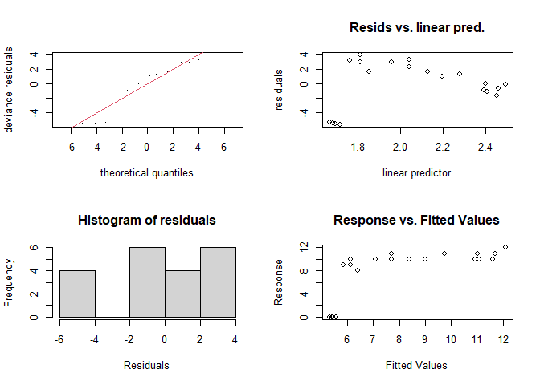
<p class="caption">(\#fig:gammodeldiagnostic-1)GAM model diagnostic summary for polar and temperate diatoms, of consecutive flashes before damping of SState induced chlorophyll fluorescence oscillations. GAM model predicted by the temperature (°C) imposed during measurements and the effective light level (µmol photons m^-2^s^-1^, estimated from flash spacings in seconds and <U+0001D6D4>~PSII~).</p>
</div>

```
## 
## Method: REML   Optimizer: outer newton
## full convergence after 12 iterations.
## Gradient range [-1.148855e-05,2.458705e-06]
## (score 56.65425 & scale 12.43105).
## Hessian positive definite, eigenvalue range [4.616448e-06,8.015894].
## Model rank =  9 / 9 
## 
## Basis dimension (k) checking results. Low p-value (k-index<1) may
## indicate that k is too low, especially if edf is close to k'.
## 
##                            k'  edf k-index p-value    
## s(LightLevel_ue)         2.00 1.83    0.26  <2e-16 ***
## s(Temp_C)                2.00 1.00    0.81    0.15    
## ti(Temp_C,LightLevel_ue) 4.00 1.00    0.55  <2e-16 ***
## ---
## Signif. codes:  0 '***' 0.001 '**' 0.01 '*' 0.05 '.' 0.1 ' ' 1
## 
## 
## ### GAM diagnostics: 2
```

<div class="figure">
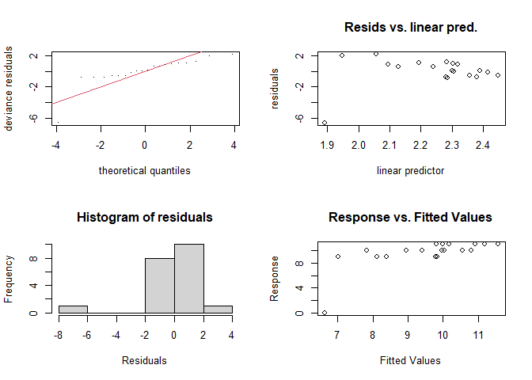
<p class="caption">(\#fig:gammodeldiagnostic-2)GAM model diagnostic summary for polar and temperate diatoms, of consecutive flashes before damping of SState induced chlorophyll fluorescence oscillations. GAM model predicted by the temperature (°C) imposed during measurements and the effective light level (µmol photons m^-2^s^-1^, estimated from flash spacings in seconds and <U+0001D6D4>~PSII~).</p>
</div>

```
## 
## Method: REML   Optimizer: outer newton
## full convergence after 12 iterations.
## Gradient range [-1.045605e-05,1.128619e-05]
## (score 47.79832 & scale 3.965611).
## Hessian positive definite, eigenvalue range [6.856764e-06,8.007953].
## Model rank =  9 / 9 
## 
## Basis dimension (k) checking results. Low p-value (k-index<1) may
## indicate that k is too low, especially if edf is close to k'.
## 
##                            k'  edf k-index p-value  
## s(LightLevel_ue)         2.00 1.10    0.76   0.065 .
## s(Temp_C)                2.00 1.00    0.93   0.235  
## ti(Temp_C,LightLevel_ue) 4.00 1.46    0.89   0.125  
## ---
## Signif. codes:  0 '***' 0.001 '**' 0.01 '*' 0.05 '.' 0.1 ' ' 1
## 
## 
## ### GAM diagnostics: 3
```

<div class="figure">
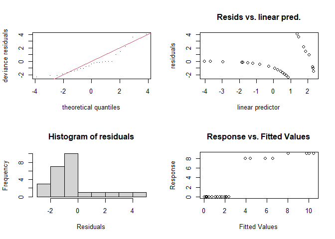
<p class="caption">(\#fig:gammodeldiagnostic-3)GAM model diagnostic summary for polar and temperate diatoms, of consecutive flashes before damping of SState induced chlorophyll fluorescence oscillations. GAM model predicted by the temperature (°C) imposed during measurements and the effective light level (µmol photons m^-2^s^-1^, estimated from flash spacings in seconds and <U+0001D6D4>~PSII~).</p>
</div>

```
## 
## Method: REML   Optimizer: outer newton
## full convergence after 12 iterations.
## Gradient range [-1.964407e-05,6.40554e-06]
## (score 55.32928 & scale 3.571869).
## Hessian positive definite, eigenvalue range [1.200439e-05,10.5307].
## Model rank =  9 / 9 
## 
## Basis dimension (k) checking results. Low p-value (k-index<1) may
## indicate that k is too low, especially if edf is close to k'.
## 
##                            k'  edf k-index p-value
## s(LightLevel_ue)         2.00 1.94    1.23    0.86
## s(Temp_C)                2.00 1.89    1.37    0.99
## ti(Temp_C,LightLevel_ue) 4.00 1.00    0.97    0.46
## 
## 
## ### GAM diagnostics: 4
```

<div class="figure">
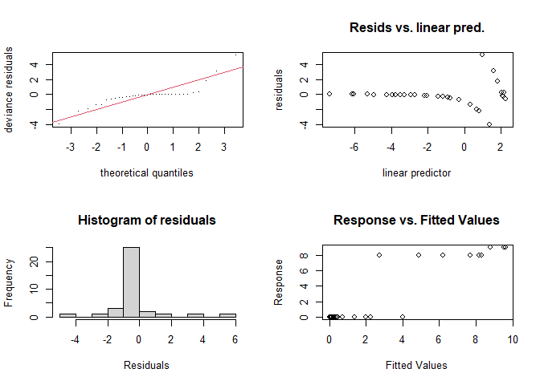
<p class="caption">(\#fig:gammodeldiagnostic-4)GAM model diagnostic summary for polar and temperate diatoms, of consecutive flashes before damping of SState induced chlorophyll fluorescence oscillations. GAM model predicted by the temperature (°C) imposed during measurements and the effective light level (µmol photons m^-2^s^-1^, estimated from flash spacings in seconds and <U+0001D6D4>~PSII~).</p>
</div>

```
## 
## Method: REML   Optimizer: outer newton
## full convergence after 11 iterations.
## Gradient range [-6.831923e-05,0.0001971058]
## (score 71.16439 & scale 2.490609).
## Hessian positive definite, eigenvalue range [5.281984e-06,15.52403].
## Model rank =  9 / 9 
## 
## Basis dimension (k) checking results. Low p-value (k-index<1) may
## indicate that k is too low, especially if edf is close to k'.
## 
##                            k'  edf k-index p-value
## s(LightLevel_ue)         2.00 1.96    1.60    1.00
## s(Temp_C)                2.00 1.00    1.02    0.47
## ti(Temp_C,LightLevel_ue) 4.00 2.17    1.48    0.99
## 
## 
## ### GAM diagnostics: 5
```

<div class="figure">
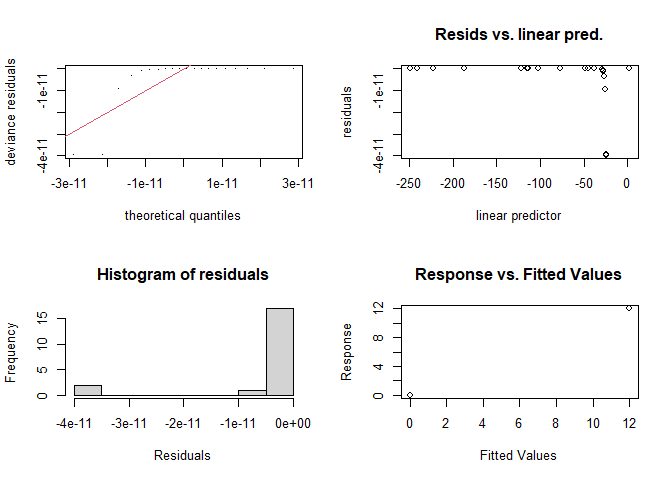
<p class="caption">(\#fig:gammodeldiagnostic-5)GAM model diagnostic summary for polar and temperate diatoms, of consecutive flashes before damping of SState induced chlorophyll fluorescence oscillations. GAM model predicted by the temperature (°C) imposed during measurements and the effective light level (µmol photons m^-2^s^-1^, estimated from flash spacings in seconds and <U+0001D6D4>~PSII~).</p>
</div>

```
## 
## Method: REML   Optimizer: outer newton
## step failed after 1 iteration.
## Gradient range [-1.61541e-06,9.174523]
## (score -420.8737 & scale 2.151999e-22).
## eigenvalue range [-9224757,7.998127].
## Model rank =  9 / 9 
## 
## Basis dimension (k) checking results. Low p-value (k-index<1) may
## indicate that k is too low, especially if edf is close to k'.
## 
##                            k'  edf k-index p-value   
## s(LightLevel_ue)         2.00 1.00    0.29   0.010 **
## s(Temp_C)                2.00 1.96    0.75   0.140   
## ti(Temp_C,LightLevel_ue) 4.00 1.00    0.67   0.095 . 
## ---
## Signif. codes:  0 '***' 0.001 '**' 0.01 '*' 0.05 '.' 0.1 ' ' 1
## 
## 
## ### GAM diagnostics: 6
```

<div class="figure">
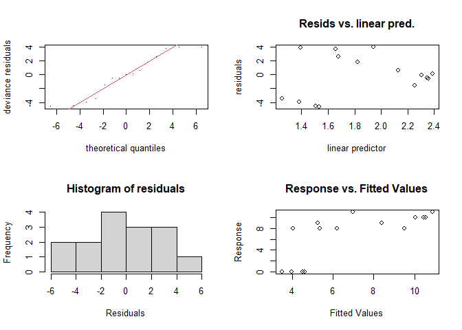
<p class="caption">(\#fig:gammodeldiagnostic-6)GAM model diagnostic summary for polar and temperate diatoms, of consecutive flashes before damping of SState induced chlorophyll fluorescence oscillations. GAM model predicted by the temperature (°C) imposed during measurements and the effective light level (µmol photons m^-2^s^-1^, estimated from flash spacings in seconds and <U+0001D6D4>~PSII~).</p>
</div>

```
## 
## Method: REML   Optimizer: outer newton
## full convergence after 13 iterations.
## Gradient range [-4.513978e-06,3.114671e-06]
## (score 42.28655 & scale 12.57865).
## Hessian positive definite, eigenvalue range [1.968747e-06,5.520196].
## Model rank =  9 / 9 
## 
## Basis dimension (k) checking results. Low p-value (k-index<1) may
## indicate that k is too low, especially if edf is close to k'.
## 
##                            k'  edf k-index p-value
## s(LightLevel_ue)         2.00 1.74    1.00    0.46
## s(Temp_C)                2.00 1.00    0.99    0.40
## ti(Temp_C,LightLevel_ue) 4.00 1.00    1.02    0.33
## 
## 
## ### GAM diagnostics: 7
```

<div class="figure">
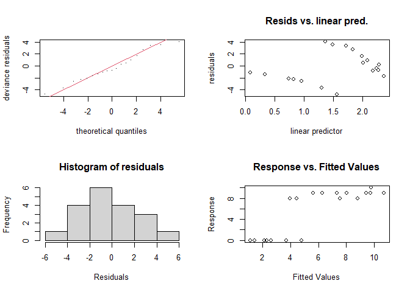
<p class="caption">(\#fig:gammodeldiagnostic-7)GAM model diagnostic summary for polar and temperate diatoms, of consecutive flashes before damping of SState induced chlorophyll fluorescence oscillations. GAM model predicted by the temperature (°C) imposed during measurements and the effective light level (µmol photons m^-2^s^-1^, estimated from flash spacings in seconds and <U+0001D6D4>~PSII~).</p>
</div>

```
## 
## Method: REML   Optimizer: outer newton
## full convergence after 10 iterations.
## Gradient range [-1.145248e-05,7.291372e-06]
## (score 49.70235 & scale 8.081872).
## Hessian positive definite, eigenvalue range [3.948816e-06,7.521732].
## Model rank =  9 / 9 
## 
## Basis dimension (k) checking results. Low p-value (k-index<1) may
## indicate that k is too low, especially if edf is close to k'.
## 
##                            k'  edf k-index p-value  
## s(LightLevel_ue)         2.00 1.85    0.70   0.055 .
## s(Temp_C)                2.00 1.25    1.14   0.670  
## ti(Temp_C,LightLevel_ue) 4.00 1.00    0.77   0.055 .
## ---
## Signif. codes:  0 '***' 0.001 '**' 0.01 '*' 0.05 '.' 0.1 ' ' 1
## 
## 
## ### GAM diagnostics: 8
```

<div class="figure">
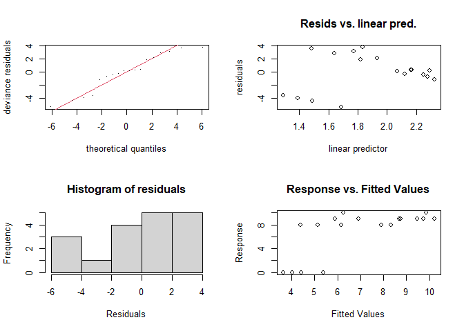
<p class="caption">(\#fig:gammodeldiagnostic-8)GAM model diagnostic summary for polar and temperate diatoms, of consecutive flashes before damping of SState induced chlorophyll fluorescence oscillations. GAM model predicted by the temperature (°C) imposed during measurements and the effective light level (µmol photons m^-2^s^-1^, estimated from flash spacings in seconds and <U+0001D6D4>~PSII~).</p>
</div>

```
## 
## Method: REML   Optimizer: outer newton
## full convergence after 8 iterations.
## Gradient range [-2.055142e-05,1.125567e-05]
## (score 49.36194 & scale 10.11107).
## Hessian positive definite, eigenvalue range [9.922912e-07,7.021343].
## Model rank =  9 / 9 
## 
## Basis dimension (k) checking results. Low p-value (k-index<1) may
## indicate that k is too low, especially if edf is close to k'.
## 
##                            k'  edf k-index p-value
## s(LightLevel_ue)         2.00 1.84    1.04    0.46
## s(Temp_C)                2.00 1.00    1.06    0.46
## ti(Temp_C,LightLevel_ue) 4.00 1.00    1.04    0.49
## 
## 
## ### GAM diagnostics: 9
```

<div class="figure">
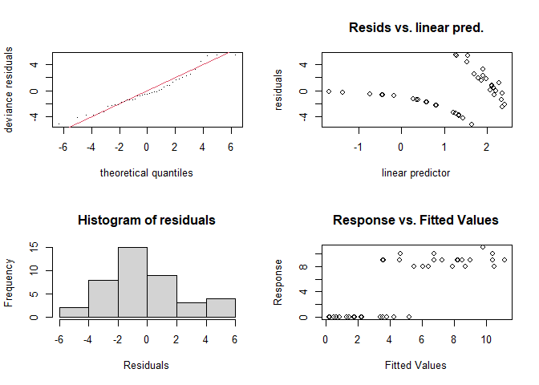
<p class="caption">(\#fig:gammodeldiagnostic-9)GAM model diagnostic summary for polar and temperate diatoms, of consecutive flashes before damping of SState induced chlorophyll fluorescence oscillations. GAM model predicted by the temperature (°C) imposed during measurements and the effective light level (µmol photons m^-2^s^-1^, estimated from flash spacings in seconds and <U+0001D6D4>~PSII~).</p>
</div>

```
## 
## Method: REML   Optimizer: outer newton
## full convergence after 12 iterations.
## Gradient range [-3.720374e-05,8.668272e-05]
## (score 104.6995 & scale 7.872017).
## Hessian positive definite, eigenvalue range [2.611616e-05,18.51441].
## Model rank =  9 / 9 
## 
## Basis dimension (k) checking results. Low p-value (k-index<1) may
## indicate that k is too low, especially if edf is close to k'.
## 
##                            k'  edf k-index p-value   
## s(LightLevel_ue)         2.00 1.90    0.72   0.035 * 
## s(Temp_C)                2.00 1.77    1.06   0.640   
## ti(Temp_C,LightLevel_ue) 4.00 1.00    0.62   0.005 **
## ---
## Signif. codes:  0 '***' 0.001 '**' 0.01 '*' 0.05 '.' 0.1 ' ' 1
## 
## 
## ### GAM diagnostics: 10
```

<div class="figure">
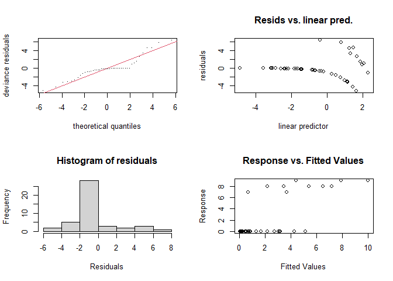
<p class="caption">(\#fig:gammodeldiagnostic-10)GAM model diagnostic summary for polar and temperate diatoms, of consecutive flashes before damping of SState induced chlorophyll fluorescence oscillations. GAM model predicted by the temperature (°C) imposed during measurements and the effective light level (µmol photons m^-2^s^-1^, estimated from flash spacings in seconds and <U+0001D6D4>~PSII~).</p>
</div>

```
## 
## Method: REML   Optimizer: outer newton
## full convergence after 9 iterations.
## Gradient range [-6.765617e-05,3.899604e-05]
## (score 103.853 & scale 6.13007).
## Hessian positive definite, eigenvalue range [5.51875e-05,20.0096].
## Model rank =  9 / 9 
## 
## Basis dimension (k) checking results. Low p-value (k-index<1) may
## indicate that k is too low, especially if edf is close to k'.
## 
##                            k'  edf k-index p-value  
## s(LightLevel_ue)         2.00 1.87    1.01    0.45  
## s(Temp_C)                2.00 1.00    1.27    0.95  
## ti(Temp_C,LightLevel_ue) 4.00 2.19    0.85    0.09 .
## ---
## Signif. codes:  0 '***' 0.001 '**' 0.01 '*' 0.05 '.' 0.1 ' ' 1
```


# References {.unnumbered}


