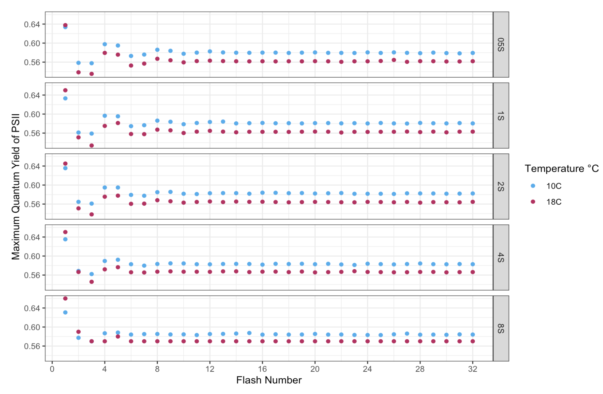

```{r setup, include=FALSE}
knitr::opts_chunk$set(echo = FALSE)
```

# Background
Light energy absorbed by the photosynthetic pigments of PSII (primarily chlorophyll-a) is distributed variably among three pathways @schubackSingleTurnoverVariableChlorophyll2021:    
   I.	Photochemistry (photochemical quenching of ChlF)    
   II.	Dissipation as heat (non-photochemical quenching of ChlF)   
   III.	Re-emission at longer wavelengths as fluorescence (ChlF)    

A complete water oxidation cycle during oxygenic photosynthesis requires the absorption of four photons and the successive accumulation of four oxidizing equivalents @zaharievaEnergeticsKineticsSState2019 @dauTimeresolvedXraySpectroscopy2007 : 

   

ChlF differs between s-states since the free energy of the water-oxidizing complex depends on the number of electrons/protons removed. Occasionally, recombination may result in the loss of charge separation, desynchronizing the s-state cycle and dampening the ChlF periodicity. 


# Objective    
Use a single-turnover variable chlorophyll fluorescence (ST-ChlF) approach to evaluate the loss of synchronization of the s-state cycle at different frequencies of photon delivery and temperatures.     

# Methods

Use Solisense apparatus and Lift software to deliver short, highly intense pulses of light to diatoms in a temperature-controlled cuvette. 

(start figure 2)    
Dark-regulated state        
   •	Assumptions: sample populated with S0 and S1 oxidation states, all RCII are open, any light-induced energy dissipation processes have been fully reversed @schubackSingleTurnoverVariableChlorophyll2021         
   •	Maximum fraction of the energy absorbed will enter the photochemistry pathway         

Deliver short, high-intensity 445nm flashes 
   •	Single-turnover technique delivers a rapid series of sub-saturating flashlets (order of microseconds)     
   •	Transiently reduces electron acceptors in the photosynthetic pathway, closing PSII    
   •	Maximum fraction of the energy will be partitioned to ChlF    

Repeated flashes at a fixed interval    
   •	Drive PSII synchronously through the s-state cycle    

1.	Alter the interval between flashes    
2.	Alter the temperature of the system     
 (end figure 2)

Derive the maximum quantum yield of PSII (Fv/Fm)    
   •	Indicates the maximum efficiency of photochemistry under different conditions 


# Results and Discussion



As flash spacing increases, we observe fewer synchronous s-state cycles before the periodicity is dampened. This indicates that longer periods of time between flashes increase the incidence of recombination. 

We hypothesized that recombination would decrease with temperature since recombination processes are temperature sensitive. As a result, we expected the diatoms at 10°C to maintain a synchronous s-state cycle for longer. However, a more sophisticated time series analysis is required to derive the relationship between temperature and photochemistry for this data set.    

# Future Directions 
The accepted lower limit of the photic zone is 1% of surface irradiance, equivalent to 1 photon reaching a PSII every ~0.03 seconds @ravenPutOutLight2000. However, some arctic diatoms may achieve net C uptake when 1 photon only reaches a PSII every 0.6-60 seconds. 

Comparing the duration of s-state synchronicity of temperate and arctic diatoms may help explain how arctic diatoms exploit extremely low light. 

```{r, include=FALSE}
knitr::write_bib(c('knitr','rmarkdown','posterdown','pagedown'), 'packages.bib')
```

# References

