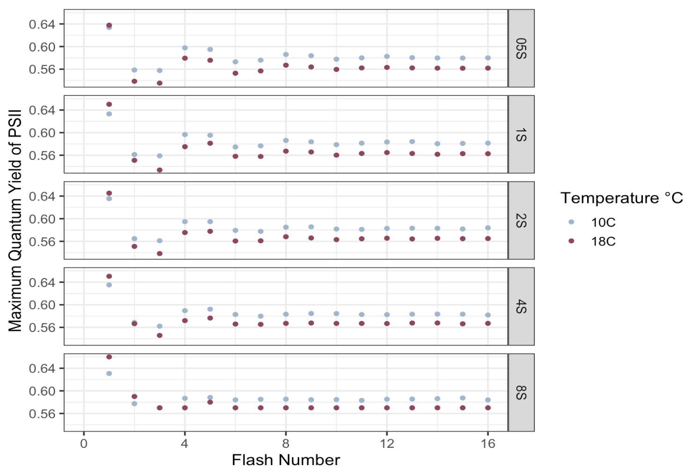

```{r, include=FALSE}
knitr::opts_chunk$set(echo = FALSE,
                      warning = FALSE,
                      tidy = FALSE,
                      message = FALSE,
                      fig.align = 'center',
                      out.width = "100%")
options(knitr.table.format = "html") 
```


# Background

The accepted lower limit of the photic zone is 1% of surface irradiance, equivalent to 1 photon reaching a PSII every ~0.03 seconds @ravenPutOutLight2000. Some arctic diatoms achieve net C uptake with 1 photon only reaching a PSII every 0.6-60 seconds @randelhoff2020.           

  Comparing the persistence of S-state synchronicity in temperate and arctic diatoms may help explain how arctic diatoms exploit extremely low light, by limiting wasteful slippage.      

**Energy Distribution**  
Light energy absorbed by the photosynthetic pigments of PSII (primarily chl-a) is distributed variably among three pathways @schubackSingleTurnoverVariableChlorophyll2021:  

  * Photochemistry (photochemical quenching of ChlF)    
  * Dissipation as heat (non-photochemical quenching of ChlF)   
  * Re-emission at longer wavelengths as fluorescence (ChlF)  
  
**S-State Cycle**   
A complete water oxidation cycle during oxygenic photosynthesis requires the absorption of four photons and the successive accumulation of four oxidizing equivalents  @gatesRealtimeKineticsLight2020@zaharievaEnergeticsKineticsSState2019@dauTimeresolvedXraySpectroscopy2007:  


ChlF varies between S-states since the free energy of the water-oxidizing complex depends on the number of electrons removed @dewijnSstateDependenceMiss2002. A loss of charge separation through recombination desynchronizes the S-state cycle, dampening the periodic changes in ChlF, and causing wasteful slippage. 


# Objective   
Use a single-turnover variable chlorophyll fluorescence (ST-ChlF) approach to evaluate the loss of synchronization of the S-state cycle at different frequencies of photon delivery and temperatures.     


# Methods

Use Solisense apparatus and Lift software to deliver short, highly intense pulses of light to diatoms (*Thalassiosira pseudonana*) in a temperature-controlled cuvette @schubackSingleTurnoverVariableChlorophyll2021.   


# Results



As flash spacing increases, we observe fewer synchronous S-state cycles before the periodicity is dampened. This indicates that longer periods of time between flashes increase the incidence of recombination and wasteful slippage.

We hypothesized that recombination would decrease with temperature since recombination processes are temperature sensitive. Initial Fast Fourier Transform analysis (M. Berthold) indeed indicates that the diatoms at 10°C maintain a synchronous S-state cycle for longer, and therefore may maintain productive electron transport under lower light levels.


# References

